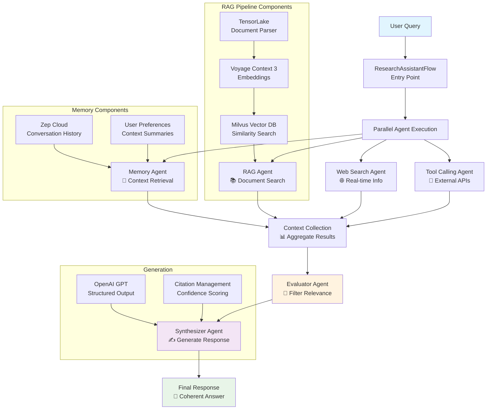
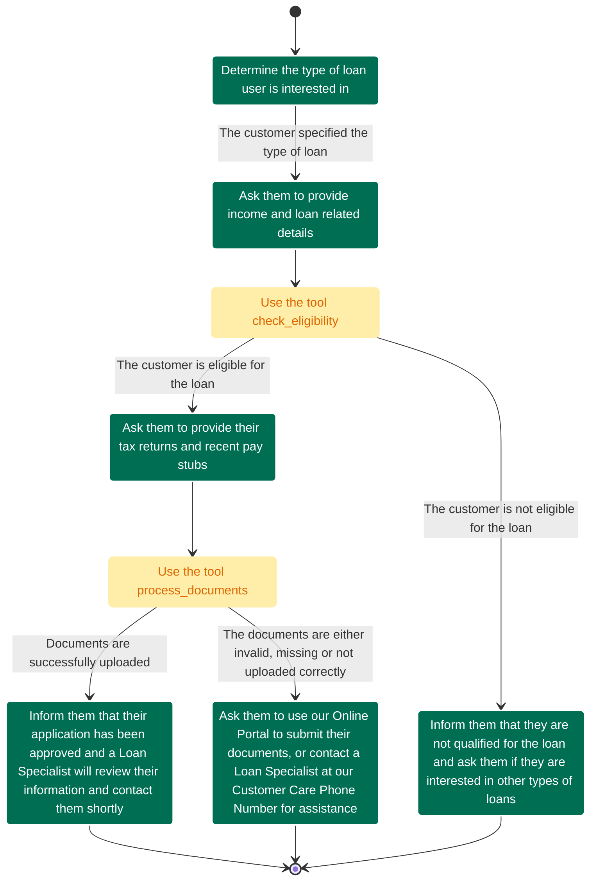

# Alexandria Engineering Hub - Full Convergence Document

**Generated:** 2026-01-18 10:16:58
**Iteration:** Convergence Pass 4 (Markdown Sanity)
**Total Files:** 104
**Source:** ai-engineering-hub-main

---

## Table of Contents

- **acp-code** / README.md
- **agentic_rag** / README.md
- **agentic_rag_deepseek** / README.md
- **agent-with-mcp-memory** / README.md
- **ai_news_generator** / README.md
- **ai-avatar-demo\data** / README.md
- **ai-avatar-demo** / README.md
- **ai-engineering-roadmap** / README.md
- **ai-podcast-generation** / README.md
- **ai-podcast-generator** / README.md
- **audio-analysis-toolkit** / README.md
- **autogen-stock-analyst** / README.md
- **book-writer-flow\book_flow\book_writing_flow** / README.md
- **book-writer-flow\book_flow\book_writing_flow\src** / book.md
- **book-writer-flow** / README.md
- **brand-monitoring** / README.md
- **Build-reasoning-model** / README.md
- **chat-with-audios** / README.md
- **chat-with-code** / README.md
- **code-model-comparison** / README.md
- **Colivara-deepseek-website-RAG** / README.md
- **content_planner_flow** / README.md
- **context-engineering-pipeline** / README.md
- **context-engineering-workflow\outputs** / markdown_chunks.md
- **context-engineering-workflow** / README.md
- **cursor_linkup_mcp** / README.md
- **database-memory-agent** / README.md
- **DeepSeek-finetuning** / README.md
- **deepseek-multimodal-RAG** / README.md
- **deepseek-thinking-ui** / README.md
- **deploy-agentic-rag** / README.md
- **documentation-writer-flow** / README.md
- **document-chat-rag** / README.md
- **eval-and-observability** / README.md
- **eyelevel-mcp-rag** / README.md
- **fastest-rag-milvus-groq** / README.md
- **fastest-rag-stack** / README.md
- **financial-analyst-deepseek** / README.md
- **firecrawl-agent** / README.md
- **gemma3-ocr** / README.md
- **github-rag** / README.md
- **gpt-oss-thinking-ui** / README.md
- **gpt-oss-vs-qwen3** / README.md
- **graphiti-mcp** / README.md
- **groundX-doc-pipeline** / README.md
- **guidelines-vs-traditional-prompt** / README.md
- **hotel-booking-crew** / README.md
- **imagegen-janus-pro** / README.md
- **kitops-mcp\ml-project\docs** / README.md
- **kitops-mcp** / README.md
- **LaTeX-OCR-with-Llama** / README.md
- **llama-4_vs_deepseek-r1** / README.md
- **llama-4-rag** / README.md
- **llamaindex-mcp** / README.md
- **llama-ocr** / README.md
- **local-chatgpt with DeepSeek** / README.md
- **local-chatgpt with Gemma 3** / README.md
- **local-chatgpt** / README.md
- **mcp-agentic-rag** / README.md
- **mcp-agentic-rag-firecrawl** / README.md
- **mcp-video-rag** / README.md
- **mcp-voice-agent** / README.md
- **mindsdb-mcp** / README.md
- **minimaxm2-vs-sonnet4-5-vs-kimik2-vs-gemini3** / README.md
- **modernbert-rag** / README.md
- **motia-content-creation** / README.md
- **Multi-Agent-deep-researcher-mcp-windows-linux** / README.md
- **multilingual-meeting-notes-generator** / README.md
- **multimodal-rag-assemblyai** / README.md
- **multiplatform_deep_researcher** / output.md
- **multiplatform_deep_researcher** / README.md
- **notebook-lm-clone** / README.md
- **o3-vs-claude-code** / README.md
- **open-agent-builder\convex** / README.md
- **open-agent-builder** / README.md
- **paralegal-agent-crew** / README.md
- **parlant-conversational-agent** / README.md
- **pixeltable-mcp\audio-index** / README.md
- **pixeltable-mcp\base-sdk** / README.md
- **pixeltable-mcp** / README.md
- **qwen-2.5VL-ocr** / README.md
- **qwen3_vs_deepseek-r1** / README.md
- **qwen3-thinking-ui** / README.md
- **rag-sql-router** / README.md
- **rag-voice-agent** / README.md
- **rag-with-dockling** / README.md
- **Root** / README.md
- **real-time-voicebot** / README.md
- **sdv-mcp** / README.md
- **siamese-network** / README.md
- **simple-rag-workflow** / README.md
- **sonnet4-vs-o4** / README.md
- **sonnet4-vs-qwen3-coder** / README.md
- **stagehand x mcp-use** / README.md
- **stock-portfolio-analysis-agent** / README.md
- **streaming-ai-chatbot** / README.md
- **trustworthy-rag** / README.md
- **ultimate-ai-assitant-using-mcp** / README.md
- **video-rag-gemini** / README.md
- **video-rag-gemini** / USAGE.md
- **web-browsing-agent** / README.md
- **Website-to-API-with-FireCrawl** / README.md
- **Youtube-trend-analysis** / README.md
- **zep-memory-assistant** / README.md

---

# acp-code

## README.md

# Summary Generator multi-agent workflow with ACP

A simple demonstration of the Agent Communication Protocol (ACP), showcasing how two agents built using different frameworks (CrewAI and Smolagents) can collaborate seamlessly to generate and verify a research summary.

---

## Setup and Installation

1. **Install Ollama:**
   ```bash
   # Setting up Ollama on linux
   curl -fsSL https://ollama.com/install.sh | sh

   # Pull the Qwen2.5 model
   ollama pull qwen2.5:14b
   ```

2. **Install project dependencies:**

    Ensure you have Python 3.10 or later installed on your system.

    First, install `uv` and set up the environment:
    ```bash
    # MacOS/Linux
    curl -LsSf https://astral.sh/uv/install.sh | sh

    # Windows
    powershell -ExecutionPolicy ByPass -c "irm https://astral.sh/uv/install.ps1 | iex"
    ```

    Install dependencies:
    ```bash
    # Create a new directory for our project
    uv init acp-project
    cd acp-project

    # Create virtual environment and activate it
    uv venv
    source .venv/bin/activate  # MacOS/Linux

    .venv\Scripts\activate     # Windows

    # Install dependencies
    uv add acp-sdk crewai smolagents duckduckgo-search ollama
    ```

You can also use any other LLM providers such as OpenAI or Anthropic. Create a `.env` file and add your API keys
```
OPENAI_API_KEY=your_openai_key
ANTHROPIC_API_KEY=your_anthropic_key
```

## Usage
Start the two ACP servers in separate terminals:

```bash
# Terminal 1
uv run crew_acp_server.py

# Terminal 2
uv run smolagents_acp_server.py
```

Run the ACP client to trigger the agent workflow:

```bash
uv run acp_client.py
```

Output:

A general summary from the first agent

A fact-checked and updated version from the second agent

## 📬 Stay Updated with Our Newsletter!
**Get a FREE Data Science eBook** 📖 with 150+ essential lessons in Data Science when you subscribe to our newsletter! Stay in the loop with the latest tutorials, insights, and exclusive resources. [Subscribe now!](https://join.dailydoseofds.com)

[](https://join.dailydoseofds.com)

---

## Contribution

Contributions are welcome! Please fork the repository and submit a pull request with your improvements.

---

# agentic_rag

## README.md

# Agentic RAG using CrewAI

This project leverages CrewAI to build an Agentic RAG that can search through your docs and fallbacks to web search in case it doesn't find the answer in the docs, have option to use either of deep-seek-r1 or llama 3.2 that runs locally. More details un Running the app section below!

Before that, make sure you grab your FireCrawl API keys to search the web.

**Get API Keys**:
   - [FireCrawl](https://www.firecrawl.dev/i/api)

### Watch Demo on YouTube
[](https://youtu.be/O4yBW_GTRk0)


## Installation and setup

**Get API Keys**:
   - [FireCrawl](https://www.firecrawl.dev/i/api)


**Install Dependencies**:
   Ensure you have Python 3.11 or later installed.
   ```bash
   pip install crewai crewai-tools chonkie[semantic] markitdown qdrant-client fastembed
   ```

**Running the app**:

To use deep-seek-rq use command ``` streamlit run app_deep_seek.py ```, for llama 3.2 use command ``` streamlit run app_llama3.2.py ```

---

## 📬 Stay Updated with Our Newsletter!
**Get a FREE Data Science eBook** 📖 with 150+ essential lessons in Data Science when you subscribe to our newsletter! Stay in the loop with the latest tutorials, insights, and exclusive resources. [Subscribe now!](https://join.dailydoseofds.com)

[](https://join.dailydoseofds.com)

---

## Contribution

Contributions are welcome! Please fork the repository and submit a pull request with your improvements.

---

# agentic_rag_deepseek

## README.md

# Enterprise-grade, agentic RAG over complex real-world docs

The project uses EyelevelAI's state of the art document parsing and retrieval system GroundX. It's integrated as a custom tool with CrewAI.

Before you start, quickly test it on your own document [here](https://dashboard.eyelevel.ai/xray)

GroundX can also be deployed completely on premise as well, the code is open-source, here's their [GitHub repo](https://github.com/eyelevelai/groundx-on-prem).

Grab your API keys's here.
- [GroundX API keys](https://docs.eyelevel.ai/documentation/fundamentals/quickstart#step-1-getting-your-api-key)
- [SERPER API keys](https://serper.dev/)

### Watch this tutorial on YouTube
[](https://www.youtube.com/watch?v=79xvgj4wvHQ)

---
## Setup and installations

**Setup Environment**:
- Paste your API keys by creating a `.env`
- Refer `.env.example` file


**Install Dependencies**:
   Ensure you have Python 3.11 or later installed.
   ```bash
   pip install groundx crewai crewai-tools
   ```
**Running the app**:
```bash
streamlit run app_deep_seek.py
```

---

## 📬 Stay Updated with Our Newsletter!
**Get a FREE Data Science eBook** 📖 with 150+ essential lessons in Data Science when you subscribe to our newsletter! Stay in the loop with the latest tutorials, insights, and exclusive resources. [Subscribe now!](https://join.dailydoseofds.com)

[](https://join.dailydoseofds.com)

---

## Contribution

Contributions are welcome! Please fork the repository and submit a pull request with your improvements.

---

# agent-with-mcp-memory

## README.md

# Crash Course: Building AI Agents with Open-Source Tools

This project is a hands-on crash course on building AI agents using a 100% open-source tech stack! You'll learn:

- What is an AI agent
- Connecting agents to tools
- Overview of MCP (Multi-Component Protocol)
- Replacing tools with MCP servers
- Setting up observability and tracing

All concepts are demonstrated with real, runnable code.

### Watch this tutorial on YouTube
<a href="https://youtu.be/R6sMAZaTCR4">
  
</a>

## What is an AI Agent?

An AI agent uses an LLM as its brain, has memory to retain context, and can take real-world actions through tools (like browsing the web, running code, etc.).

In short: it thinks, remembers, and acts.

## Tech Stack

- [CrewAI](https://github.com/crewAIInc) — Build MCP-ready agents
- [Zep Graphiti](https://github.com/getzep/graphiti) — Add human-like memory
- [CometML Opik](https://github.com/comet-ml/opik) — Observability and tracing
- 100% open-source!

## System Overview

Here's how the system works:

1. User sends a query
2. Assistant runs a web search via MCP
3. Query + results go to the Memory Manager
4. Memory Manager stores context in Graphiti
5. Response agent crafts the final answer

---

### SetUp

- **Setup ollama:**

1. Install Ollama by following the official instructions for your OS:

   **For macOS:**
   ```bash
   curl -fsSL https://ollama.com/install.sh | sh
   ```

   **For Linux:**
   ```bash
   curl -fsSL https://ollama.com/install.sh | sh
   ```

   **For Windows:**
   Download and install from [Ollama's official website](https://ollama.com/download)

2. Pull the required model:
   ```bash
   ollama pull llama3.2
   ```

You should see a response from the model. If you get any errors, check that Ollama is running with:


- **Add all necessary keys:**
  
  Create a new `.env` file in the project root, using `.env.example` as a template. Copy the example file and fill in your own API keys and secrets as needed.
  
  ```bash
  cp .env.example .env
  # Then edit .env to add your keys
  ```

- **Install dependencies:**
  
  Run the following command in the project root to install all required dependencies:
  
  ```bash
  uv sync
  ```

#### Start MCP servers:

- **Start Linkup server:**

  [Get your Linkup API keys here](https://www.linkup.so/)
  
  Run the following command in the project root:
  
  ```bash
  python server.py
  ```

- **Start the Graphiti MCP server:**
  
  This is only for advanced usage, you cna still learn all the fundamentals with just Linkup MCP server also.

  Follow the instructions in the [Graphiti MCP README](https://github.com/patchy631/ai-engineering-hub/blob/main/graphiti-mcp/README.md)


## 📬 Stay Updated with Our Newsletter!

**Get a FREE Data Science eBook** 📖 with 150+ essential lessons in Data Science when you subscribe to our newsletter! Stay in the loop with the latest tutorials, insights, and exclusive resources. [Subscribe now!](https://join.dailydoseofds.com)

[](https://join.dailydoseofds.com)

## Contribution

Contributions are welcome! Feel free to fork this repository and submit pull requests with your improvements.

---

# ai_news_generator

## README.md

# AI News generator

This project leverages CrewAI and Cohere's Command-R:7B model to build an AI news generator!

## Installation and setup

**Get API Keys**:
   - [Serper API Key](https://serper.dev/)
   - [Cohere API Key](https://dashboard.cohere.com/api-keys)


**Install Dependencies**:
   Ensure you have Python 3.11 or later installed.
   ```bash
   pip install crewai crewai-tools
   ```

---

## 📬 Stay Updated with Our Newsletter!
**Get a FREE Data Science eBook** 📖 with 150+ essential lessons in Data Science when you subscribe to our newsletter! Stay in the loop with the latest tutorials, insights, and exclusive resources. [Subscribe now!](https://join.dailydoseofds.com)

[](https://join.dailydoseofds.com)

---

## Contribution

Contributions are welcome! Please fork the repository and submit a pull request with your improvements.

---

# ai-avatar-demo\data

## README.md

# Zep Documentation Data Directory

This directory contains the (sample) data used for the Zep knowledge graph.

## Files

- **chunked-docs.json** - Sample chunked data provided for ingestion into the Zep knowledge graph.

## Using Your Own Data

If you want to use your own data, you must generate a `chunked-docs.json` file with a similar structure to the provided sample. Ensure the file is formatted correctly for ingestion.

## Ingesting the Data

To ingest the `chunked-docs.json` file into the Zep knowledge graph:

```bash
python scripts/ingest_to_graph.py
```

After running the script, make sure to check the Zep dashboard and wait a few minutes for the data to be fully processed and available for use.

---

# ai-avatar-demo

## README.md

# AI Avatar Demo powered by Zep

A conversational AI assistant powered by [Zep](https://www.getzep.com/) knowledge graphs, custom LLM integration, and Anam AI avatar—creating natural conversations with memory and context-aware responses.

We use:

- [Zep](https://www.getzep.com/) for conversation memory and knowledge graph management
- Anam AI for realistic avatar and voice interactions
- OpenRouter with Minimax M2 (LLM)
- FastAPI for streaming backend
- Streamlit to wrap the logic in an interactive UI

## Architecture


## Set Up

Run these commands in project root

### Install Dependencies

```bash
uv sync
```

### Configure Environment

Create a `.env` file in the project root, similar to `.env.example`, and add your API keys:

[Get your Zep API keys here](https://www.getzep.com/)

### Ingest Data

To populate the knowledge graph with your data:

```bash
python scripts/ingest_to_graph.py
```

### Run the Application

Start the backend server:

```bash
uvicorn backend:app --port 8000 --reload
```

In a separate terminal, start the frontend:

```bash
streamlit run app.py
```

## Usage

1. Enter your session unique name in the sidebar
2. Click "Initialize New Session" to create a Zep session
3. Click "Start Conversation" to interact with the avatar
4. The assistant uses knowledge graph context and conversation history for personalized responses

Note: To understand Zep better, we recommend going through the Jupyter notebook (`zep_demo.ipynb`) provided in the project root.

## 📬 Stay Updated with Our Newsletter!

**Get a FREE Data Science eBook** 📖 with 150+ essential lessons in Data Science when you subscribe to our newsletter! Stay in the loop with the latest tutorials, insights, and exclusive resources. [Subscribe now!](https://join.dailydoseofds.com)

[](https://join.dailydoseofds.com)

## Contribution

Contributions are welcome! Feel free to fork this repository and submit pull requests with your improvements.

---

# ai-engineering-roadmap

## README.md

# 🚀 AI Engineering Roadmap

A comprehensive guide to becoming an AI Engineer, starting from Python fundamentals to building production-ready AI applications.


---

## 📚 Table of Contents

- [1️⃣ Master Python](#1️⃣-master-python)
- [2️⃣ AI with Python](#2️⃣-ai-with-python)
- [3️⃣ Maths for ML](#3️⃣-maths-for-ml)
- [4️⃣ Understanding LLMs](#4️⃣-understanding-llms)
- [5️⃣ LLM Research](#5️⃣-llm-research)
- [6️⃣ AI Agents](#6️⃣-ai-agents)
- [7️⃣ Applied AI](#7️⃣-applied-ai)
- [8️⃣ AI Protocols (MCP)](#8️⃣-ai-protocols-mcp)
- [9️⃣ Project-based Learning](#9️⃣-project-based-learning)
- [🔟 Books](#🔟-books)

---

## 1️⃣ Master Python

**Strong coding fundamentals are important.**

Start with Python, and Harvard's CS50p is the best place to learn it.


**🔗 [Harvard CS50's Introduction to Programming with Python](https://pll.harvard.edu/course/cs50s-introduction-programming-python)**

- **Duration:** 9 weeks
- **Time Commitment:** 3-9 hours per week
- **Difficulty:** Introductory
- **Platform:** edX

---

## 2️⃣ AI with Python

**Next, learn how Python is used in AI.**

This 4-hour course by Andrew Ng is a great starting point.


**🔗 [AI Python for Beginners - DeepLearning.AI](https://deeplearning.ai/short-courses/ai-python-for-beginners/)**

- **Duration:** 4 hours 15 minutes
- **Instructor:** Andrew Ng
- **Lessons:** 35 video lessons
- **Code Examples:** 27 code examples

---

## 3️⃣ Maths for ML

**Fundamentals of Linear Algebra, Probability, and Statistics are important, especially in AI research.**

These playlists by Khan Academy are the perfect place to learn it:


**🔗 Essential Math Playlists:**
- [Linear Algebra](https://www.youtube.com/playlist?list=PLFD0EB975BA0CC1E0)
- [Probability](https://www.youtube.com/playlist?list=PLC58778F28211FA19)
- [Statistics](https://www.youtube.com/playlist?list=PL1328115D3D8A2566)

---

## 4️⃣ Understanding LLMs

**These three videos by 3Blue1Brown are the best visual explainers of LLMs and their internal workings.**


**🔗 [Neural Networks Playlist - 3Blue1Brown](https://www.youtube.com/playlist?list=PLZHQObOWTQDNU6R1_67000Dx_ZCJB-3pi)**

**Key Topics:**
- How LLMs work
- Transformers Deep-dive
- Attention in transformers
- How LLMs store facts

---

## 5️⃣ LLM Research

**Now that you understand what LLMs are, it's time to learn how to build them yourself.**

Neural Nets zero-to-hero by Andrej Karpathy is the greatest series to do so.


**🔗 [Neural Networks: Zero to Hero - Andrej Karpathy](https://youtube.com/playlist?list=PLAqhIrjkxbuWI23v9cThsA9GvCAUhRvKZ)**

- **Videos:** 10 videos
- **Total Views:** 2M+ views
- **Focus:** Building neural networks from scratch

---

## 6️⃣ AI Agents

**Before even jumping into the Agents, you should first read Anthropic AI's guide on building effective agents.**

> *"To build an agent, you don't need complex frameworks or libraries, but rather composable patterns."*


**🔗 [Building Effective Agents - Anthropic](https://anthropic.com/engineering/building-effective-agents)**

- **Published:** December 19, 2024
- **Focus:** Simple, composable patterns for LLM agents
- **Industry Insights:** Real-world implementation patterns

---

## 7️⃣ Applied AI

**I don't recommend chasing frameworks, but I took this course on CrewAI when I started.**

João Moura precisely teaches how to think of agents like humans working together in a clear and practical manner.


**🔗 [Multi AI Agent Systems with CrewAI - Coursera](https://coursera.org/projects/multi-ai-agent-systems-with-crewai)**

- **Duration:** 2 hours 41 minutes
- **Instructor:** João Moura
- **Lessons:** 18 video lessons
- **Code Examples:** 7 code examples

---

## 8️⃣ AI Protocols (MCP)

**Now that you understand what agents are, it's time to connect them to external tools, APIs, and databases.**

This free hands-on guide on MCP has 10+ projects.


**🔗 [MCP: The Illustrated Guidebook](https://mcp.dailydoseofds.com)**

- **Edition:** 2025 Edition
- **Status:** FREE
- **Projects:** 10+ hands-on projects
- **Focus:** Model Context Protocol implementation

---

## 9️⃣ Project-based Learning

**This GitHub repo contains 75+ projects on AI Engineering covering:**

- LLMs and RAGs
- Real-world AI agent applications
- Examples to implement, adapt, and scale in your projects


**🔗 [AI Engineering Hub - GitHub](https://github.com/patchy631/ai-engineering-hub)**

**What you'll find:**
- In-depth tutorials on LLMs and RAGs
- Real-world AI agent applications
- Examples to implement, adapt, and scale in your projects
- Resources for all skill levels

---

## 🔟 Books

**Every AI engineer building real-world applications should read this book.**

Chip Huyen's book is one of the best on AI Engineering.


**🔗 [AI Engineering Book - GitHub](https://github.com/chiphuyen/aie-book)**

**What you'll learn:**
- Understand what AI engineering is and how it differs from traditional ML engineering
- Learn the process for developing an AI application
- Explore various model adaptation techniques
- Examine bottlenecks for latency and cost when serving foundation models
- Choose the right model, metrics, data, and developmental patterns

---

## 🎯 Learning Path Summary

1. **Foundation** → Master Python programming
2. **AI Basics** → Learn Python for AI applications
3. **Mathematics** → Build strong math fundamentals
4. **Understanding** → Grasp how LLMs work internally
5. **Research** → Learn to build neural networks from scratch
6. **Agents** → Understand effective agent design patterns
7. **Application** → Build multi-agent systems
8. **Integration** → Connect agents to external tools and APIs
9. **Practice** → Work on real-world projects
10. **Mastery** → Deep dive into production AI engineering

---

## 🤝 Contributing

Found this roadmap helpful? Star ⭐ this repository and share it with others!

*Happy Learning! 🚀*

---

# ai-podcast-generation

## README.md

# 🎙️ Podsite - AI Podcast Generation

Transform web content and text into engaging AI-generated podcasts with natural-sounding conversations between two speakers.

## 🚀 Two Versions Available

### 📱 Regular Version (`app.py`)
- Uses **OpenAI GPT-4** for script generation
- Requires OpenAI API key
- Fast and reliable cloud-based AI
- Pay-per-use pricing model

### 🔓 Open Source Version (`app_oss.py`)
- Uses **Ollama** with local AI models
- No API keys required for script generation
- Completely private and offline
- Free to use after setup

## ✨ Features

- **🌐 Website Scraping**: Extract content from any URL using Firecrawl
- **📋 Text Input**: Paste any text content directly
- **🎭 Multiple Styles**: Choose from Conversational, Interview, Debate, or Educational formats
- **⏱️ Flexible Duration**: Generate podcasts from 5 to 20 minutes
- **🎵 AI Audio Generation**: Convert scripts to natural-sounding speech using Kokoro TTS
- **📥 Export Options**: Download both scripts (JSON) and audio files (WAV)
- **📚 Source Management**: Store multiple sources and generate podcasts from any of them

## 🚀 Quick Start

### Prerequisites

- Python 3.11 or 3.12
- [uv](https://github.com/astral-sh/uv) package manager

**For Regular Version (`app.py`):**
- OpenAI API key (required)
- Firecrawl API key (optional, for web scraping)

**For Open Source Version (`app_oss.py`):**
- Ollama installed and running
- A local AI model (e.g., `gpt-oss:20b`)

### Installation

1. Navigate to the project:
```bash
cd ai-podcast-generation
```

2. Install dependencies using uv:
```bash
uv sync
```

3. Set up your environment variables:
```bash
cp .env.example .env
```

4. Add your API keys to `.env` (for regular version):
```
OPENAI_API_KEY=your_openai_api_key_here
FIRECRAWL_API_KEY=your_firecrawl_api_key_here  # Optional
```

### Running the Apps

**Regular Version (OpenAI):**
```bash
uv run streamlit run app.py
```

**Open Source Version (Ollama):**
```bash
# First, ensure Ollama is running with your model
ollama serve
ollama pull gpt-oss:20b  # or your preferred model

# Then run the OSS app
uv run streamlit run app_oss.py
```

Both apps will open in your default browser at `http://localhost:8501`

## 📖 Usage

### Step 1: Add Sources

Navigate to the "📁 Add Sources" tab:

**Option A: Scrape Website**
1. Select the "🌐 Website" tab
2. Enter a URL (e.g., https://example.com/article)
3. Click "Add Website"
4. Wait for the content to be scraped
5. Requires FIRECRAWL_API_KEY in .env

**Option B: Paste Text**
1. Select the "📋 Text" tab
2. Enter a source name
3. Paste your content
4. Click "Add Text"

Your sources will appear in the sidebar with:
- Source name/title
- Type (Website or Text)
- Word count
- Delete button (🗑️) to remove

### Step 2: Generate Podcast

1. Navigate to the "🎙️ Studio" tab
2. Select a source from the dropdown
3. Choose your podcast style:
   - **Conversational**: Natural, friendly discussion
   - **Interview**: Q&A format
   - **Debate**: Different perspectives
   - **Educational**: Explanatory with clarifying questions
4. Choose duration (5, 10, 15, or 20 minutes)
5. Click "🎙️ Generate Podcast"
6. Wait for script and audio generation
7. Download the results!

## 🏗️ Project Structure

```
ai-podcast-generation/
├── app.py                          # Main Streamlit application
├── src/
│   ├── podcast/
│   │   ├── script_generator.py    # Podcast script generation
│   │   └── text_to_speech.py      # Audio generation with TTS
│   └── web_scraping/
│       └── web_scraper.py          # Web content extraction
├── outputs/                        # Generated audio files
├── pyproject.toml                  # Project dependencies (uv)
├── .env.example                    # Environment variables template
└── README.md                       # This file
```

## 🛠️ Technology Stack

- **Streamlit**: Web interface
- **OpenAI GPT-4**: Script generation via CrewAI
- **Kokoro TTS**: Natural text-to-speech synthesis
- **Firecrawl**: Web content extraction
- **uv**: Fast Python package management

## 📝 Example Output

The app generates:

1. **Podcast Script** (JSON format):
   - Structured dialogue between Speaker 1 and Speaker 2
   - Metadata including source, duration, and line count

2. **Audio Files** (WAV format):
   - Individual segments for each speaker turn
   - Complete combined podcast with natural pauses
   - High-quality 24kHz audio

## 🔧 Configuration

### Podcast Settings

- **Style**: Conversational, Interview, Debate, Educational
- **Duration**: 5, 10, 15, or 20 minutes
- Configured in the Studio tab

### Audio Settings

Modify in `src/podcast/text_to_speech.py`:
- Speaker voices (default: `af_heart` and `am_liam`)
- Sample rate (default: 24000 Hz)
- Pause duration between segments (default: 0.2s)

## 🐛 Troubleshooting

### Web Scraping Not Available

If you see "Web scraping will not be available":
- Add `FIRECRAWL_API_KEY` to your `.env` file
- Get a key from https://www.firecrawl.dev
- Restart the app

### TTS Not Available

If you see "TTS not available":
```bash
uv pip install kokoro>=0.9.4
```

### OpenAI API Errors

- Check your API key is correctly set in `.env`
- Ensure you have sufficient API credits
- Verify your API key has access to GPT-4 models

### Import Errors

Make sure all dependencies are installed:
```bash
uv sync
```

## 💡 Workflow

```
1. Add Source (URL or Text)
   ↓
2. Content is stored in session
   ↓
3. Select source in Studio
   ↓
4. Generate script (GPT-4)
   ↓
5. Generate audio (Kokoro TTS)
   ↓
6. Download script & audio
```

## 📄 License

This project is part of the AI Engineering Hub.

## 🙏 Acknowledgments

- Inspired by NotebookLM's podcast generation feature
- Uses Kokoro TTS for natural-sounding speech synthesis
- Powered by OpenAI's language models
- Web scraping by Firecrawl

## 🤝 Contributing

Contributions are welcome! Feel free to open issues or submit pull requests.

---

Built with ❤️ using Streamlit and AI

---

# ai-podcast-generator

## README.md

# AI Podcast Generator
Transform any web article or blog post into an engaging podcast between two speakers using [Minimax](https://www.minimax.io/) M2.1 and [Minimax](https://www.minimax.io/) Speech 2.6's state of the art capabilities.

## Overview

AI Podcast Generator is an intelligent tool that converts written content into natural-sounding podcast dialogues. Simply provide a URL, and the system will:

- Scrape and extract clean content from any webpage
- Generate an engaging two-host podcast script with natural conversation flow
- Converts the text script into audio segments for the podcast
- Merge all segments into a complete, ready-to-listen podcast

### Tech Stack

- **Minimax-M2.1** for intelligent script generation and dialogue conversion
- **Minimax Speech 2.6** for natural-sounding text-to-speech with multiple voice options
- **Firecrawl** for robust web scraping and content extraction
- **Streamlit** for an intuitive and interactive web interface

## How It Works

1. **Content Extraction**: Firecrawl scrapes the provided URL and extracts clean, structured content
2. **Script Generation**: Minimax-M2.1 analyzes the content and creates an engaging podcast dialogue between two hosts
4. **Audio Synthesis**: Each dialogue segment is converted to speech using Minimax's advanced TTS models
5. **Merging**: All audio segments are seamlessly combined into a single podcast file
6. **Delivery**: Users can listen to, download, and share their AI-generated podcast

## Installation & Setup

**Prerequisites**: Python 3.12+
    
1. **Install dependencies:**
    First, install `uv` and set up the environment:
    ```bash
    # MacOS/Linux
    curl -LsSf https://astral.sh/uv/install.sh | sh

    # Windows
    powershell -ExecutionPolicy ByPass -c "irm https://astral.sh/uv/install.ps1 | iex"
    ```

    Install dependencies:
    ```bash
    # Create a new directory for our project
    uv init ai-podcast-generator
    cd ai-podcast-generator

    # Create virtual environment and activate it
    uv venv
    source .venv/bin/activate  # MacOS/Linux

    .venv\Scripts\activate     # Windows

    # Install dependencies
    uv sync
    ```

2. **Set up environment variables:**
   Create a `.env` file with your API keys as specified in `.env.example` file:
   ```env
   MINIMAX_API_KEY=<YOUR_MINIMAX_API_KEY>
   FIRECRAWL_API_KEY=<YOUR_FIRECRAWL_API_KEY>
   OPENROUTER_API_KEY=<YOUR_OPENROUTER_API_KEY>
   ```

3. **Get your API keys:**

   - **Minimax**: [platform.minimax.io](https://platform.minimax.io)
   - **Firecrawl**: [firecrawl.dev](https://firecrawl.dev)
   - **OpenRouter**: [openrouter.ai](https://openrouter.ai)

   You can enter these keys directly in the app's sidebar when you run it.

## Usage

### Running the Web Application

```bash
streamlit run app.py
```

The app will open at `http://localhost:8501`

### Using the Application

1. **Enter API Keys**: Input your Firecrawl, OpenRouter, and Minimax API keys in the left sidebar
2. **Provide URL**: Enter the URL of the article or blog post you want to convert
3. **Generate**: Click "Generate Podcast" and watch the magic happen
4. **Listen & Download**: Once complete, listen to your podcast or download it for later


## 📬 Stay Updated with Our Newsletter!
**Get a FREE Data Science eBook** 📖 with 150+ essential lessons in Data Science when you subscribe to our newsletter! Stay in the loop with the latest tutorials, insights, and exclusive resources. [Subscribe now!](https://join.dailydoseofds.com)

[](https://join.dailydoseofds.com)

---

## Contribution

Contributions are welcome! Please fork the repository and submit a pull request with your improvements.

---

# audio-analysis-toolkit

## README.md

# AssemblyAI Audio Analysis Toolkit

This project demonstrates how to build an audio analysis system powered by AssemblyAI and the Model Context Protocol (MCP).

We use the following tech stack:

- AssemblyAI for audio transcription and analysis (audio-RAG)
- Streamlit for the interactive web UI
- Cursor as the MCP host for programmatic access

## Setup and Installation

Ensure you have Python 3.12 or later installed on your system.

### Install dependencies

```bash
# Clone the repository and navigate to the project directory
# git clone <your-repo-url>
cd project-name

# Create a virtual environment
python -m venv .venv

# Activate the virtual environment
# MacOS/Linux
source .venv/bin/activate
# Windows
.venv\Scripts\activate

# Install dependencies
pip install -r requirements.txt
```

## Configure environment variables
Copy `.env.example` to `.env` and configure the following environment variables:

```
ASSEMBLYAI_API_KEY=your_assemblyai_api_key
```

## Usage

### 1. Run as a Streamlit App (Interactive UI)

Launch the web app for interactive audio analysis:

```bash
streamlit run app.py
```

- **Upload Audio**: Drag and drop or browse for audio files (WAV, MP3, MP4, M4A, FLAC)
- **Processing**: The app automatically processes your audio with AssemblyAI
- **Analysis**: Navigate through different tabs to explore results:
  - View timestamped transcription
  - Read AI-generated summaries
  - Analyze speaker patterns
  - Explore sentiment analysis
  - Discover key topics
  - Chat with your audio content

### 2. Run as an MCP Server (for Cursor/Agent Integration)

First, set up your MCP server as follows:

1. Go to Cursor settings
2. Select MCP Tools
3. Add new global MCP server.
4. In the JSON file, add this:

```json
{
    "mcpServers": {
        "assemblyai": {
            "command": "python",
            "args": [
                "server.py"
            ],
            "env": {
                "ASSEMBLYAI_API_KEY": "YOUR_ASSEMBLYAI_API_KEY"
            }
        }
    }
}
```
You should now be able to see the MCP server listed in the MCP settings. In Cursor MCP settings make sure to toggle the button to connect the server to the host.

Done! Your server is now up and running.

## MCP Tools

The custom MCP server provides the following tools:

- **transcribe_audio**: Ingests and transcribes audio, returning sentences with timestamps
- **get_audio_data**: Retrieves features from the last transcript, including:
  - Full transcript text
  - Timestamped sentences
  - Summary
  - Speaker labels
  - Sentiment analysis
  - Topic categories

You can now ingest your audio files, retrieve relevant data, and query it all using the Cursor Agent or any MCP-compatible client. The agent can analyze, summarize, and answer questions about your audio just with a single query.

## 📬 Stay Updated with Our Newsletter!

**Get a FREE Data Science eBook** 📖 with 150+ essential lessons in Data Science when you subscribe to our newsletter! Stay in the loop with the latest tutorials, insights, and exclusive resources. [Subscribe now!](https://join.dailydoseofds.com)

[](https://join.dailydoseofds.com)

## Contribution

Contributions are welcome! Feel free to fork this repository and submit pull requests with your improvements.

---

# autogen-stock-analyst

## README.md

# Coding and Stock Analyst

This project leverages Microsoft's AutoGen to build an advanced Coding and Stock Analyst. The solution is powered by Qualcomm's **Cloud AI 100 Ultra**, enabling high-performance LLM serving. Explore the [Qualcomm Cloud AI 100 Ultra Playground](http://bit.ly/Qualcomm-CloudAI100Ultra-Playground) to learn more.

## Demo
Check out the demo video below to see the project in action:
[![Demo Video]](https://youtu.be/ijHtziG0knY)  

## Installation

**Install Dependencies**:
   Ensure you have Python 3.11 or later installed.
   ```bash
   pip install imagine_sdk-0.4.1-py3-none-any.whl[langchain]
   pip install autogen-agentchat~=0.2
   ```
## Features

- Advanced LLM-powered stock analysis
- Auto-code generation for financial and analytical tasks
- Optimized deployment using Qualcomm's Cloud AI 100 Ultra

## Contribution

Contributions are welcome! Please fork the repository and submit a pull request with your improvements.

---

# book-writer-flow\book_flow\book_writing_flow

## README.md

# {{crew_name}} Crew

Welcome to the {{crew_name}} Crew project, powered by [crewAI](https://crewai.com). This template is designed to help you set up a multi-agent AI system with ease, leveraging the powerful and flexible framework provided by crewAI. Our goal is to enable your agents to collaborate effectively on complex tasks, maximizing their collective intelligence and capabilities.

## Installation

Ensure you have Python >=3.10 <3.13 installed on your system. This project uses [UV](https://docs.astral.sh/uv/) for dependency management and package handling, offering a seamless setup and execution experience.

First, if you haven't already, install uv:

```bash
pip install uv
```

Next, navigate to your project directory and install the dependencies:

(Optional) Lock the dependencies and install them by using the CLI command:
```bash
crewai install
```

### Customizing

**Add your `OPENAI_API_KEY` into the `.env` file**

- Modify `src/book_writing_flow/config/agents.yaml` to define your agents
- Modify `src/book_writing_flow/config/tasks.yaml` to define your tasks
- Modify `src/book_writing_flow/crew.py` to add your own logic, tools and specific args
- Modify `src/book_writing_flow/main.py` to add custom inputs for your agents and tasks

## Running the Project

To kickstart your crew of AI agents and begin task execution, run this from the root folder of your project:

```bash
crewai run
```

This command initializes the book_writing_flow Crew, assembling the agents and assigning them tasks as defined in your configuration.

This example, unmodified, will run the create a `report.md` file with the output of a research on LLMs in the root folder.

## Understanding Your Crew

The book_writing_flow Crew is composed of multiple AI agents, each with unique roles, goals, and tools. These agents collaborate on a series of tasks, defined in `config/tasks.yaml`, leveraging their collective skills to achieve complex objectives. The `config/agents.yaml` file outlines the capabilities and configurations of each agent in your crew.

## Support

For support, questions, or feedback regarding the {{crew_name}} Crew or crewAI.

- Visit our [documentation](https://docs.crewai.com)
- Reach out to us through our [GitHub repository](https://github.com/joaomdmoura/crewai)
- [Join our Discord](https://discord.com/invite/X4JWnZnxPb)
- [Chat with our docs](https://chatg.pt/DWjSBZn)

Let's create wonders together with the power and simplicity of crewAI.

---

# book-writer-flow\book_flow\book_writing_flow\src

## book.md

# Chapter 1: Introduction to Astronomy in 2025
As the cosmos unfurls its vast tapestry, 2025 stands as a pivotal year in the field of astronomy. A remarkable convergence of celestial events, technological advancements, and a renewed dedication to education and collaboration ensures that our understanding of the universe is poised for an exhilarating leap forward. In this chapter, we will explore the myriad ways in which astronomy in 2025 offers a rich landscape for both seasoned astronomers and budding enthusiasts.

To begin with, the year features a dazzling array of astronomical events that promise to captivate observers worldwide. Don your star-gazing gear, for among the attractions are multiple partial solar eclipses and total lunar eclipses, alongside mesmerizing meteor showers and supermoon displays. Each of these phenomena presents incredible opportunities for stargazing, allowing individuals from all walks of life to witness firsthand the celestial ballet that unfolds above us (source: RMG).

At the heart of this cosmic spectacle lies cutting-edge technology. The peak of the solar cycle anticipated in 2025 will induce intense geomagnetic storms, producing breathtaking auroras that stretch across the night sky. This unique astronomical weather will provide ideal conditions for observational studies and research endeavors, illuminating aspects of the universe that have previously remained cloaked in mystery (source: Forbes).

The drive to understand our universe is further fueled by groundbreaking discoveries and research. Notably, ongoing studies have unveiled intriguing details about celestial objects, including the revelation of multiple planets orbiting Barnard's Star; this discovery is a testament to the remarkable advancements in observational methods (source: ScienceDaily). Such findings pave the way for future explorations that could reshape our understanding of planetary systems and their dynamics.

In parallel, NASA's upcoming missions herald a new era of astrophysical insights. The highly anticipated Roman Space Telescope aims to probe the elusive dark matter as well as cosmic phenomena that have perplexed scientists for years (source: HubbleSite). This mission, along with others, is set against a backdrop of global collaboration, empowering researchers to harness the power of artificial intelligence (AI) to identify and study rare astronomical phenomena. This innovative approach is expected to propel astronomical research to unprecedented heights, revealing the secrets of the universe with greater clarity (source: Universe Today).

Education plays a crucial role in fostering a deeper understanding of astronomy. In 2025, institutions are implementing updated curricula designed to educate students about the latest developments in the field. This commitment to enhancement ensures that the next generation of astronomers and space enthusiasts is well-prepared to engage with the mysteries of the cosmos (source: Amherst College).

Research opportunities abound in this vibrant year, notably focusing on the unique geological features of Mars, as scientists embark on examining multi-process fan deposits in a quest to illuminate planetary dynamics (source: Frontiers). Such explorations epitomize the relentless human spirit of inquiry and our passion for understanding our neighboring planets.

To cap off this feast of astronomical activity, the 2025 astronomy calendar serves as a valuable resource for amateur astronomers and skywatching enthusiasts alike. This calendar not only details notable celestial events but also helps individuals plan their observations throughout the year (source: StarWalk). Among these events is the remarkable alignment of Jupiter and Uranus in January 2025, an astronomical phenomenon not to be missed (source: ITN).

Lastly, community engagement is experiencing a renaissance, with astronomy clubs and workshops working diligently to ignite public interest and involvement in the field. Through the elucidation of fundamental concepts of astronomy, star dynamics, and cosmic phenomena, these initiatives create a robust platform for fostering a love of the universe among people of all ages (source: Bays Mountain).

In conclusion, 2025 is poised to be an extraordinary year for astronomy, characterized by frequent and breathtaking celestial phenomena, exciting discoveries, immense technological progress, and educational growth. Each of these facets contributes to a rich narrative that beckons us to look up and engage with the wonders of the universe above, encouraging a spirit of exploration that will undoubtedly inspire countless individuals to embark on their own celestial journeys.
# Chapter 2: Celestial Events to Look Forward To
As we embark on a journey through 2025, the cosmos promises to dazzle with a series of breathtaking celestial events that beckon both seasoned astronomers and casual stargazers alike. This chapter is your guide to what lies ahead in the night sky, transforming the ordinary into the extraordinary with the wonders of the universe.

**The Dance of the Planets**
Kicking off the celestial calendar, January 16 will witness Mars at opposition, a time when the Red Planet makes its closest approach to Earth. The sight of Mars, glowing bright and bold against the backdrop of the night, is an invitation to observe its intricate features through a telescope. But the excitement doesn't end there; just a few weeks later, on February 28, residents across the globe will have the rare opportunity to witness a spectacular planetary parade. Imagine all seven classical planets aligning majestically in the evening sky—a sight not often bestowed upon us!

**January’s Show of Fireworks**
As the New Year settles in, enthusiasts can enjoy the Quadrantids Meteor Shower peaking on January 3-4. This enchanting display can deliver up to 120 meteors per hour, racing through the sky and igniting the dark canvas above. Hold your wishes close as you gaze upward, for every shooting star carries the potential of a dream come true.

**The Light and Shadows of March**
March will treat us to a captivating lunar experience with a Total Lunar Eclipse on the night of March 13-14. At this time, the Earth will pass directly between the Sun and the Moon, casting a hauntingly beautiful shadow that transforms our satellite into a deep shade of red—a phenomenon often dubbed a “Blood Moon.” Just a few weeks later, on March 29, a Partial Solar Eclipse will grace the sky, with the Moon poised to cover about 93% of the Sun at its apex, creating a mesmerizing spectacle lasting almost four hours.

**April’s Celestial Shows**
April will bring forth a symphony of celestial wonders, as the Lyrids Meteor Shower dazzles from April 15 to April 29. With moments of shooting stars brightening the night, this annually anticipated event is sure to enchant. Moreover, April marks the rise of the Mineral Moon, a supermoon that captivates with its enhanced brightness and compelling size. 

**Auroras and Fluorescent Meteor Showers**
Prepare for more frequent, vivid Auroras in 2025, a spectacle fueled by the solar cycle reaching its peak activity. These shimmering lights will dance across northern skies, a breathtaking reminder of the Earth's connection to the cosmos. And among the numerous meteor showers, keep an eye out for the rare Fluorescent Meteor Showers—when meteors streak across the heavens, leaving trails of vivid colors that seem to explode in the night.

**Summer and Autumn Highlights**
As we glide through the summer months, anticipate a series of Supermoons, particularly in June and July, where the Moon will be larger and brighter than normal. In August, the Percy Meteor Shower is expected to peak, offering high visibility for those who seek to bathe in the beauty of the cosmos.

**Conjunctions and Occultations**
The year will also feature notable conjunctions, including breathtaking moments when planets like Venus and Jupiter dance near each other, offering stunning views for amateur and professional astronomers alike. For instance, watch for Mars as it temporarily hides behind the Moon on specific dates, adding a touch of mystery to its often-dominant presence in our skies.

**Conclusion: A Bejeweled Sky Awaits**
As we look forward to these celestial events, 2025 unfolds like a series of cosmic chapters, each one written with the brilliance of the stars and the urgency of their fleeting moments. Every event is an invitation to step outside, breathe in the cool night air, and be reminded of our place in the vast, sprawling cosmos. So gather your loved ones, prepare your viewing spots, and get ready to be mesmerized by the celestial symphony awaiting us in the skies above.
# Chapter 3: The Marvel of Planetary Visibility
As we peer into the vastness of the cosmos, the allure of celestial bodies tugging at our imaginations beckons us to marvel at the universe's wonders, particularly during remarkable events such as the planetary visibility of 2025. This chapter explores the breathtaking occurrence of a 'planet parade' where the planets dance together in a fleeting cosmic ballet, captivating starry-eyed spectators and seasoned astronomers alike.

In 2025, stargazers are treated to a rare spectacle: the visibility of all seven planets—Mercury, Venus, Mars, Jupiter, Saturn, Uranus, and Neptune—aligning across the evening sky. Such planetary alignment events are not everyday phenomena; they operate on cycles that span decades, igniting a sense of urgency for enthusiasts to seize this limited opportunity. Notably, the spectacular alignment is poised to culminate on February 28, 2025, when the planets can be seen together, weaving a tapestry of celestial color that begs to be witnessed.

Optimal times to behold this marvel differ from planet to planet and day to day. Throughout late January and into February, a handful of these celestial orbs will emerge shortly after sunset, their luminescent glow competing with the twilight. Observers in various geographic locales may have differing experiences, as the visibility of certain planets—such as Mercury and Saturn—may hinge on the horizon and atmospheric conditions. Incorporated into this pursuit of the stars is the delicate challenge of light pollution and local weather, which can obscure even the brightest of our neighboring worlds.

The narrative of planetary visibility extends beyond mere observation; it unfolds as an educational opportunity, a conduit for sharing knowledge about the solar system and its celestial mechanics. Astronomy enthusiasts and educators can seize the moment to enlighten others about orbital dynamics and the characteristics of these planets. It becomes a platform to inspire curiosity and nurture a deeper appreciation for the science of the skies. For instance, while the naked eye can behold most planets, the ethereal Uranus and Neptune require telescopes, rendering their shinier cousins as gateways for introducing newcomers to the facets of astronomy.

As the days pass, celestial positioning weaves a song of intrigue, with planets forming new patterns and configurations. For those with access to astronomy apps or charts, these cosmic shifts will serve not just as predictability in positioning but as an invitation to engage with the rhythms of the universe. Marveling at the unfolding nightly display, we gain insight into our cosmic neighborhood, where the planets ripple through the fabric of space-time like notes in a celestial symphony.

Historically, celestial alignments have held deep significance across cultures, stirring human spirits with awe and instilling a desire to explore the unknown. The planetary parade of 2025 resonates echoingly with our ancestors’ interpretations of the heavens, bridging a gap between ancient cultural significance and modern astronomical understanding. In this convergence of history and science, a rare opportunity arises not only to observe, but also to reflect on the enduring human fascination with the universe.

Public interest in astronomy swells as such events draw attention from every corner of society. An awakening curiosity leads to an increase in science engagement, outdoor activities, and communal gatherings dedicated to skywatching. As communities unite under the blanket of the night sky, shared experiences are forged, echoing a timeless bond between humanity and the celestial sphere.

It’s crucial to remember the fleeting nature of this cosmic display. The planet parade of 2025 is a singular occurrence, with a recurrence not expected until around 2040. Thus, it implores all who gaze upwards to cherish this wondersome season and partake in the human tradition of celestial observation. Amidst the grand expanse, we stand together, reveling in the spectacle of our solar system and perhaps evoking a sense of belonging to something greater.

As the parade approaches, the invitation remains clear: Look to the skies, grasp the knowledge that is being passed down, and etch your moment in the memoir of starlit nights. Because every glance upward at the planetary parade is not merely a viewing; it is a celebration of existence, a celebration of wonder, and above all, a celebration of the marvel of planetary visibility.
# Chapter 4: Meteor Showers: Nature's Fireworks
As dusk falls and the skies deepen into a velvety canvas woven with stars, Earth embarks on a celestial journey, threading through the remnants of cosmic history—debris left behind by wandering comets. This phenomenon, known as a meteor shower, transforms our night sky into a dazzling display reminiscent of nature's most enchanting fireworks. 

Meteor showers occur when Earth traverses through clouds of dust and small particles that were shed by comets as they made their passes through the innermost regions of our solar system. These tiny fragments, although minuscule in size—often no larger than a grain of sand—enter the Earth's atmosphere at speeds that can reach up to 215,000 kilometers per hour (133,000 miles per hour). As they streak through the atmosphere, the friction ignites these particles, causing them to combust in shocking brilliance and producing what we know as meteors.

The optimal time to witness this awe-inspiring celestial spectacle is typically between one to three hours after midnight, under the cloak of dark skies far removed from the glow of city lights. This simple migration from illumination to darkness will enhance the level of vividness as the meteors burst forth, each moment bursting with a fleeting blaze of light. 

Among the many meteor showers, four major events stand out and capture the attention of avid sky-watchers: 
1. **Perseid Meteor Shower**: Peaks around August 12-13 each year, renowned for its prolific and bright meteors, often culminating in a breathtaking visual climax that feels like a fireworks finale against the night sky.
2. **Geminid Meteor Shower**: Occurring every December, it is one of the richest meteor showers, capable of producing a staggering 120 meteors per hour, glittering in the night like nature’s own holiday lights.
3. **Quadrantid Meteor Shower**: Though it happens in early January and often gets eclipsed by the more prominent Perseids and Geminids, it still has moments of brilliance worth seeking out.
4. **Lyrid Meteor Shower**: This historic event, peaking in April, is known for its radiant meteors and lingering trails, echoing the tales spun around campfires.  

The captivating characteristics of meteors spark not just joy but curiosity about the universe beyond. Their transient beauty—bright streaks disappearing in a blink—serves as a poignant reminder of time's fleeting nature. Observers often feel a sense of urgency, a deep yearning to catch every last glimpse of these cosmic embers before they extinguish into darkness.

Meteor showers also possess an enriching cultural significance. For centuries, people across civilizations have regarded these celestial events as magical occurrences, interpreting them as omens, wishes granted by the universe, or simply nature's extraordinary fireworks meant to stir one's wonder. It is not merely about the visual marvel; it is about connection—the feeling of being part of something grand and eternal.

To make the most of these celestial events, preparation is key. Seek a serene location, far from the harsh glow of urban lights. Lie back and allow your eyes to adjust to the darkness, immersing yourself into the quiet that accompanies the night sky. The number of meteors seen can depend significantly on the moon's phase—the brightness of moonlight can sometimes wash out the visibility of fainter meteors. Planning for a night with minimal moon disturbance can maximize one’s viewing experience.

With meteor shower season arriving predictably year after year, astronomy enthusiasts revel in the anticipation that fills the air with excitement. Studies surrounding meteor showers offer not only artistic expression and visual wonder but also scientific insight into the solar system's dynamics, helping us better comprehend the complex dance of celestial bodies.

For many passionate observers, capturing meteors through photography adds another layer of creativity and appreciation. Long-exposure techniques create awe-inspiring images that highlight the beauty of these ephemeral celestial events, portraying the meteors as ethereal streaks that punctuate the night sky, forever immortalized.

In essence, meteor showers are not merely natural displays of fireworks in the heavens; they are profound cosmic narratives that make us ponder our existence within the vast universe. The next time you find yourself under a starry sky, remember to pause, breathe, and look up. For in those fleeting moments when meteors blaze across the canopy of night, you just might glimpse the sublime spectacle of the cosmos.
# Chapter 5: Supermoons and Full Moons: A Closer Look
As night descends and the sky transitions into a canvas of dark blue, the Moon often takes center stage, drawing our gaze with its silvery glow. Among its many phases, the supermoon stands out, an awe-inspiring phenomenon that ignites imagination across cultures and captivates stargazers globally. In this chapter, we’ll embark on an exploratory journey into what supermoons and full moons truly represent, unraveling their scientific essence alongside cultural significance and offering tips for optimal viewing.

### What is a Supermoon?

At the heart of this celestial marvel lies the definition of a supermoon. Scientifically termed a ‘perigee full moon,’ a supermoon occurs when a full moon aligns with the Moon’s closest approach to Earth, known as perigee. This unique convergence results in a Moon that appears remarkably larger and brighter than a typical full moon. It is during these cosmic alignments that the Moon can appear up to 14% larger and 30% brighter, producing a dazzling sight against the velvet backdrop of night.

### The Illusion of Grandeur

However, the excitement surrounding supermoons can sometimes blur the lines between fact and optical perception. As the Moon rises near the horizon, our brain plays tricks on us, amplifying its perceived size due to atmospheric effects and the surrounding landscape. This phenomenon, often termed the ‘moon illusion,’ can create the impression that a supermoon is significantly larger than its average counterpart. While the increase in size is relatively modest from a scientific perspective, the visual spectacle remains striking, leading many to underestimate the subtlety that defines our closest cosmic neighbor.

### Frequency and Upcoming Events

The rhythms of our celestial dance ensure that supermoons do not remain confined to one time of year. As the Moon orbits the Earth in an elliptical path, a series of supermoons can occur throughout the year. In 2025, enthusiasts are in for a treat, with several anticipated supermoons promising multiple opportunities for observation. Notable dates will soon become topics of discussion among astronomy aficionados, eager to mark their calendars for these impending lunar events.

### Cultural Ties to the Moon

Not merely a scientific curiosity, full moons—especially supermoons—are steeped in rich cultural significance. They have played a vital role in various mythologies and agricultural practices across different societies. Many cultures celebrate the harvest moon, a full moon in autumn that traditionally signifies the time for harvesting crops. The Moon's ethereal glow has inspired countless tales, ceremonies, and rituals, connecting humanity with the cosmos in a shared observation of nature's cycles.

### A Viewing Guide: Capturing the Moment

For optimal viewing of a supermoon, aim to witness it when it rises near the horizon. This vantage point creates the perfect opportunity to appreciate the contrast between the Moon and nearby landscapes, enhancing its visual impact. Cities, mountains, open fields, or lakes offer picturesque backdrops against which the supermoon can be framed. Whether you are an aspiring photographer or a casual observer, the experience of seeing the supermoon bathe the earth in its light can be transformative.

### Understanding the Science

Beyond the awe-inspired gazes, the study of supermoons also leads to scientific inquiry. Researchers delve into how moon phases might influence human behavior and natural phenomena, exploring the gravitational pull exerted by the Moon and its effects on Earth—particularly concerning tides. The marvel of the supermoon opens avenues for scientific exploration, bringing together enthusiasts, scientists, and casual observers under the shared wonder of this celestial event.

### Frequently Asked Questions

As we wrap up our journey through the significance of supermoons and full moons, several common questions often arise: Are supermoons indeed larger? How frequently do they take place? What distinct characteristics set a supermoon apart from its usual counterpart? The answers, deeply rooted in both observation and scientific understanding, serve to demystify these enchanting occurrences.

### Conclusion

In capturing the essence of supermoons, we realize they are not just a spectacle for the eyes but a reminder of our connection to the universe. They inspire wonder and curiosity, beckoning us to look upwards and ponder our place in the cosmos. As we await the next cosmic spectacle, let us revel in the knowledge that the Moon, in all its phases, holds stories of science and culture that bind us together as inhabitants of this Earth, forever captivated by the dance of celestial bodies.
# Chapter 6: National Astronomy Week: Engaging the Public
As the sun sets and darkness envelops our vibrant planet, National Astronomy Week (NAW) beckons to all aspiring stargazers, seasoned astronomers, and curious minds alike. This cherished event, rooted in its longstanding tradition of celebrating the wonders of the cosmos, is set to embark on a remarkable journey in 2025 with the theme "Chasing the Moon." This captivating theme not only serves as an invitation to explore the lunar landscape but also emphasizes the importance of community engagement in the realm of astronomy.

Taking place in the United Kingdom, NAW showcases astronomy in a manner that transcends barriers and reaches out to everyone—making it truly a festival for the public. Organizers work diligently to enhance accessibility through engaging astronomy talks, captivating public observing events, and hands-on workshops. The goal is clear: to demystify the stars and spark a sense of wonder about the universe’s vast intricacies.

In recent years, collaboration has been at the heart of NAW's success. It brings together various astronomical societies and organizations, a collective effort that magnifies the reach and impact of the event. Schools, local clubs, and science centers unite to curate a diverse program of activities, ensuring that there is something for everyone. From enthusiastic children to seasoned enthusiasts, all can find their place under the celestial umbrella of astronomy.

One of the most enchanting aspects of NAW is its commitment to storytelling and community participation. Activities that involve citizen science projects, where local residents contribute to real scientific data collection, foster a sense of ownership and belonging to the field. Imagine, for instance, families venturing outside with binoculars and notebooks to document lunar phases, each entry becoming part of a larger compendium of knowledge.

But that’s not all; NAW adeptly embraces the digital age to enhance participant experiences. Live events are complemented by an array of online resources, offering everything from webinars by renowned astronomers to interactive guides for aspiring stargazers. This integration of live and virtual activities ensures that people from around the globe can participate in the lunar festivities—even when they can’t physically be present at an event.

In today’s world, the influence of social media cannot be overstated. It plays a vital role in outreach and promotion during NAW, allowing the organizers to share breathtaking images of the moon, live updates from events, and engaging snippets of knowledge. Hashtags like #ChasingTheMoon generate excited online discussions, urging individuals to share their thoughts, images, and personal experiences. This virtual conversation adds another layer of connection, inspiring participants to explore astronomy in ways they may have never considered before.

Inclusivity is another pillar of NAW’s mission. With efforts to reach diverse audiences, events are designed to resonate with individuals from varying backgrounds and experiences. Whether hosting events in multiple languages or adapting activities to meet the needs of differently-abled participants, NAW stands as a testament to the belief that astronomy is a universal language—a window into understanding our place in the universe.

In preparing for NAW 2025, families are encouraged not only to observe but to cherish the lunar events with their loved ones. Activities like moon watching, storytelling under the stars, and educational exhibitions will encourage intergenerational bonding, knowledge sharing, and a growing appreciation for the science of astronomy.

In conclusion, National Astronomy Week is more than just an event; it’s a celebration of our shared fascination with the cosmos. Through its engaging talks, collaborative activities, and a commitment to inclusivity, NAW provides an unmatched platform for the public to learn about, appreciate, and connect with the wonders of the night sky. The adventure of "Chasing the Moon" is poised to inspire countless individuals to look up, explore, and engage with the universe around them.
# Festivals Under the Stars: The Bryce Canyon Experience
As the sun sets behind the rugged cliffs of Bryce Canyon, a magical transformation takes place. The darkness descends upon the canyon's fiery orange hoodoos, creating a stark contrast against the unpolluted backdrop of the universe. This ethereal atmosphere sets the perfect stage for the Bryce Canyon Astronomy Festival, an exciting gathering of amateur and professional astronomers scheduled to take place from June 25 to June 28, 2025.

The Bryce Canyon Astronomy Festival is much more than an event; it is an experience. Located in one of America's most stunning national parks, the festival harnesses the park's extraordinary dark skies known for their clarity and vibrancy. These skies are not just a playground for celestial observation; they serve as a canvas, inviting stargazers to connect with the cosmos. The festival offers a chance to celebrate this magnificent expanse, helping visitors appreciate its spectrum of stars, planets, and galaxies above.

Each day of the festival is brimming with enriching activities designed to educate and inspire. Attendees are welcomed with engaging talks and workshops where experienced astronomers delve into subjects ranging from basic astronomy to complex astrophysics. These interactive sessions allow participants to quench their curiosity, equipping them with knowledge about the celestial phenomena that grace our night skies.

As dusk approaches, the festival shifts into a new gear with evening programs, transforming the park into an open-air observatory. Guided telescope viewings become a highlight, presenting an unparalleled opportunity to gaze upon celestial wonders through various telescopes. Each telescope station, set up for public use, offers a unique view of our universe, from distant galaxies to nearby planets. Constellation tours guide eager stargazers through the night, helping them identify the twinkling stars and learn the stories that decorate the sky.

A particular allure of the Bryce Canyon Astronomy Festival is its lineup of prominent guest speakers and keynotes. Renowned scientists and astronomers share their latest research and discoveries, providing insight into the current state of astronomical science. Speakers from prestigious institutions like NASA enrich the experience, elevating the festival into a space where knowledge meets wonder.

In addition to the educational journeys through the cosmos, the festival embraces artistic elements with astrophotography classes. Here, participants engage with the creative side of astronomy, learning the technical skills required to capture the breathtaking beauty of the starry night. With hands-on guidance, attendees leave inspired, equipped with skills to immortalize their experiences through stunning photographs.

Cultural performances and activities related to the theme of the night sky enhance the communal aspect of the festival. Music, storytelling, and art converge, creating an atmosphere rich in engagement and celebration. As the community comes together beneath the vast expanse of stars, attendees not only connect with the universe but also develop a collective appreciation for the unique cultural heritage tied to the celestial experience.

While the festival is open to all and free to attend, visitors should be mindful of the $35 park entrance fee. It is advisable for attendees to bring their own telescopes and equipment to maximize their experience, although ample facilities will be readily available on-site. The festival promises not just to inspire awe but to forge lasting connections between people and the universe.

For those eager to explore the wonders of the night sky, more detailed information regarding specific events and schedules can be found through various resources, including Ruby's Inn Events and the official National Park Service website. This allows prospective visitors to plan their journey effectively.

In conclusion, the Bryce Canyon Astronomy Festival offers a unique opportunity to immerse oneself in the wonders of the cosmos while enjoying the breathtaking beauty of Bryce Canyon National Park. The festivities extend beyond stargazing; they create a platform to engage, learn, and revel in the mysteries of the universe together under the stars. From seasoned astronomers to curious newcomers, everyone is invited to partake in this joyous celebration of the heavens, where each star twinkles with the promise of discovery.
# Chapter 8: Innovations and Discoveries in Observational Astronomy
As we stand on the brink of a new era in observational astronomy, the year 2025 heralds a cornucopia of innovations and discoveries set to reshape our understanding of the cosmos. At the forefront of this revolution is the much-anticipated Rubin Observatory in Chile, which is slated to begin operations this year. With its colossal 3.2 gigapixel camera, the observatory aims to survey the southern sky every four days, creating a wealth of data that could illuminate the enigmatic nature of dark energy and other cosmic phenomena. This ambitious endeavor promises not only to deepen our knowledge of the universe but also to trigger a cascade of breakthroughs across multiple domains of astronomy.  

In the quest to decode the mysteries of the universe, various technological advancements are paving the way for remarkable breakthroughs. Among these is a novel detection system designed for radio telescopes, specifically targeting the elusive fast radio bursts (FRBs) that mystify astronomers. By integrating advanced engineering with astronomy, this system will facilitate rapid detection and immediate analysis of FRBs, offering unprecedented insights into these cosmic signals and their origins. The intersection of technology and observational techniques exemplifies how innovation can propel our understanding of complex astrophysical phenomena.  

International collaboration is also taking center stage, as evidenced by China’s ambitious asteroid sample return mission. This project, which underscores the importance of cooperative exploration, is poised to provide critical observational data regarding celestial bodies, potentially shifting paradigms in planetary science. Such global initiatives highlight that the march toward discovery involves not just individual institutions, but a concerted effort among nations to understand our place in the cosmos.  

Meanwhile, NASA is at the forefront of exploring new technological concepts that extend beyond traditional observational techniques. Initiatives aimed at investigating the Sun’s influence on the solar system and developing sustainable habitats on the Moon are not only crucial for human advancement but also hold immense relevance for observational astronomy. As these technologies evolve, they will enhance our capacity to observe celestial events, paving the way for advancements that could redefine our approach to both planetary and astronomical studies.  

As we reflect on the contributions of the past, celebrations commemorating the legacy of Edwin Hubble serve as a potent reminder of the roots from which modern astronomy has grown. Hubble’s groundbreaking work laid the foundation for contemporary discoveries, offering a narrative that inspires today's astronomers to push the boundaries of known science. Building on this legacy, the American Astronomical Society (AAS) continues to honor exceptional contributions to observational astrophysics, fostering a vibrant research community dedicated to exploring the universe's most profound secrets.  

In addition to astronomical advancements, there is an increasing emphasis on monitoring solar activities that impact our planet's space weather. Upcoming observational projects are expected to deploy finely-tuned instruments capable of capturing solar events with high precision. Understanding these phenomena is critical not only for astronomers but also for the sectors reliant on satellite operations and communication technologies, drawing a direct line between space weather and everyday life on Earth. 

Public engagement also plays a vital role in the unfolding narrative of observational astronomy. Various interactive workshops are being organized to inspire interest and enhance understanding of the cosmos amongst non-professionals. These initiatives underscore the vital connection between science and society, aiming to equip the public with the tools to engage with astronomical phenomena, sparking curiosity and fostering a sense of communal discovery.  

To support the burgeoning field of observational research, new funding awards are being introduced, aimed at catalyzing creativity and innovative experiments in the discipline. This commitment to investing in the future of observational astronomy signifies a recognition of its potential to unlock the universe's mysteries and the importance of nurturing the next generation of researchers.  

In conclusion, the landscape of observational astronomy in 2025 is one of profound transformation, driven by technological advancements, collaborative efforts, and a commitment to public education. The innovations and discoveries promised this year are not just incremental changes but transformative shifts that will illuminate the darkness of the cosmos, preparing us for a future filled with wonder and understanding—a future in which we are closer than ever to unraveling the mysteries of the universe.
# Chapter 9: The Peak of Solar Activity: What to Expect
As we stand on the brink of a significant cosmic event, the peak of Solar Cycle 25 is drawing near, with expectations to reach its zenith around July 2025. In this chapter, we will explore the myriad effects that heightened solar activity will have on Earth and its inhabitants, offering insight into what to anticipate during this celestial climax.

**Increased Sunspot Activity**
One of the most observable phenomena associated with solar maximum is the increase in sunspots, dark patches on the sun's surface that signify intense magnetic activity. As Solar Cycle 25 nears its peak, these blemishes will multiply, providing a visual testament to the sun's dynamic nature. The correlation between sunspot numbers and solar activity serves as a reminder of the powerful forces at play within our solar system. As we marvel at this increase, it becomes clear that we are entering the height of solar activity, a state that warrants both scientific investigation and public interest.

**Solar Flares and Coronal Mass Ejections (CMEs)**
Alongside the proliferation of sunspots comes the heightened occurrence of solar flares and coronal mass ejections (CMEs). These outbursts of energy can unleash vast amounts of solar particles into space, with the potential to create geomagnetic storms when they collide with Earth's magnetic field. The implications of such events are significant—satellite systems, power grids, and communication channels are all vulnerable to disruption. The year 2025 may bring a surge in these phenomena, and understanding their patterns will be crucial for safeguarding our technological infrastructure.

**Auroras Visibility**
One of the more enchanting side effects of increased solar activity is the heightened visibility of auroras. The Northern Lights, known to grace the skies of polar regions, may now appear across more temperate latitudes, offering a spectacular display of nature’s artistry. As charged particles collide with Earth's atmosphere, colorful curtains of light will dance across the sky, much to the delight of stargazers and scientists alike. This phenomenon brings both beauty and a deeper appreciation of the interplay between our planet and the sun.

**Impact on Communication and Technology**
As we become increasingly reliant on technology, the potential impact of solar activity on our communications infrastructure cannot be overstated. With the rise in solar flares and CMEs, disruptions to communication systems and satellites could become common. Anticipating these disturbances is paramount, as they could range from minor inconveniences to major outages. The need for intricate forecasting during this period is critical, as it will enable us to prepare for and mitigate the effects of solar storms on daily life.

**Long-Term Effects**
The peak of solar activity is not a fleeting moment; it may cast a long shadow that stretches into late 2025 and beyond. Understanding that we may remain in a state of heightened solar activity for an extended period allows researchers and space weather forecasters to better predict and prepare for accompanying events. The transition from solar maximum to solar minimum will bring with it a renewed focus on the sun’s cycles and their impact on our world.

**Educational Opportunities**
Amidst the uncertainty and potential challenges presented by solar maximum, there lies an array of educational opportunities. Researchers and students alike will find the peak of solar activity an invaluable time for studying solar phenomena and understanding their implications for our environment and technological advancements. Academics and institutions must leverage this unique cosmic event to foster a greater understanding of astronomy and astrophysics among the public.

**Environmental Changes**
In addition to the immediate effects on technology, the increases in solar activity can also alter the dynamics of Earth’s ionosphere. A fluctuating ionosphere may disrupt global positioning systems and increase radiation exposure for those venturing into space, including astronauts aboard the International Space Station. It is important to recognize the interconnected nature of solar activity and terrestrial challenges, particularly for space agencies and scientists.

**Goldilocks Zone for Space Weather Forecasting**
The peak of Solar Cycle 25 marks a critical moment for space weather forecasting. The delicate balance between solar and terrestrial systems creates a 'Goldilocks zone' where accurate predictions become essential in mitigating risks. As conditions fluctuate, understanding how best to prepare for solar-related disturbances can help us maintain the integrity of our technology and infrastructure.

**Public Awareness and Safety Precautions**
In this era of increased solar activity, public awareness is key. Agencies and organizations across the globe are emphasizing the importance of understanding solar phenomena and their potential impacts. By fostering knowledge of solar activity, communities can be better prepared for disruptions in communication and other essential services. A well-informed public can navigate the challenges of solar storms with confidence and understanding.

**Historical Context**
In reviewing past solar cycles, this solar maximum may emerge as one of the more intense periods in recent history. We must draw insights from the disturbances seen during earlier peaks, preparing for the potential consequences that may arise. Engaging with historical data enhances our understanding of our sun's behavior and the broader implications for life on Earth. 

As we anticipate the peak of solar activity in 2025, this chapter serves as both a guide and a warning. The sun, with its seemingly passive beauty, orchestrates a chaotic symphony that governs life on Earth in more ways than we often recognize. Embracing these celestial rhythms can enhance our understanding of the universe and our lively place within it.
# Chapter 10: Enhancing Public Engagement in Astronomy
In the ever-expanding universe of knowledge, the field of astronomy stands out not only for its scientific significance but also for its enchanting ability to capture the human spirit. As we venture deeper into 2025, the challenge of enhancing public engagement in astronomy has never been more paramount. This chapter examines strategies that foster engagement and inclusivity, ensuring that astronomy transcends the confines of academia and resonates with diverse audiences.

**Diverse Audiences Engagement**  
To engage effectively, we must first understand the tapestry of our society. Astronomy programs tailored for diverse demographics are critical in igniting interest across various communities. From neighborhood observatories to cultural local astronomy days, these initiatives recognize and celebrate the differences that exist within our population. Engaging young people, underrepresented groups, and individuals with disabilities requires intentional strategies that resonate with their unique interests and backgrounds. We must heed the call for inclusivity by leveraging community insights and tailoring experiences that reflect the voices of those often left in the shadows of the starlit skies.

**Making Use of Media**  
In today's digital age, the potential of media to spark curiosity is enormous. It was a pivotal moment when we realized that platforms such as social media, podcasts, and educational websites could serve as bridges to the cosmos. Modern engagement is not limited to textbooks; it dances through viral videos, captivating documentaries, and real-time streaming of celestial events. By embracing various media formats, we can inspire and sustain the public's fascination with the universe, inviting them to explore the celestial secrets that lie beyond our atmosphere.

**Community Based Initiatives**  
The Surabaya Astronomy Club exemplifies the power of community-driven projects. These engagement initiatives empower individuals to participate in astronomy firsthand—working together on local observational projects or hosting family-friendly ‘star parties’ where members share their knowledge amidst the twinkling sky. Such hands-on experiences cultivate a sense of belonging and passion among participants, making astronomy a shared journey rather than a solitary pursuit.

**Interactive Events**  
Astronomy events that offer participatory activities have effectively piqued interest and deepened understanding. Public lectures, open telescopes, and citizen science projects serve as vibrant platforms for exchanging ideas, allowing the public to engage with concepts in the cosmos actively. By providing opportunities for interaction, we not only educate but also invigorate minds and hearts connected to the stars above.

**Use of Technology**  
The dawn of new technologies such as virtual reality (VR) and sonification has brought forth thrilling experiences, transforming astronomy into a multisensory engagement. Imagine navigating the rings of Saturn or hearing the songs of the stars synchronized with a visual dance of galaxies. Such innovative experiences democratize access to astronomy, breaking down physical and perceptual barriers that hinder engagement.

**National Initiatives**  
Institutional programs, like the NSF’s Partnerships in Astronomy and Astrophysics Research and Education, have emerged to enhance outreach efforts tied to academic research in astronomy. By fostering collaborations between institutions, these initiatives amplify engagement and spark dialogues about scientific findings, ensuring a well-informed public that is intimately connected to ongoing discoveries with the cosmos.
 
**Ethical Considerations**  
As we make strides in outreach, ethical considerations are paramount. Astronomy professionals are increasingly urged to reflect on the social implications of their work. How do we communicate discoveries that affect public understanding? Engaging ethically means striving to communicate not just the facts but the contextual significance of our research to promote a well-rounded understanding of our universe's intricate fabric.

**Public Engagement during Scientific Events**  
Large scientific gatherings provide invaluable opportunities for direct public engagement. From science fairs to symposiums, these events serve as platforms to disseminate cutting-edge research while inviting questions and curiosity. Engaging with the public in such interactive gatherings enhances comprehension and democratizes knowledge, empowering individuals with information and inspiring them to become the next torchbearers of astronomical discovery.

**Collaboration Across Fields**  
The astronomy community's collaboration with fields such as climate science and environmental education opens new avenues for outreach. By leveraging broader societal issues, we can draw connections that pique interest and highlight the relevance of astronomy in understanding our Earth's ecosystem. These partnerships foster a multilateral approach that merges critical societal narratives with cosmic exploration.

**Ongoing Professional Development**  
To better connect with the public, astronomy professionals require ongoing training in communication strategies and engagement techniques. Professional development programs enrich their skillsets and prepare them to inspire awe and curiosity. By honing the craft of storytelling, they can convey the beauty of astronomical concepts and instill a sense of wonder in their audiences.

As we approach 2025, enhancing public engagement in astronomy is not merely a goal—it's a necessity. Through inclusive practices, innovative media, community initiatives, diverse technologies, ethical considerations, collaborative outreach, and robust professional training, we can democratize the magic of the stars and make astronomy accessible to all. The universe is vast, and its mysteries beckon us to share them, cultivate wonder, and unite spirits in the shared pursuit of knowledge, all while experiencing the splendor of the cosmos together.
# Chapter 11: Online Astronomical Resources: Stargazing in the Digital Age
In an age where information is merely a click away, the realm of astronomy has transformed remarkably, inviting enthusiasts of all ages to engage with the stars like never before. Gone are the days when amateur astronomers had to rely solely on printed manuals and a handful of resources. Welcome to the digital age, where the cosmos is as accessible as our smartphones. In this chapter, we will explore the extensive online astronomical resources that are revolutionizing stargazing, bringing the universe closer to us all.

**Resources Availability**  
With just a simple search, one can access a myriad of websites, apps, and forums dedicated to astronomy. Some of the most reputable sites include NASA's own webpage, which offers numerous educational resources and real-time data on celestial events. From live feeds of spacecraft missions to detailed explanations about the latest discoveries, these platforms enhance the experience of stargazing by providing context and background for what lies above us.

**Stargazing Manuals**  
For those seeking a deeper dive into the night sky, resources such as 'The New Astronomy Guide: Stargazing in the Digital Age' provide valuable insights into the practice of observing celestial bodies. This comprehensive guide combines traditional stargazing techniques with modern digital tools, ensuring readers can maximize their celestial experiences.

**Interactive Tools**  
A standout feature of the digital age is the availability of interactive tools, allowing stargazers to engage with real-time data and star maps. Websites like Stellarium and Sky Safari not only show the positions of stars and planets as they appear in the sky for any location on Earth but also allow users to travel forward or backward in time. Imagine being able to witness a supernova that happened centuries ago right from your backyard!

**Community Engagement**  
Astronomy has always thrived on community, and in today's digital age, this sentiment is stronger than ever. Local astronomy clubs often promote events that cater to enthusiasts of all levels. Many clubs also maintain active online forums and social media pages where members can share experiences and findings. This sense of community enhances learning and provides opportunities for group observations, workshops, and discussions.

**Educational Courses**  
Online learning platforms have surged in popularity, offering courses tailored to those wishing to navigate the night sky with confidence. Websites like Coursera and edX feature courses from renowned institutions, connecting students with experts and allowing them to learn at their own pace. These resources are designed to equip even the most novice stargazer with the necessary knowledge to appreciate the intricate dance of celestial bodies overhead.

**Digital Age Tools**  
The advent of mobile applications has profoundly changed how we identify and interact with celestial bodies. Apps infused with augmented reality allow users to point their devices at the night sky and see an overlay of the constellations and planets, transforming the stargazing experience into an interactive exploration. Notable apps like SkyView and Night Sky have made it fun and easy for anyone to locate a shooting star or learn about famous constellations.

**Supportive Organizations**  
Organizations like the Night Sky Network support amateur astronomers with the latest news updates, star maps, and event notifications. These networks aim to enhance public awareness of astronomy, creating a supportive community for individuals wishing to dive deeper into the science of the cosmos.

**Diverse Resources**  
The availability of diverse resources caters to various audiences, including amateurs, educators, and students. NASA, for instance, offers an extensive collection of materials that engage learners of any age. These resources range from detailed guides about the solar system to engaging visual content explaining space concepts, ensuring that astronomy remains a staple in educational curricula.

**Curation of Information**  
Lastly, the continuous curation of content online ensures that astronomers of all levels have access to updated resources. Websites and applications strive to provide accurate and timely information, making it easier than ever for enthusiasts to stay informed about upcoming celestial events, toy with concepts, or simply bask in the beauty of the stars.

In conclusion, the digital age has heralded unprecedented access to the wonders of the universe. With a wealth of online astronomical resources, we can forge a deeper connection with the night sky, illuminating our minds as we embark on this cosmic journey. No longer reserved for the few, the marvels of our universe are now at everyone's fingertips, waiting to be explored, understood, and marveled at. As we gaze upwards, we can all become part of the grand tapestry of stargazing in the digital age.
# Chapter 12: Inspiring Future Generations: The Role of Astronomy Education
Astronomy has always held a sense of magic for humankind, drawing our gaze upward and igniting our curiosity about the universe. Yet beyond its breathtaking beauty lies a powerful educational tool—one that serves as a gateway to understanding the wider realms of science, technology, engineering, and mathematics (STEM). In Chapter 12, we delve into how astronomy education inspires and shapes future generations, igniting curiosity and fostering a new wave of thinkers and innovators.

**Astronomy as a Gateway Science**  
Astrology initiates a beautiful journey into science, providing a rich context that captivates diverse audiences. By engaging with astronomy, students encounter fundamental scientific principles that resonate in their daily lives. This captivating introduction to STEM fields not only sparks interest in science but also enhances scientific literacy, allowing students to navigate the complexities of the modern world with informed perspectives. Young minds begin to see the universe not just as a distant expanse, but as an interconnected tapestry of discoveries waiting to be understood.

**Interdisciplinary Approach**  
Integrating astronomy into educational curricula does not occur in isolation; it weaves itself into the fabric of multiple disciplines. This interdisciplinary approach encourages students to draw connections between physics, mathematics, history, and even art. Astronomy nurtures a holistic educational experience, enabling students to perceive the relevance of science across varied contexts, while simultaneously cultivating critical thinking and analytical skills essential for their future.

**Inspiring Future Scientists**  
Indeed, the vibrations of discovery prompted by astronomy resonate deeply within students. Engaging with the cosmos inspires them to pursue careers within the scientific realm, instilling a passion for critical thinking, problem-solving, and an exploration of the larger questions of existence. The excitement of pondering distant worlds and pondering the beginnings of our universe poses a magnificent challenge for the mind, shaping them into future explorers and pioneers.

**Public Engagement**  
The role of astronomy education transcends the classroom—it seeps into the community through public events, like International Astronomy Day, which foster collaborative explorations between individuals of all ages. These celestial gatherings invite participation and dialogue, thus nurturing an informed generation that does not merely observe the stars but yearns to comprehend their mysteries.

**Accessibility in Education**  
The cosmos is for everyone, and as such, new initiatives like the development of tactile astronomy kits designed for visually impaired students showcase the commitment to inclusivity within astronomy education. By reaching out and inspiring a broader demographic, we ensure that the wonders of the universe are accessible to all. This dedication to inclusivity paints a future where education transcends barriers and reaches every eager mind.

**Learning Through Discovery**  
Hands-on experiences in astronomy ignite discovery. Citizen science projects invite students to engage deeply with authentic scientific processes, forming a community of budding astronomers who contribute to real advancements in knowledge. This experiential-learning approach heightens their engagement, fostering a sense of ownership as they investigate the cosmic framework and contribute to our collective understanding.

**Role of Modern Technology**  
In 2025, the integration of artificial intelligence and virtual learning platforms reshapes the landscape of astronomy education. Students can access vast resources, partake in virtual observatories, and connect with experts worldwide without ever leaving their hometown. Such advancements bolster their learning experience and deepen engagement, proving that the appetite for knowledge need not be confined by geographical limitations.

**Community Support for Education**  
The path to celestial enlightenment is not one that should be walked alone. Collaborative partnerships between educational institutions, public outreach programs, and organizations enhance astronomy education, ensuring accessibility across communities. Together, we cultivate an environment of shared knowledge and support for aspiring astronomers, breaking down silos and inspiring a sense of belonging.

**The Importance of Educators**  
At the heart of this journey are the educators—figures who inspire, guide, and cultivate a passion for astronomy among students. Their continuous development through workshops and training enhances their ability to pass knowledge effectively, sustaining the enthusiasm that underpins the appreciation for the cosmos.

**Fostering Curiosity and Exploration**  
Finally, the sheer excitement surrounding astronomy fosters an endless cycle of curiosity and exploration. This prized sense of wonder stimulates students to embark on journeys into the unknown, encouraging innovative thought that paves the way for future advancements in science and beyond.  

In conclusion, astronomy education plays a pivotal role in illuminating the paths of future generations. It encourages curiosity, fortifies scientific literacy, promotes interdisciplinary learning, and engages diverse communities. By nurturing an ever-expanding understanding of our universe, we are not only inspiring young minds to look up but also empowering them to shape the future—a future where the stars could very well be in reach.

---

# book-writer-flow

## README.md

# Book Writer flow using DeepMind's Gemma 3, CrewAI and BrightData

This project implements an automated book writing system using AI agents.
- [Bright Data](https://brdta.com/dailydoseofds) is used to scrape YouTube videos.
- CrewAI to build the Agentic workflow.
- Google DeepMind's latest Gemma 3 as the LLM.


---
## Setup and installations

**Get BrightData API Key**:
- Go to [Bright Data](https://brdta.com/dailydoseofds) and sign up for an account.
- Select "Proxies & Scraping" and create a new "SERP API"
- Select "Native proxy-based access"
- You will find your username and password there.
- Store it in the .env file of the src/ folder (after renaming .env.example to .env).


```
BRIGHDATA_USERNAME="..."
BRIGHDATA_PASSWORD="..."
```

**Setup Ollama**:
   ```bash
   # setup ollama on linux 
   curl -fsSL https://ollama.com/install.sh | sh
   # pull gemma3 model
   ollama pull gemma3:4b 
   ```


**Install Dependencies**:
   Ensure you have Python 3.11 or later installed.
   ```bash
   pip install ollama crewai crewai-tools
   ```

---

## Run the project

Finally, head over to this folder:
```
cd book_flow/book_writing_flow/src
```

and run the project by running the following command:

```bash
python book_writing_flow/main.py
```

## Sample Output

The book produced by the workflow on "Astronomy in 2025" is shown here: [Sample book](Final_book.pdf)

---

## 📬 Stay Updated with Our Newsletter!
**Get a FREE Data Science eBook** 📖 with 150+ essential lessons in Data Science when you subscribe to our newsletter! Stay in the loop with the latest tutorials, insights, and exclusive resources. [Subscribe now!](https://join.dailydoseofds.com)

[](https://join.dailydoseofds.com)

---

## Contribution

Contributions are welcome! Please fork the repository and submit a pull request with your improvements.

---

# brand-monitoring

## README.md

# Brand monitoring flow using DeepSeek-R1, CrewAI and BrightData

This project implements an automated brand monitoring system using AI agents. We use the following tools to build this:
- [Bright Data](https://brdta.com/dailydoseofds) is used to scrape the web.
- CrewAI to build the Agentic workflow.
- DeepSeek-R1 as the LLM.

The brand monitoring output is shown here: [Sample output](brand-monitoring-demo.mp4)

---
## Setup and installations

**Get BrightData API Key**:
- Go to [Bright Data](https://brdta.com/dailydoseofds) and sign up for an account.
- Select "Proxies & Scraping" and create a new "SERP API"
- Select "Native proxy-based access"
- You will find your username and password there.
- Store it in the .env file of the src/ folder (after renaming the .env.example file to .env)

```
BRIGHT_DATA_USERNAME="..."
BRIGHT_DATA_PASSWORD="..."
```

- Also get the Bright Data API key from your dashboard.

```
BRIGHT_DATA_API_KEY="..."
```

**Setup Ollama**:
   ```bash
   # setup ollama on linux 
   curl -fsSL https://ollama.com/install.sh | sh
   # pull deepseek-r1 model
   ollama pull deepseek-r1
   ```


**Install Dependencies**:
   Ensure you have Python 3.11 or later installed.
   ```bash
   pip install ollama crewai crewai-tools streamlit
   ```

---

## Run the project

Finally, head over to this folder:
```
cd brand_monitoring_flow/src
```

and run the project by running the following command:

```bash
streamlit run brand_monitoring_app.py
```

---

## 📬 Stay Updated with Our Newsletter!
**Get a FREE Data Science eBook** 📖 with 150+ essential lessons in Data Science when you subscribe to our newsletter! Stay in the loop with the latest tutorials, insights, and exclusive resources. [Subscribe now!](https://join.dailydoseofds.com)

[](https://join.dailydoseofds.com)

---

## Contribution

Contributions are welcome! Please fork the repository and submit a pull request with your improvements.

---

# Build-reasoning-model

## README.md

# Build a reasoning model like DeepSeek-R1

This project implements building a reasoning model like DeepSeek-R1 using Unsloth.

---
## Setup and installations

**Install Dependencies**:
   Ensure you have Python 3.11 or later installed.
   ```bash
   pip install unsloth vllm
   ```

---

## 📬 Stay Updated with Our Newsletter!
**Get a FREE Data Science eBook** 📖 with 150+ essential lessons in Data Science when you subscribe to our newsletter! Stay in the loop with the latest tutorials, insights, and exclusive resources. [Subscribe now!](https://join.dailydoseofds.com)

[](https://join.dailydoseofds.com)

---

## Contribution

Contributions are welcome! Please fork the repository and submit a pull request with your improvements.

---

# chat-with-audios

## README.md

# RAG over audio files using AssemblyAI

This project builds a RAG app over audio files.
We use:
- AssemblyAI to generate transcripts from audio files.
- LlamaIndex for orchestrating the RAG app.
- Qdrant VectorDB for storing the embeddings.
- Streamlit to build the UI.

A demo is shown below:

[Video demo](demo.mp4)

## Installation and setup

**Setup AssemblyAI**:

Get an API key from [AssemblyAI](http://bit.ly/4bGBdux) and set it in the `.env` file as follows:

```bash
ASSEMBLYAI_API_KEY=<YOUR_API_KEY> 
```

**Setup SambaNova**:

Get an API key from [SambaNova](https://sambanova.ai/) and set it in the `.env` file as follows:

```bash
SAMBANOVA_API_KEY=<YOUR_SAMBANOVA_API_KEY> 
```

Note: Instead of SambaNova, you can also use Ollama.

**Setup Qdrant VectorDB**
   ```bash
   docker run -p 6333:6333 -p 6334:6334 \
   -v $(pwd)/qdrant_storage:/qdrant/storage:z \
   qdrant/qdrant
   ```

**Install Dependencies**:
   Ensure you have Python 3.11 or later installed.
   ```bash
   pip install streamlit assemblyai llama-index-vector-stores-qdrant llama-index-llms-sambanovasystems sseclient-py
   ```

**Run the app**:

   Run the app by running the following command:

   ```bash
   streamlit run app.py
   ```

---

## 📬 Stay Updated with Our Newsletter!
**Get a FREE Data Science eBook** 📖 with 150+ essential lessons in Data Science when you subscribe to our newsletter! Stay in the loop with the latest tutorials, insights, and exclusive resources. [Subscribe now!](https://join.dailydoseofds.com)

[](https://join.dailydoseofds.com)

---

## Contribution

Contributions are welcome! Please fork the repository and submit a pull request with your improvements.

---

# chat-with-code

## README.md

# Chat with Code using Qwen3-Coder

Enhance your experience with GitHub repositories through a natural language interface. We are developing a Streamlit app that enables users to communicate with code using the Qwen3-Coder model. This app offers a user-friendly interface for querying code and receiving responses, along with the additional advantage of validating those responses using Cleanlab Codex.

We use:

- [Llama_Index](https://docs.llamaindex.ai/en/stable/) for orchestration
- [Milvus](https://milvus.io/) to self-host a VectorDB
- [Cleanlab](https://help.cleanlab.ai/codex/) codex to validate the response
- [OpenRouterAI](https://openrouter.ai/docs/quick-start) to access Alibaba's Qwen3-Coder

## Set Up

Follow these steps one by one:

### Setup Milvus VectorDB

Milvus provides an installation script to install it as a docker container.

To install Milvus in Docker, you can use the following command:

```bash
curl -sfL https://raw.githubusercontent.com/milvus-io/milvus/master/scripts/standalone_embed.sh -o standalone_embed.sh

bash standalone_embed.sh start
```

### Install Dependencies

```bash
uv sync
```

## Run the Notebook

You can run the `notebook.ipynb` file to test the functionality of the code in a Jupyter Notebook environment. This notebook will guide you through the process of querying code and validating responses.

## Run the Application

To run the Streamlit app, use the following command:

```bash
streamlit run app.py
```

Open your browser and navigate to `http://localhost:8501` to access the app.

## 📬 Stay Updated with Our Newsletter!

**Get a FREE Data Science eBook** 📖 with 150+ essential lessons in Data Science when you subscribe to our newsletter! Stay in the loop with the latest tutorials, insights, and exclusive resources. [Subscribe now!](https://join.dailydoseofds.com)

[](https://join.dailydoseofds.com)

## Contribution

Contributions are welcome! Feel free to fork this repository and submit pull requests with your improvements.

---

# code-model-comparison

## README.md

# Code Generation Model Comparison using Opik

This application compares the code generation capabilities of different frontier models, that you can select from the dropdown menu, using Opik metrics. The app allows users to ingest code from a GitHub repository as context and generate new code based on that context. Both models run parallely side by side giving a fair comparison of their capabilities. Finally evaluates both models on custom code metrics and provides a detailed performance comparison with neat and clean visuals.

We use:

- LiteLLM for orchestration
- Opik for evaluation and observability
- Gitingest for ingesting code
- Streamlit for the UI

---

## Setup and Installation

Ensure you have Python 3.12 or later installed on your system.

Install dependencies:

```bash
uv sync
```

Copy `.env.example` to `.env` and configure the following environment variables:

```
OPENAI_API_KEY=your_openai_api_key_here
OPENROUTER_API_KEY=your_openrouter_api_key_here
```

Look for the `.opik.config` file in the root directory and set your respective credentials for Opik.

Run the Streamlit app:

```bash
streamlit run app.py
```

## Usage

1. Select the models you want to compare from the dropdown menu
2. Enter a GitHub repository URL in the sidebar
3. Click "Ingest Repository" to load the repository context
4. Enter your code generation prompt in the chat
5. View the generated code from both models side by side
6. Click on "Evaluate Code" to evaluate code using Opik
7. View the evaluation metrics comparing both models' performance

## Evaluation Metrics

The app evaluates generated code using three comprehensive metrics powered by Opik's G-Eval:

- **Code Correctness**: Evaluates the functional correctness of the generated code

- **Code Readability**: Measures how easy the code is to understand and maintain

- **Best Practices**: Assesses adherence to coding standards and coding best practices

Each metric is scored on a scale of 0-10, with the following general interpretation:

- 0-2: Major issues or non-functional code
- 3-5: Basic implementation with significant gaps
- 6-8: Good implementation with minor issues
- 9-10: Excellent implementation meeting all criteria

The overall score is calculated as an average of these three metrics.

---

## 📬 Stay Updated with Our Newsletter!

**Get a FREE Data Science eBook** 📖 with 150+ essential lessons in Data Science when you subscribe to our newsletter! Stay in the loop with the latest tutorials, insights, and exclusive resources. [Subscribe now!](https://join.dailydoseofds.com)

[](https://join.dailydoseofds.com)

---

## Contribution

Contributions are welcome! Please fork the repository and submit a pull request with your improvements.

---

# Colivara-deepseek-website-RAG

## README.md

# MultiModal RAG with ColiVara and DeepSeek-Janus-Pro

This project implements a MultiModal RAG with DeepSeek's latest model Janus-Pro and ColiVara.

We use the following tools
- DeepSeek-Janus-Pro as the multi-modal LLM.
- [ColiVara](https://colivara.com/) for SOTA document understanding and retrieval.
- [Firecrawl](https://www.firecrawl.dev/i/api) for web scraping.
- Streamlit as the web interface.

## Demo

A demo of the project is available below:


---
## Setup and installations

**Setup Janus**:
```
git clone https://github.com/deepseek-ai/Janus.git
pip install -e ./Janus
```

**Get the API keys**:
- [ColiVara](https://colivara.com/) for SOTA document understanding and retrieval.
- [Firecrawl](https://www.firecrawl.dev/i/api) for web scraping.

Create a .env file and store them as follows:
```python
COLIVARA_API_KEY="<COLIVARA-API-KEY>"
FIRECRAWL_API_KEY="<FIRECRAWL-API-KEY>"
```


**Install Dependencies**:
   Ensure you have Python 3.11 or later installed.
   ```bash
   pip install streamlit-pdf-viewer colivara-py streamlit fastembed flash-attn transformers
   ```

---

## Run the project

Finally, run the project by running the following command:

```bash
streamlit run app.py
```


---

## 📬 Stay Updated with Our Newsletter!
**Get a FREE Data Science eBook** 📖 with 150+ essential lessons in Data Science when you subscribe to our newsletter! Stay in the loop with the latest tutorials, insights, and exclusive resources. [Subscribe now!](https://join.dailydoseofds.com)

[](https://join.dailydoseofds.com)

---

## Contribution

Contributions are welcome! Please fork the repository and submit a pull request with your improvements.

---

# content_planner_flow

## README.md

# Content writing agentic-workflow

This project leverages CrewAI Flow to scrape a website, prepare a social post and publish it, powered by a locally running Llama 3.2!

### Watch Demo on YouTube
[](https://www.youtube.com/watch?v=Nor6vNl1NPo)


## Installation and setup

**Get API Keys**:
   - [FireCrawl](https://docs.firecrawl.dev/introduction)
   - [Typefully](https://support.typefully.com/en/articles/8718287-typefully-api)


**Install Dependencies**:
   Ensure you have Python 3.11 or later installed.
   ```bash
   pip install crewai crewai-tools
   ```

---

## 📬 Stay Updated with Our Newsletter!
**Get a FREE Data Science eBook** 📖 with 150+ essential lessons in Data Science when you subscribe to our newsletter! Stay in the loop with the latest tutorials, insights, and exclusive resources. [Subscribe now!](https://join.dailydoseofds.com)

[](https://join.dailydoseofds.com)

---

## Contribution

Contributions are welcome! Please fork the repository and submit a pull request with your improvements.

---

# context-engineering-pipeline

## README.md

# Context Engineering with [Pixeltable](https://pixeltable.com/)

This project demonstrates **Context Engineering**—a sophisticated approach to building AI systems that intelligently manage and utilize context from multiple sources. The demo showcases how to combine Retrieval Augmented Generation (RAG), tool calling, and advanced memory management to create context-aware AI agents that can answer questions accurately using both external knowledge and conversation history.


How It Works:

1.  **Document Ingestion**: Financial documents are loaded into a Pixeltable database and automatically chunked for efficient retrieval.
2.  **RAG Setup**: Documents are embedded using sentence transformers and indexed for semantic search, enabling the system to find relevant information from PDFs.
3.  **Tool Integration**: Custom tools are created for document search (RAG) and external APIs (MCP servers), extending the agent's capabilities beyond text generation.
4.  **Agent Creation**: An AI agent is configured with these tools and a system prompt that guides its behavior for context-aware responses.
5.  **Memory Management**: The system implements both short-term memory (conversation history) and long-term memory (vector database) for persistent, searchable context.
6.  **Context Engineering**: Multiple context sources (tool outputs, chat history, long-term memory) are intelligently combined and summarized to stay within token budgets.
7.  **Response Generation**: A specialized response agent synthesizes all context sources into accurate, helpful answers while respecting a hierarchy of information sources.

We use:

- [Pixeltable](https://docs.pixeltable.com) for AI data infrastructure
- [Pixelagent](https://github.com/pixeltable/pixelagent) for stateful agents

## Set Up

Follow these steps one by one:

### Install Dependencies

```bash
uv sync
```

## Run Notebook

Please refer to the `context_engineering_notebook.ipynb` notebook for detailed instructions and the complete code to build the Context Engineering Pipeline using [Pixeltable ecosystem](https://pixeltable.com/).

## 📬 Stay Updated with Our Newsletter!

**Get a FREE Data Science eBook** 📖 with 150+ essential lessons in Data Science when you subscribe to our newsletter! Stay in the loop with the latest tutorials, insights, and exclusive resources. [Subscribe now!](https://join.dailydoseofds.com)

[](https://join.dailydoseofds.com)

## Contribution

Contributions are welcome! Feel free to fork this repository and submit pull requests with your improvements.

---

# context-engineering-workflow\outputs

## markdown_chunks.md

## CHUNK NUMBER 0

## Page 1


# Attention Is All You Need


| Ashish Vaswani* Google Brain | Noam Shazeer* Google Brain | Niki Parmar* Google Research | Jakob Uszkoreit* Google Research |
| --- | --- | --- | --- |
| avaswani@google.com | noam@google.com | nikip@google.com | usz@google.com |


| Llion Jones* Google Research | Aidan N. Gomez* * University of Toronto | Łukasz Kaiser* Google Brain |
| --- | --- | --- |
| llion@google.com | aidan@cs.toronto.edu | lukaszkaiser@google.com |


Illia Polosukhin* * illia.polosukhin@gmail.com


## CHUNK NUMBER 1

## Page 1


## Abstract

The dominant sequence transduction models are based on complex recurrent or convolutional neural networks that include an encoder and a decoder. The best performing models also connect the encoder and decoder through an attention mechanism. We propose a new simple network architecture, the Transformer, based solely on attention mechanisms, dispensing with recurrence and convolutions entirely. Experiments on two machine translation tasks show these models to be superior in quality while being more parallelizable and requiring significantly less time to train. Our model achieves 28.4 BLEU on the WMT 2014 English- to-German translation task, improving over the existing best results, including ensembles, by over 2 BLEU. On the WMT 2014 English-to-French translation task, our model establishes a new single-model state-of-the-art BLEU score of 41.0 after training for 3.5 days on eight GPUs, a small fraction of the training costs of the best models from the literature.


## CHUNK NUMBER 2

## Page 2


## 1 Introduction

Recurrent neural networks, long short-term memory [12] and gated recurrent [7] neural networks in particular, have been firmly established as state of the art approaches in sequence modeling and transduction problems such as language modeling and machine translation [29, 2, 5]. Numerous efforts have since continued to push the boundaries of recurrent language models and encoder-decoder architectures [31, 21, 13].

*Equal contribution. Listing order is random. Jakob proposed replacing RNNs with self-attention and started the effort to evaluate this idea. Ashish, with Illia, designed and implemented the first Transformer models and has been crucially involved in every aspect of this work. Noam proposed scaled dot-product attention, multi-head attention and the parameter-free position representation and became the other person involved in nearly every detail. Niki designed, implemented, tuned and evaluated countless model variants in our original codebase and tensor2tensor. Llion also experimented with novel model variants, was responsible for our initial codebase, and efficient inference and visualizations. Lukasz and Aidan spent countless long days designing various parts of and implementing tensor2tensor, replacing our earlier codebase, greatly improving results and massively accelerating our research.

* Work performed while at Google Brain.

\#Work performed while at Google Research.

31st Conference on Neural Information Processing Systems (NIPS 2017), Long Beach, CA, USA.
Recurrent models typically factor computation along the symbol positions of the input and output sequences. Aligning the positions to steps in computation time, they generate a sequence of hidden states ht, as a function of the previous hidden state ht-1 and the input for position t. This inherently sequential nature precludes parallelization within training examples, which becomes critical at longer sequence lengths, as memory constraints limit batching across examples. Recent work has achieved significant improvements in computational efficiency through factorization tricks [18] and conditional computation [26], while also improving model performance in case of the latter. The fundamental constraint of sequential computation, however, remains.
Attention mechanisms have become an integral part of compelling sequence modeling and transduc- tion models in various tasks, allowing modeling of dependencies without regard to their distance in the input or output sequences [2, 16]. In all but a few cases [22], however, such attention mechanisms are used in conjunction with a recurrent network.
In this work we propose the Transformer, a model architecture eschewing recurrence and instead relying entirely on an attention mechanism to draw global dependencies between input and output. The Transformer allows for significantly more parallelization and can reach a new state of the art in translation quality after being trained for as little as twelve hours on eight P100 GPUs.


## CHUNK NUMBER 3

## Page 2


## 2 Background

The goal of reducing sequential computation also forms the foundation of the Extended Neural GPU [20], ByteNet [15] and ConvS2S [8], all of which use convolutional neural networks as basic building block, computing hidden representations in parallel for all input and output positions. In these models, the number of operations required to relate signals from two arbitrary input or output positions grows in the distance between positions, linearly for ConvS2S and logarithmically for ByteNet. This makes it more difficult to learn dependencies between distant positions [11]. In the Transformer this is reduced to a constant number of operations, albeit at the cost of reduced effective resolution due to averaging attention-weighted positions, an effect we counteract with Multi-Head Attention as described in section 3.2.
Self-attention, sometimes called intra-attention is an attention mechanism relating different positions of a single sequence in order to compute a representation of the sequence. Self-attention has been used successfully in a variety of tasks including reading comprehension, abstractive summarization, textual entailment and learning task-independent sentence representations [4, 22, 23, 19].
End-to-end memory networks are based on a recurrent attention mechanism instead of sequence- aligned recurrence and have been shown to perform well on simple-language question answering and language modeling tasks [28].
To the best of our knowledge, however, the Transformer is the first transduction model relying entirely on self-attention to compute representations of its input and output without using sequence- aligned RNNs or convolution. In the following sections, we will describe the Transformer, motivate self-attention and discuss its advantages over models such as [14, 15] and [8].


## CHUNK NUMBER 4

## Page 2


## 3 Model Architecture

Most competitive neural sequence transduction models have an encoder-decoder structure [5, 2, 29]. Here, the encoder maps an input sequence of symbol representations (x1, ... , In) to a sequence of continuous representations z = (z1, ... , Zn). Given z, the decoder then generates an output sequence (y1, ... , ym) of symbols one element at a time. At each step the model is auto-regressive [9], consuming the previously generated symbols as additional input when generating the next.
The Transformer follows this overall architecture using stacked self-attention and point-wise, fully connected layers for both the encoder and decoder, shown in the left and right halves of Figure 1, respectively.


## CHUNK NUMBER 5

## Page 3


### 3.1 Encoder and Decoder Stacks

Encoder: The encoder is composed of a stack of N = 6 identical layers. Each layer has two sub-layers. The first is a multi-head self-attention mechanism, and the second is a simple, position-

2
Figure 1: The Transformer - model architecture.

### Figure 
Output Probabilities
Softmax
Linear
Add & Norm
Feed Forward
Add & Norm
Add & Norm
Feed Forward
Multi-Head Attention
Nx
Nx
Add & Norm
Add & Norm
Multi-Head Attention
Masked Multi-Head Attention
Positional Encoding
Positional Encoding
Input Embedding
Output Embedding
Inputs
Outputs (shifted right)

wise fully connected feed-forward network. We employ a residual connection [10] around each of the two sub-layers, followed by layer normalization [1]. That is, the output of each sub-layer is LayerNorm(x+ Sublayer(x)), where Sublayer(x) is the function implemented by the sub-layer itself. To facilitate these residual connections, all sub-layers in the model, as well as the embedding layers, produce outputs of dimension dmodel = 512.
Decoder: The decoder is also composed of a stack of N = 6 identical layers. In addition to the two sub-layers in each encoder layer, the decoder inserts a third sub-layer, which performs multi-head attention over the output of the encoder stack. Similar to the encoder, we employ residual connections around each of the sub-layers, followed by layer normalization. We also modify the self-attention sub-layer in the decoder stack to prevent positions from attending to subsequent positions. This masking, combined with fact that the output embeddings are offset by one position, ensures that the predictions for position i can depend only on the known outputs at positions less than i.


## CHUNK NUMBER 6

## Page 3


### 3.2 Attention

An attention function can be described as mapping a query and a set of key-value pairs to an output, where the query, keys, values, and output are all vectors. The output is computed as a weighted sum of the values, where the weight assigned to each value is computed by a compatibility function of the query with the corresponding key.


## CHUNK NUMBER 7

## Page 4


#### 3.2.1 Scaled Dot-Product Attention

We call our particular attention "Scaled Dot-Product Attention" (Figure 2). The input consists of queries and keys of dimension dk, and values of dimension dy. We compute the dot products of the

3
Scaled Dot-Product Attention
### Figure 
1
MatMul
1
SoftMax
1
Mask (opt.)
1
Scale
1
MatMul
1
1
Q
K
V

Figure 2: (left) Scaled Dot-Product Attention. (right) Multi-Head Attention consists of several attention layers running in parallel.

### Figure 
Multi-Head Attention
Linear
Concat
Scaled Dot-Product Attention
h
Linear
Linear
Linear
V
K
Q

query with all keys, divide each by Vdk, and apply a softmax function to obtain the weights on the values.
In practice, we compute the attention function on a set of queries simultaneously, packed together into a matrix Q. The keys and values are also packed together into matrices K and V. We compute the matrix of outputs as:
Attention(Q, K, V) = softmax(
Vdk QKT V (1)
The two most commonly used attention functions are additive attention [2], and dot-product (multi- plicative) attention. Dot-product attention is identical to our algorithm, except for the scaling factor of . Additive attention computes the compatibility function using a feed-forward network with Vdk a single hidden layer. While the two are similar in theoretical complexity, dot-product attention is much faster and more space-efficient in practice, since it can be implemented using highly optimized matrix multiplication code.
While for small values of dk the two mechanisms perform similarly, additive attention outperforms dot product attention without scaling for larger values of dk [3]. We suspect that for large values of dk, the dot products grow large in magnitude, pushing the softmax function into regions where it has extremely small gradients 4. To counteract this effect, we scale the dot products by.


## CHUNK NUMBER 8

## Page 5


#### 3.2.2 Multi-Head Attention

Instead of performing a single attention function with dmodel-dimensional keys, values and queries, we found it beneficial to linearly project the queries, keys and values h times with different, learned linear projections to dk, dk and dy dimensions, respectively. On each of these projected versions of queries, keys and values we then perform the attention function in parallel, yielding dy-dimensional output values. These are concatenated and once again projected, resulting in the final values, as depicted in Figure 2.
Multi-head attention allows the model to jointly attend to information from different representation subspaces at different positions. With a single attention head, averaging inhibits this.

4To illustrate why the dot products get large, assume that the components of q and k are independent random variables with mean 0 and variance 1. Then their dot product, q . k = >iz1 qiki, has mean 0 and variance dk -

4
MultiHead(Q,K,V) = Concat(head1, ... , headh)Wº where headi = Attention(Qwº, KWK, VW)
Where the projections are parameter matrices Wo E Rdmodel X dk , W.K € Rdmodel Xdk , WY € Rdmodel X dy and WO E Rhdy Xdmodel
In this work we employ h = 8 parallel attention layers, or heads. For each of these we use dk = dy = dmodel/h = 64. Due to the reduced dimension of each head, the total computational cost is similar to that of single-head attention with full dimensionality.


## CHUNK NUMBER 9

## Page 5


#### 3.2.3 Applications of Attention in our Model

The Transformer uses multi-head attention in three different ways:
· In "encoder-decoder attention" layers, the queries come from the previous decoder layer, and the memory keys and values come from the output of the encoder. This allows every position in the decoder to attend over all positions in the input sequence. This mimics the typical encoder-decoder attention mechanisms in sequence-to-sequence models such as [31, 2, 8].
· The encoder contains self-attention layers. In a self-attention layer all of the keys, values and queries come from the same place, in this case, the output of the previous layer in the encoder. Each position in the encoder can attend to all positions in the previous layer of the encoder.
· Similarly, self-attention layers in the decoder allow each position in the decoder to attend to all positions in the decoder up to and including that position. We need to prevent leftward information flow in the decoder to preserve the auto-regressive property. We implement this inside of scaled dot-product attention by masking out (setting to -oo) all values in the input of the softmax which correspond to illegal connections. See Figure 2.


## CHUNK NUMBER 10

## Page 5


### 3.3 Position-wise Feed-Forward Networks

In addition to attention sub-layers, each of the layers in our encoder and decoder contains a fully connected feed-forward network, which is applied to each position separately and identically. This consists of two linear transformations with a ReLU activation in between.
FFN(x)=max(0,xW1+b1)W2+b2 (2)
While the linear transformations are the same across different positions, they use different parameters from layer to layer. Another way of describing this is as two convolutions with kernel size 1. The dimensionality of input and output is dmodel = 512, and the inner-layer has dimensionality dff =2048.


## CHUNK NUMBER 11

## Page 5


### 3.4 Embeddings and Softmax

Similarly to other sequence transduction models, we use learned embeddings to convert the input tokens and output tokens to vectors of dimension dmodel. We also use the usual learned linear transfor- mation and softmax function to convert the decoder output to predicted next-token probabilities. In our model, we share the same weight matrix between the two embedding layers and the pre-softmax linear transformation, similar to [24]. In the embedding layers, we multiply those weights by Vdmodel.


## CHUNK NUMBER 12

## Page 6


### 3.5 Positional Encoding

Since our model contains no recurrence and no convolution, in order for the model to make use of the order of the sequence, we must inject some information about the relative or absolute position of the tokens in the sequence. To this end, we add "positional encodings" to the input embeddings at the

5
Table 1: Maximum path lengths, per-layer complexity and minimum number of sequential operations for different layer types. n is the sequence length, d is the representation dimension, k is the kernel size of convolutions and r the size of the neighborhood in restricted self-attention.


| Layer Type | Complexity per Layer | Sequential Operations | Maximum Path Length |
| --- | --- | --- | --- |
| Self-Attention | O(n2 · d) | O(1) | O(1) |
| Recurrent | O(n · d2) | O(n) | O(n) |
| Convolutional | O(k · n · d2) | O(1) | O(logk (n)) |
| Self-Attention (restricted) | O(r . n . d) | O(1) | O(n/r) |


bottoms of the encoder and decoder stacks. The positional encodings have the same dimension dmodel as the embeddings, so that the two can be summed. There are many choices of positional encodings, learned and fixed [8].
In this work, we use sine and cosine functions of different frequencies:
PE(pos,2i) = sin(pos/100002i/dmodel ) PE(pos,2i+1) = cos(pos/100002i/dmodel )
where pos is the position and i is the dimension. That is, each dimension of the positional encoding corresponds to a sinusoid. The wavelengths form a geometric progression from 27 to 10000 . 27. We chose this function because we hypothesized it would allow the model to easily learn to attend by relative positions, since for any fixed offset k, PEpos+k can be represented as a linear function of PE, pos·
We also experimented with using learned positional embeddings [8] instead, and found that the two versions produced nearly identical results (see Table 3 row (E)). We chose the sinusoidal version because it may allow the model to extrapolate to sequence lengths longer than the ones encountered during training.


## CHUNK NUMBER 13

## Page 7


## 4 Why Self-Attention

In this section we compare various aspects of self-attention layers to the recurrent and convolu- tional layers commonly used for mapping one variable-length sequence of symbol representations (x1, ... , In) to another sequence of equal length (z1, ... , Zn), with Ti, Zi E Rd, such as a hidden layer in a typical sequence transduction encoder or decoder. Motivating our use of self-attention we consider three desiderata.
One is the total computational complexity per layer. Another is the amount of computation that can be parallelized, as measured by the minimum number of sequential operations required.
The third is the path length between long-range dependencies in the network. Learning long-range dependencies is a key challenge in many sequence transduction tasks. One key factor affecting the ability to learn such dependencies is the length of the paths forward and backward signals have to traverse in the network. The shorter these paths between any combination of positions in the input and output sequences, the easier it is to learn long-range dependencies [11]. Hence we also compare the maximum path length between any two input and output positions in networks composed of the different layer types.
As noted in Table 1, a self-attention layer connects all positions with a constant number of sequentially executed operations, whereas a recurrent layer requires O(n) sequential operations. In terms of computational complexity, self-attention layers are faster than recurrent layers when the sequence length n is smaller than the representation dimensionality d, which is most often the case with sentence representations used by state-of-the-art models in machine translations, such as word-piece [31] and byte-pair [25] representations. To improve computational performance for tasks involving very long sequences, self-attention could be restricted to considering only a neighborhood of size r in

6
the input sequence centered around the respective output position. This would increase the maximum path length to O(n/r). We plan to investigate this approach further in future work.
A single convolutional layer with kernel width k < n does not connect all pairs of input and output positions. Doing so requires a stack of O(n/k) convolutional layers in the case of contiguous kernels, or O(logk(n)) in the case of dilated convolutions [15], increasing the length of the longest paths between any two positions in the network. Convolutional layers are generally more expensive than recurrent layers, by a factor of k. Separable convolutions [6], however, decrease the complexity considerably, to O(k . n . d + n . d2). Even with k = n, however, the complexity of a separable convolution is equal to the combination of a self-attention layer and a point-wise feed-forward layer, the approach we take in our model.
As side benefit, self-attention could yield more interpretable models. We inspect attention distributions from our models and present and discuss examples in the appendix. Not only do individual attention heads clearly learn to perform different tasks, many appear to exhibit behavior related to the syntactic and semantic structure of the sentences.


## CHUNK NUMBER 14

## Page 7


## 5 Training

This section describes the training regime for our models.


## CHUNK NUMBER 15

## Page 7


### 5.1 Training Data and Batching

We trained on the standard WMT 2014 English-German dataset consisting of about 4.5 million sentence pairs. Sentences were encoded using byte-pair encoding [3], which has a shared source- target vocabulary of about 37000 tokens. For English-French, we used the significantly larger WMT 2014 English-French dataset consisting of 36M sentences and split tokens into a 32000 word-piece vocabulary [31]. Sentence pairs were batched together by approximate sequence length. Each training batch contained a set of sentence pairs containing approximately 25000 source tokens and 25000 target tokens.


## CHUNK NUMBER 16

## Page 7


### 5.2 Hardware and Schedule

We trained our models on one machine with 8 NVIDIA P100 GPUs. For our base models using the hyperparameters described throughout the paper, each training step took about 0.4 seconds. We trained the base models for a total of 100,000 steps or 12 hours. For our big models,(described on the bottom line of table 3), step time was 1.0 seconds. The big models were trained for 300,000 steps (3.5 days).


## CHUNK NUMBER 17

## Page 7


### 5.3 Optimizer

We used the Adam optimizer [17] with 31 = 0.9, 2 = 0.98 and € = 10-9. We varied the learning rate over the course of training, according to the formula:
lrate = dmodel . min(step_num-0.5, step_num . warmup_steps-1.5) (3)
This corresponds to increasing the learning rate linearly for the first warmup_steps training steps, and decreasing it thereafter proportionally to the inverse square root of the step number. We used warmup_steps = 4000.


## CHUNK NUMBER 18

## Page 8


### 5.4 Regularization

We employ three types of regularization during training:
Residual Dropout We apply dropout [27] to the output of each sub-layer, before it is added to the sub-layer input and normalized. In addition, we apply dropout to the sums of the embeddings and the positional encodings in both the encoder and decoder stacks. For the base model, we use a rate of Pdrop =0.1.

7
Table 2: The Transformer achieves better BLEU scores than previous state-of-the-art models on the English-to-German and English-to-French newstest2014 tests at a fraction of the training cost.


| Model | BLEU |  | Training Cost (FLOPs) |  |
| --- | --- | --- | --- | --- |
|  | EN-DE | EN-FR | EN-DE | EN-FR |
| ByteNet [15] | 23.75 |  |  |  |
| Deep-Att + PosUnk [32] |  | 39.2 |  | 1.0 . 1020 |
| GNMT + RL [31] | 24.6 | 39.92 | 2.3 . 1019 | 1.4 . 1020 |
| ConvS2S [8] | 25.16 | 40.46 | 9.6 . 1018 | 1.5 . 1020 |
| MoE [26] | 26.03 | 40.56 | 2.0 · 1019 | 1.2 . 1020 |
| Deep-Att + PosUnk Ensemble [32] |  | 40.4 |  | 8.0 . 1020 |
| GNMT + RL Ensemble [31] | 26.30 | 41.16 | 1.8 . 1020 | 1.1 . 1021 |
| ConvS2S Ensemble [8] | 26.36 | 41.29 | 7.7 . 1019 | 1.2 . 1021 |
| Transformer (base model) | 27.3 | 38.1 | 3.3 . 1018 |  |
| Transformer (big) | 28.4 | 41.0 | 2.3 . 1019 |  |


Label Smoothing During training, we employed label smoothing of value Els = 0.1 [30]. This hurts perplexity, as the model learns to be more unsure, but improves accuracy and BLEU score.


## CHUNK NUMBER 19

## Page 8


## 6 Results


### 6.1 Machine Translation

On the WMT 2014 English-to-German translation task, the big transformer model (Transformer (big) in Table 2) outperforms the best previously reported models (including ensembles) by more than 2.0 BLEU, establishing a new state-of-the-art BLEU score of 28.4. The configuration of this model is listed in the bottom line of Table 3. Training took 3.5 days on 8 P100 GPUs. Even our base model surpasses all previously published models and ensembles, at a fraction of the training cost of any of the competitive models.
On the WMT 2014 English-to-French translation task, our big model achieves a BLEU score of 41.0, outperforming all of the previously published single models, at less than 1/4 the training cost of the previous state-of-the-art model. The Transformer (big) model trained for English-to-French used dropout rate Pdrop = 0.1, instead of 0.3.
For the base models, we used a single model obtained by averaging the last 5 checkpoints, which were written at 10-minute intervals. For the big models, we averaged the last 20 checkpoints. We used beam search with a beam size of 4 and length penalty & = 0.6 [31]. These hyperparameters were chosen after experimentation on the development set. We set the maximum output length during inference to input length + 50, but terminate early when possible [31].
Table 2 summarizes our results and compares our translation quality and training costs to other model architectures from the literature. We estimate the number of floating point operations used to train a model by multiplying the training time, the number of GPUs used, and an estimate of the sustained single-precision floating-point capacity of each GPU 5.


## CHUNK NUMBER 20

## Page 9


### 6.2 Model Variations

To evaluate the importance of different components of the Transformer, we varied our base model in different ways, measuring the change in performance on English-to-German translation on the development set, newstest2013. We used beam search as described in the previous section, but no checkpoint averaging. We present these results in Table 3.
In Table 3 rows (A), we vary the number of attention heads and the attention key and value dimensions, keeping the amount of computation constant, as described in Section 3.2.2. While single-head attention is 0.9 BLEU worse than the best setting, quality also drops off with too many heads.

5We used values of 2.8, 3.7, 6.0 and 9.5 TFLOPS for K80, K40, M40 and P100, respectively.

8
Table 3: Variations on the Transformer architecture. Unlisted values are identical to those of the base model. All metrics are on the English-to-German translation development set, newstest2013. Listed perplexities are per-wordpiece, according to our byte-pair encoding, and should not be compared to per-word perplexities.


|  | N | dmodel | dff | h | dk | dv | Pdrop | Els | train steps | PPL (dev) | BLEU (dev) | params ×106 |
| --- | --- | --- | --- | --- | --- | --- | --- | --- | --- | --- | --- | --- |
| base | 6 | 512 | 2048 | 8 | 64 | 64 | 0.1 | 0.1 | 100K | 4.92 | 25.8 | 65 |
| (A) |  |  |  | 1 | 512 | 512 |  |  |  | 5.29 | 24.9 |  |
|  |  |  |  | 4 | 128 | 128 |  |  |  | 5.00 | 25.5 |  |
|  |  |  |  | 16 | 32 | 32 |  |  |  | 4.91 | 25.8 |  |
|  |  |  |  | 32 | 16 | 16 |  |  |  | 5.01 | 25.4 |  |
| (B) |  |  |  |  | 16 |  |  |  |  | 5.16 | 25.1 | 58 |
|  |  |  |  |  | 32 |  |  |  |  | 5.01 | 25.4 | 60 |
| (C) | 2 |  |  |  |  |  |  |  |  | 6.11 | 23.7 | 36 |
|  | 4 |  |  |  |  |  |  |  |  | 5.19 | 25.3 | 50 |
|  | 8 |  |  |  |  |  |  |  |  | 4.88 | 25.5 | 80 |
|  |  | 256 |  |  | 32 | 32 |  |  |  | 5.75 | 24.5 | 28 |
|  |  | 1024 |  |  | 128 | 128 |  |  |  | 4.66 | 26.0 | 168 |
|  |  |  | 1024 |  |  |  |  |  |  | 5.12 | 25.4 | 53 |
|  |  |  | 4096 |  |  |  |  |  |  | 4.75 | 26.2 | 90 |
| (D) |  |  |  |  |  |  | 0.0 |  |  | 5.77 | 24.6 |  |
|  |  |  |  |  |  |  | 0.2 |  |  | 4.95 | 25.5 |  |
|  |  |  |  |  |  |  |  | 0.0 |  | 4.67 | 25.3 |  |
|  |  |  |  |  |  |  |  | 0.2 |  | 5.47 | 25.7 |  |
| (E) | positional embedding |  |  |  |  | instead of | sinusoids |  |  | 4.92 | 25.7 |  |
| big | 6 | 1024 | 4096 | 16 |  |  | 0.3 |  | 300K | 4.33 | 26.4 | 213 |


In Table 3 rows (B), we observe that reducing the attention key size dk hurts model quality. This suggests that determining compatibility is not easy and that a more sophisticated compatibility function than dot product may be beneficial. We further observe in rows (C) and (D) that, as expected, bigger models are better, and dropout is very helpful in avoiding over-fitting. In row (E) we replace our sinusoidal positional encoding with learned positional embeddings [8], and observe nearly identical results to the base model.


## CHUNK NUMBER 21

## Page 10


## 7 Conclusion

In this work, we presented the Transformer, the first sequence transduction model based entirely on attention, replacing the recurrent layers most commonly used in encoder-decoder architectures with multi-headed self-attention.
For translation tasks, the Transformer can be trained significantly faster than architectures based on recurrent or convolutional layers. On both WMT 2014 English-to-German and WMT 2014 English-to-French translation tasks, we achieve a new state of the art. In the former task our best model outperforms even all previously reported ensembles.
We are excited about the future of attention-based models and plan to apply them to other tasks. We plan to extend the Transformer to problems involving input and output modalities other than text and to investigate local, restricted attention mechanisms to efficiently handle large inputs and outputs such as images, audio and video. Making generation less sequential is another research goals of ours.
The code we used to train and evaluate our models is available at https://github.com/ tensorflow/tensor2tensor.
Acknowledgements We are grateful to Nal Kalchbrenner and Stephan Gouws for their fruitful comments, corrections and inspiration.

9


## CHUNK NUMBER 22

## Page 11


## References

[1] Jimmy Lei Ba, Jamie Ryan Kiros, and Geoffrey E Hinton. Layer normalization. arXiv preprint arXiv: 1607.06450, 2016.
[2] Dzmitry Bahdanau, Kyunghyun Cho, and Yoshua Bengio. Neural machine translation by jointly learning to align and translate. CoRR, abs/1409.0473, 2014.
[3] Denny Britz, Anna Goldie, Minh-Thang Luong, and Quoc V. Le. Massive exploration of neural machine translation architectures. CoRR, abs/1703.03906, 2017.
[4] Jianpeng Cheng, Li Dong, and Mirella Lapata. Long short-term memory-networks for machine reading. arXiv preprint arXiv: 1601.06733, 2016.
[5] Kyunghyun Cho, Bart van Merrienboer, Caglar Gulcehre, Fethi Bougares, Holger Schwenk, and Yoshua Bengio. Learning phrase representations using rnn encoder-decoder for statistical machine translation. CoRR, abs/1406.1078, 2014.
[6] Francois Chollet. Xception: Deep learning with depthwise separable convolutions. arXiv preprint arXiv: 1610.02357, 2016.
[7] Junyoung Chung, Çaglar Gülçehre, Kyunghyun Cho, and Yoshua Bengio. Empirical evaluation of gated recurrent neural networks on sequence modeling. CoRR, abs/1412.3555, 2014.
[8] Jonas Gehring, Michael Auli, David Grangier, Denis Yarats, and Yann N. Dauphin. Convolu- tional sequence to sequence learning. arXiv preprint arXiv: 1705.03122v2, 2017.
[9] Alex Graves. Generating sequences with recurrent neural networks. arXiv preprint arXiv: 1308.0850, 2013.
[10] Kaiming He, Xiangyu Zhang, Shaoqing Ren, and Jian Sun. Deep residual learning for im- age recognition. In Proceedings of the IEEE Conference on Computer Vision and Pattern Recognition, pages 770-778, 2016.
[11] Sepp Hochreiter, Yoshua Bengio, Paolo Frasconi, and Jürgen Schmidhuber. Gradient flow in recurrent nets: the difficulty of learning long-term dependencies, 2001.
[12] Sepp Hochreiter and Jürgen Schmidhuber. Long short-term memory. Neural computation, 9(8):1735-1780, 1997.
[13] Rafal Jozefowicz, Oriol Vinyals, Mike Schuster, Noam Shazeer, and Yonghui Wu. Exploring the limits of language modeling. arXiv preprint arXiv: 1602.02410, 2016.
[14] Łukasz Kaiser and Ilya Sutskever. Neural GPUs learn algorithms. In International Conference on Learning Representations (ICLR), 2016.
[15] Nal Kalchbrenner, Lasse Espeholt, Karen Simonyan, Aaron van den Oord, Alex Graves, and Ko- ray Kavukcuoglu. Neural machine translation in linear time. arXiv preprint arXiv: 1610.10099v2, 2017.
[16] Yoon Kim, Carl Denton, Luong Hoang, and Alexander M. Rush. Structured attention networks. In International Conference on Learning Representations, 2017.
[17] Diederik Kingma and Jimmy Ba. Adam: A method for stochastic optimization. In ICLR, 2015.
[18] Oleksii Kuchaiev and Boris Ginsburg. Factorization tricks for LSTM networks. arXiv preprint arXiv: 1703.10722, 2017.
[19] Zhouhan Lin, Minwei Feng, Cicero Nogueira dos Santos, Mo Yu, Bing Xiang, Bowen Zhou, and Yoshua Bengio. A structured self-attentive sentence embedding. arXiv preprint arXiv: 1703.03130, 2017.
[20] Samy Bengio Łukasz Kaiser. Can active memory replace attention? In Advances in Neural Information Processing Systems, (NIPS), 2016.

10
[21] Minh-Thang Luong, Hieu Pham, and Christopher D Manning. Effective approaches to attention- based neural machine translation. arXiv preprint arXiv: 1508.04025, 2015.
[22] Ankur Parikh, Oscar Täckström, Dipanjan Das, and Jakob Uszkoreit. A decomposable attention model. In Empirical Methods in Natural Language Processing, 2016.
[23] Romain Paulus, Caiming Xiong, and Richard Socher. A deep reinforced model for abstractive summarization. arXiv preprint arXiv: 1705.04304, 2017.
[24] Ofir Press and Lior Wolf. Using the output embedding to improve language models. arXiv preprint arXiv: 1608.05859, 2016.
[25] Rico Sennrich, Barry Haddow, and Alexandra Birch. Neural machine translation of rare words with subword units. arXiv preprint arXiv: 1508.07909, 2015.
[26] Noam Shazeer, Azalia Mirhoseini, Krzysztof Maziarz, Andy Davis, Quoc Le, Geoffrey Hinton, and Jeff Dean. Outrageously large neural networks: The sparsely-gated mixture-of-experts layer. arXiv preprint arXiv: 1701.06538, 2017.
[27] Nitish Srivastava, Geoffrey E Hinton, Alex Krizhevsky, Ilya Sutskever, and Ruslan Salakhutdi- nov. Dropout: a simple way to prevent neural networks from overfitting. Journal of Machine Learning Research, 15(1):1929-1958, 2014.
[28] Sainbayar Sukhbaatar, arthur szlam, Jason Weston, and Rob Fergus. End-to-end memory networks. In C. Cortes, N. D. Lawrence, D. D. Lee, M. Sugiyama, and R. Garnett, editors, Advances in Neural Information Processing Systems 28, pages 2440-2448. Curran Associates, Inc., 2015.
[29] Ilya Sutskever, Oriol Vinyals, and Quoc VV Le. Sequence to sequence learning with neural networks. In Advances in Neural Information Processing Systems, pages 3104-3112, 2014.
[30] Christian Szegedy, Vincent Vanhoucke, Sergey Ioffe, Jonathon Shlens, and Zbigniew Wojna. Rethinking the inception architecture for computer vision. CoRR, abs/1512.00567, 2015.
[31] Yonghui Wu, Mike Schuster, Zhifeng Chen, Quoc V Le, Mohammad Norouzi, Wolfgang Macherey, Maxim Krikun, Yuan Cao, Qin Gao, Klaus Macherey, et al. Google's neural machine translation system: Bridging the gap between human and machine translation. arXiv preprint arXiv: 1609.08144, 2016.
[32] Jie Zhou, Ying Cao, Xuguang Wang, Peng Li, and Wei Xu. Deep recurrent models with fast-forward connections for neural machine translation. CoRR, abs/1606.04199, 2016.

11

---

# context-engineering-workflow

## README.md

# Context Engineering Pipeline for Research Assistant

A comprehensive research assistant that combines multiple AI agents using CrewAI Flows to provide intelligent, multi-source responses to research queries.

## Architecture Overview

This research assistant uses a multi-agent CrewAI Flow architecture with the following components:

### Core Components

1. **Document Processing & RAG Pipeline**
   - TensorLake for complex document parsing with structured extraction
   - Voyage Context 3 embeddings for contextualized semantic understanding
   - Milvus vector database for efficient similarity search
   - OpenAI GPT models with structured output formatting

2. **Memory Layer**
   - Zep Cloud for persistent conversation memory
   - User preference tracking
   - Conversation summarization and context retrieval

3. **Web Search Integration**
   - Firecrawl for real-time web search capabilities
   - Retrieval of recent information not available in documents

4. **Multi-Agent Flow Architecture**
   - **RAG Agent**: Searches through parsed research documents
   - **Memory Agent**: Retrieves conversation history and user preferences
   - **Web Search Agent**: Finds recent web-based information
   - **Tool Calling Agent**: Interfaces with external APIs (extensible)
   - **Evaluator Agent**: Filters and ranks context relevance
   - **Synthesizer Agent**: Creates coherent final responses

## Flow Process



## Project Structure

```
context-engineering-workflow/
├── 📁 src/                          # Main source code directory
│   ├── 📁 workflows/                # 🎯 Complete workflow orchestration
│   │   ├── 📄 agents.py            # Agent creation from YAML configs
│   │   ├── 📄 tasks.py             # Task creation from YAML configs  
│   │   ├── 📄 flow.py              # Main ResearchAssistantFlow
│   ├── 📁 tools/                   # 🔧 All specialized tools
│   │   ├── 📄 rag_tool.py          # RAG search functionality
│   │   ├── 📄 memory_tool.py       # Memory retrieval tool
│   │   ├── 📄 arxiv_tool.py        # ArXiv academic search
│   │   ├── 📄 web_search_tool.py   # Web search via Firecrawl
│   ├── 📁 rag/                     # 📚 RAG pipeline components
│   │   ├── 📄 rag_pipeline.py      # Unified RAG orchestration
│   │   ├── 📄 retriever.py         # Milvus vector database
│   │   ├── 📄 embeddings.py        # Contextualized embeddings
│   ├── 📁 document_processing/     # 📄 Document parsing & processing
│   │   ├── 📄 doc_parser.py        # TensorLake document parser
│   ├── 📁 memory/                  # 🧠 Memory management
│   │   ├── 📄 memory.py            # Zep memory layer
│   ├── 📁 generation/              # ✍️ Response generation
│   │   ├── 📄 generation.py        # Structured response generation
│   ├── 📁 config/                  # ⚙️ Configuration management
│   │   ├── 📄 config_loader.py     # YAML configuration loader
├── 📁 config/                      # 📋 YAML configuration files
│   ├── 📁 agents/                  # Agent configurations
│   │   └── 📄 research_agents.yaml # Agent roles, goals, backstories
│   └── 📁 tasks/                   # Task configurations  
│       └── 📄 research_tasks.yaml  # Task descriptions, expected outputs
├── 📁 data/                        # 📊 Research documents (PDFs)
├── 📁 outputs/                     # 📤 Generated outputs and results
├── 📄 app.py                       # 🌐 Streamlit web interface
├── 📄 pyproject.toml               # 🔧 Project configuration
├── 📄 uv.lock                      # 🔒 Dependency lock file
└── 📄 README.md                    
```

## Installation & Setup
    
1. **Install dependencies:**
    First, install `uv` and set up the environment:
    ```bash
    # MacOS/Linux
    curl -LsSf https://astral.sh/uv/install.sh | sh

    # Windows
    powershell -ExecutionPolicy ByPass -c "irm https://astral.sh/uv/install.ps1 | iex"
    ```

    Install dependencies:
    ```bash
    # Create a new directory for our project
    uv init research-assistant
    cd research-assistant

    # Create virtual environment and activate it
    uv venv
    source .venv/bin/activate  # MacOS/Linux

    .venv\Scripts\activate     # Windows

    # Install dependencies
    uv sync
    ```

2. **Set up environment variables:**
   Create a `.env` file with your API keys:
   ```env
   TENSORLAKE_API_KEY=your_tensorlake_key
   VOYAGE_API_KEY=your_voyage_key
   OPENAI_API_KEY=your_openai_key
   ZEP_API_KEY=your_zep_key
   FIRECRAWL_API_KEY=your_firecrawl_key
   ```

   Get the API keys here:
   - [Tensorlake →](https://tensorlake.ai/)
   - [Zep AI →](https://www.getzep.com/)
   - [Firecrawl →](https://www.firecrawl.dev/)
   - [OpenAI →](https://openai.com)
   - [Voyage →](https://dashboard.voyageai.com/)

4. **Prepare documents:**
   Place your research documents in the `data/` directory (PDF format supported)

## Usage

```python
uv run app.py or streamlit run app.py
```

## Key Features

### 1. Extended citations support
Each response includes comprehensive source attribution with a:

#### 🎯 Source Relevance Summary
- **Relevant Sources**: List of sources used
- **Relevance Scores**: Confidence scores (0-1) for each source
- **Reasoning**: Explanation of source selection

### 2. Multi-Source Intelligence
- Combines document knowledge, conversation memory, web search, and external APIs
- Each source operates independently and in parallel for efficiency

### 3. Intelligent Context Evaluation
- Evaluator agent filters irrelevant information
- Only relevant context is used for final response generation

### 4. Coherent Response Synthesis
- Synthesizer agent creates well-structured responses
- Proper citation and confidence scoring
- Handles insufficient context gracefully

### 5. Persistent Memory
- Conversation history stored in Zep Cloud
- User preferences and context maintained across sessions
- Agentic memory with graph-based internal representations

## API Requirements

- **TensorLake**: Document parsing and structured extraction
- **Voyage AI**: Contextualized embeddings
- **OpenAI**: Response generation with structured outputs
- **Zep Cloud**: Persistent memory and conversation management
- **Firecrawl**: Web search capabilities

## 📬 Stay Updated with Our Newsletter!
**Get a FREE Data Science eBook** 📖 with 150+ essential lessons in Data Science when you subscribe to our newsletter! Stay in the loop with the latest tutorials, insights, and exclusive resources. [Subscribe now!](https://join.dailydoseofds.com)

[](https://join.dailydoseofds.com)

---

## Contribution

Contributions are welcome! Please fork the repository and submit a pull request with your improvements.

---

# cursor_linkup_mcp

## README.md

# Build your own MCP server for Cursor

We're building a custom MCP server, which connects to Cursor and lets it perform deep web searches using [Linkup](https://www.linkup.so/) amd RAG using LlamaIndex.


### Watch this tutorial on YouTube
[](https://youtu.be/XMVzT8X0QTA)

### Setup

To sync dependencies, run:

```sh
uv sync
```

### Environment Variables

You need to set up the following environment variables:

```sh
LINKUP_API_KEY=...
OPENAI_API_KEY=...
```
[Get your Linkup API keys here](https://www.linkup.so/)

Ensure these variables are configured correctly before running the application.

---

## 📬 Stay Updated with Our Newsletter!
**Get a FREE Data Science eBook** 📖 with 150+ essential lessons in Data Science when you subscribe to our newsletter! Stay in the loop with the latest tutorials, insights, and exclusive resources. [Subscribe now!](https://join.dailydoseofds.com)

[](https://join.dailydoseofds.com)

---

## Contribution

Contributions are welcome! Please fork the repository and submit a pull request with your improvements.

---

# database-memory-agent

## README.md

# Database Memory Agent

We're building a Database Memory Agent with RAG (Retrieval Augmented Generation) capabilities that integrates MongoDB Atlas Vector Search for semantic document retrieval, Voyage AI for embeddings, and OpenAI for intelligent responses. The agent uses tools (vector search and calculator) to answer questions from uploaded documents and perform calculations, with context-aware memory across conversations.

We use:

- [MongoDB Atlas Vector Search](https://www.mongodb.com/products/platform/atlas-vector-search) for semantic search and document storage
- [Voyage AI](https://www.voyageai.com/) for generating embeddings (voyage-3-large model)
- [OpenAI](https://openai.com/) for LLM responses (gpt-4o)
- [Streamlit](https://streamlit.io/) to wrap the logic in an interactive UI

## Set Up

### Prerequisites

You must have the following:

- One of the following MongoDB cluster types:

  - An [Atlas cluster](https://www.mongodb.com/docs/atlas/tutorial/create-new-cluster/) running MongoDB version 6.0.11, 7.0.2, or later. Ensure that your IP address (Internet Protocol address) is included in your Atlas project's [access list](https://www.mongodb.com/docs/atlas/security/ip-access-list/).

  - A local Atlas deployment created using the Atlas CLI. To learn more, see [Create a Local Atlas Deployment](https://www.mongodb.com/docs/atlas/cli/current/atlas-cli-deploy-local/).

  - A MongoDB Community or Enterprise cluster with [Search and Vector Search](https://www.mongodb.com/docs/manual/administration/install-community/#std-label-community-search-deploy) installed.

- A Voyage AI API key.

- An OpenAI API key.

### Configure Environment Variables

Copy `.env.example` to `.env` and configure the following environment variables:

```env
MONGODB_URI="<mongodb-connection-string>"
VOYAGE_API_KEY="<your-voyage-api-key>"
OPENAI_API_KEY="<your-openai-api-key>"
```

Replace `<mongodb-connection-string>` with the connection string for your Atlas cluster or local Atlas deployment.

**Atlas Cluster:**

Your connection string should use the following format:

```
mongodb+srv://<db_username>:<db_password>@<clusterName>.<hostname>.mongodb.net
```

To learn more, see [Connect to a Cluster via Drivers](https://www.mongodb.com/docs/atlas/driver-connection/).

**Local or Self-Managed:**

Your connection string should use the following format:

```
mongodb://localhost:<port-number>/?directConnection=true
```

To learn more, see [Connection Strings](https://www.mongodb.com/docs/manual/reference/connection-string/).

### Install Dependencies

```bash
uv sync
```

### Run the Application

Run the application with:

```bash
streamlit run app.py
```

Or use the CLI version:

```bash
python main.py
```

[Get your Voyage AI API keys here](https://dashboard.voyageai.com/)

[Get your OpenAI API keys here](https://platform.openai.com/api-keys)

## Project Structure

```
database-memory-agent/
├── .env                 # Environment variables (create from .env.example)
├── config.py            # MongoDB and API configuration
├── ingest_data.py       # PDF ingestion and vector index creation
├── tools.py             # Agent tools (vector search, calculator)
├── memory.py            # Chat history storage
├── planning.py          # Agent planning and response generation
├── app.py              # Streamlit web application
├── main.py             # CLI application
├── pyproject.toml      # Project dependencies
└── README.md           # This file
```

## 📬 Stay Updated with Our Newsletter!

**Get a FREE Data Science eBook** 📖 with 150+ essential lessons in Data Science when you subscribe to our newsletter! Stay in the loop with the latest tutorials, insights, and exclusive resources. [Subscribe now!](https://join.dailydoseofds.com)

[](https://join.dailydoseofds.com)

## Contribution

Contributions are welcome! Feel free to fork this repository and submit pull requests with your improvements.

---

# DeepSeek-finetuning

## README.md

# DeepSeek Finetuning

This project fine-tunes DeepSeek (distilled Llama variant) using Unsloth and Ollama.

---
## Setup and installations

**Setup Ollama**:
   ```bash
   # setup ollama on linux 
   curl -fsSL https://ollama.com/install.sh | sh
   ```


**Install Dependencies**:
   Ensure you have Python 3.11 or later installed.
   ```bash
   pip install unsloth ollama
   ```

---

## 📬 Stay Updated with Our Newsletter!
**Get a FREE Data Science eBook** 📖 with 150+ essential lessons in Data Science when you subscribe to our newsletter! Stay in the loop with the latest tutorials, insights, and exclusive resources. [Subscribe now!](https://join.dailydoseofds.com)

[](https://join.dailydoseofds.com)

---

## Contribution

Contributions are welcome! Please fork the repository and submit a pull request with your improvements.

---

# deepseek-multimodal-RAG

## README.md

# MultiModal RAG with DeepSeek-Janus-Pro

This project implements a MultiModal RAG with DeepSeek's latest model Janus-Pro.

We use the following tools
- DeepSeek-Janus-Pro as the multi-modal LLM
- ColPali as the vision encoder
- Qdrant as the vector database
- Streamlit as the web interface

## Demo

A demo of the project is available below:


---
## Setup and installations

**Setup Janus**:
```
git clone https://github.com/deepseek-ai/Janus.git
pip install -e ./Janus
```

**Install Dependencies**:
   Ensure you have Python 3.11 or later installed.
   ```bash
   pip install streamlit fastembed flash-attn transformers
   ```

---

## Run the project

Finally, run the project by running the following command:

```bash
streamlit run app.py
```


---

## 📬 Stay Updated with Our Newsletter!
**Get a FREE Data Science eBook** 📖 with 150+ essential lessons in Data Science when you subscribe to our newsletter! Stay in the loop with the latest tutorials, insights, and exclusive resources. [Subscribe now!](https://join.dailydoseofds.com)

[](https://join.dailydoseofds.com)

---

## Contribution

Contributions are welcome! Please fork the repository and submit a pull request with your improvements.

---

# deepseek-thinking-ui

## README.md

# Local ChatGPT with thinking UI

This project leverages DeepSeek-R1 and Streamlit to create a 100% locally running mini-ChatGPT app.

## Installation and setup

**Setup Ollama**:
   ```bash
   # setup ollama on linux 
   curl -fsSL https://ollama.com/install.sh | sh
   # pull the DeepSeek-R1 model
   ollama pull deepseek-r1 
   ```


**Install Dependencies**:
   Ensure you have Python 3.11 or later installed.
   ```bash
   pip install streamlit ollama
   ```

**Run the app**:

   Run the streamlit app as follows:
   ```bash
   streamlit run app.py -w
   ```

---

## 📬 Stay Updated with Our Newsletter!
**Get a FREE Data Science eBook** 📖 with 150+ essential lessons in Data Science when you subscribe to our newsletter! Stay in the loop with the latest tutorials, insights, and exclusive resources. [Subscribe now!](https://join.dailydoseofds.com)

[](https://join.dailydoseofds.com)

---

## Contribution

Contributions are welcome! Please fork the repository and submit a pull request with your improvements.

---

# deploy-agentic-rag

## README.md

# 100% private Agentic RAG API

This is a simple API that uses CrewAI and LitServe to create a 100% private Agentic RAG API.

## How to use

1. Clone the repo
2. Install the dependencies:

```bash
pip install crewai crewai-tools litserve
```

Download Ollama and run the following command to download the Qwen3 model:

```bash
ollama pull qwen3
```

3. Run the server:

```bash
python server.py
```

4. Run the client:

```bash
python client.py --query "What is the Qwen3?"
```

---

## 📬 Stay Updated with Our Newsletter!
**Get a FREE Data Science eBook** 📖 with 150+ essential lessons in Data Science when you subscribe to our newsletter! Stay in the loop with the latest tutorials, insights, and exclusive resources. [Subscribe now!](https://join.dailydoseofds.com)

[](https://join.dailydoseofds.com)

---

## Contribution

Contributions are welcome! Please fork the repository and submit a pull request with your improvements.

---

# documentation-writer-flow

## README.md

# Documentation Writer Flow using CrewAI and Deepseek-R1

This project implements a documentation writing agentic workflow that can generate documentation for your code.

We use:
- CrewAI for multi-agent orchestration.
- Ollama for serving Deepseek-R1 locally.
- Cursor IDE as the MCP host.

---
## Setup and installations

**Install Ollama**

```bash
# Setting up Ollama on linux
curl -fsSL https://ollama.com/install.sh | sh

# Pull the Deepseek-R1 model
ollama pull deepseek-r1
```

**Install Dependencies**

   Ensure you have Python 3.12 or later installed.
   ```bash
   pip install crewai crewai-tools ollama mcp
   ```

   Alternatively, you can also use uv to directly install the required dependencies.
   ```bash
    uv sync
   ```
---

## Run the project

First, set up your MCP server as follows:
- Go to Cursor settings
- Select MCP 
- Add new global MCP server.

In the JSON file, add this:
```json
{
    "mcpServers": {
        "doc-writer": {
            "url": "http://127.0.0.1:8000/sse"
        }
    }
}
```

You should now be able to see the MCP server listed in the MCP settings.

Next, start the server using
```bash
python server.py
```

In Cursor MCP settings make sure to toggle the button to connect the server to the host.

Done! Your server is now up and running. 

You can now chat with Cursor and generate the documentation for your code. Simply provide the GitHub URL to your project and watch the magic unfold.

---

## 📬 Stay Updated with Our Newsletter!
**Get a FREE Data Science eBook** 📖 with 150+ essential lessons in Data Science when you subscribe to our newsletter! Stay in the loop with the latest tutorials, insights, and exclusive resources. [Subscribe now!](https://join.dailydoseofds.com)

[](https://join.dailydoseofds.com)

---

## Contribution

Contributions are welcome! Please fork the repository and submit a pull request with your improvements.

---

# document-chat-rag

## README.md

<a target="_blank" href="https://lightning.ai/akshay-ddods/studios/rag-using-llama-3-3-by-meta-ai">
  
</a>

# LLama3.3-RAG application

This project leverages a locally Llama 3.3 to build a RAG application to **chat with your docs** and Streamlit to build the UI.

## Demo

Watch the demo video:

[](https://www.youtube.com/watch?v=ZgNJMWipirk)


## Installation and setup

**Setup Ollama**:
   ```bash
   # setup ollama on linux 
   curl -fsSL https://ollama.com/install.sh | sh
   # pull llama 3.3:70B
   ollama pull llama3.3 
   ```
**Setup Qdrant VectorDB**
   ```bash
   docker run -p 6333:6333 -p 6334:6334 \
   -v $(pwd)/qdrant_storage:/qdrant/storage:z \
   qdrant/qdrant
   ```

**Install Dependencies**:
   Ensure you have Python 3.11 or later installed.
   ```bash
   pip install streamlit ollama llama-index-vector-stores-qdrant
   ```

---

## 📬 Stay Updated with Our Newsletter!
**Get a FREE Data Science eBook** 📖 with 150+ essential lessons in Data Science when you subscribe to our newsletter! Stay in the loop with the latest tutorials, insights, and exclusive resources. [Subscribe now!](https://join.dailydoseofds.com)

[](https://join.dailydoseofds.com)

---

## Contribution

Contributions are welcome! Please fork the repository and submit a pull request with your improvements.

---

# eval-and-observability

## README.md

# Evaluation and Observability for AI Apps

This project leverages [CometML Opik](https://github.com/comet-ml/opik) to build an e2e evaluation and observability pipeline for a RAG application.


## Installation and setup

**Get API Keys**:
   - [Opik API Key](https://www.comet.com/signup)  
   - [Open AI API Key](https://platform.openai.com/api-keys) 


**Install Dependencies**:
   Ensure you have Python 3.11 or later installed.
   ```bash
   pip install opik llama-index llama-index-agent-openai llama-index-llms-openai --upgrade --quiet
   ```

**Running**:

You can run the code in notebook ```demo.ipynb```.

---

## 📬 Stay Updated with Our Newsletter!
**Get a FREE Data Science eBook** 📖 with 150+ essential lessons in Data Science when you subscribe to our newsletter! Stay in the loop with the latest tutorials, insights, and exclusive resources. [Subscribe now!](https://join.dailydoseofds.com)

[](https://join.dailydoseofds.com)

---

## Contribution

Contributions are welcome! Please fork the repository and submit a pull request with your improvements.

---

# eyelevel-mcp-rag

## README.md

# Build an MCP server for RAG over comple real world docs

This server leverages [GroundX](https://eyelevel.ai/)'s state-of-the-art document search and retrieval capabilities.

You can quickly test it on your own complex docs [here](https://eyelevel.ai/).

### Setup

To sync dependencies, run:

```sh
uv sync
```

### Environment Variables

You need to set up the following environment variables:

```sh
GROUNDX_API_KEY=...
```
[Get your GroundX API keys here](https://eyelevel.ai/)

Ensure these variables are configured correctly before running the application use `.env.example` as reference and create your own `.env` file.

---

## 📬 Stay Updated with Our Newsletter!
**Get a FREE Data Science eBook** 📖 with 150+ essential lessons in Data Science when you subscribe to our newsletter! Stay in the loop with the latest tutorials, insights, and exclusive resources. [Subscribe now!](https://join.dailydoseofds.com)

[](https://join.dailydoseofds.com)

---

## Contribution

Contributions are welcome! Please fork the repository and submit a pull request with your improvements.

---

# fastest-rag-milvus-groq

## README.md

# Fastest RAG stack with Milvus and Groq

This project builds the fastest stack to build a RAG application with **retrieval latency < 15ms**. 

It leverages binary quantization for efficient retrieval coupled with Groq's blazing fast inference speeds.

We use:

- LlamaIndex for orchestrating the RAG app.
- Milvus vectorDB for binary vector indexing and storage.
- Groq as the inference engine for MoonshotAI's Kimi K2.
- [Beam](https://www.beam.cloud/) for ultra-fast serverless deployment.

## Setup and Installation

Ensure you have Python 3.11 or later installed on your system.

First, let’s install uv and set up our Python project and environment:
```bash
# MacOS/Linux
curl -LsSf https://astral.sh/uv/install.sh | sh

# Windows
powershell -ExecutionPolicy ByPass -c "irm https://astral.sh/uv/install.ps1 | iex"
```

**Install dependencies**:

```bash
# Create a new directory for our project
uv init fastest-rag
cd fastest-rag

# Create virtual environment and activate it
uv venv
source .venv/bin/activate  # MacOS/Linux

.venv\Scripts\activate     # Windows

# Install dependencies
uv add pymilvus llama-index llama-index-embeddings-huggingface llama-index-llms-groq streamlit beam-client
```

**Setup Groq**:

Get an API key from [Groq](https://console.groq.com/) and set it in the `.env` file as follows:

```bash
GROQ_API_KEY=<YOUR_GROQ_API_KEY> 
```

**Setup Beam**:

- Go to https://www.beam.cloud/ and get started
- Your default token will be generated automatically

In your terminal add the command with your beam token to register
```bash
beam configure default --token <YOUR_BEAM_TOKEN>
```

**Deploy the app on Beam cloud**:
```bash
python start_server.py
```

This will successfully deploy your streamlit application on Beam cloud. 

Copy the generated link and access the app straight from your browser.

**Run the app locally (optional)**:

   Or you can also run the app locally by running the following command:

   ```bash
   streamlit run app.py
   ```

---

## 📬 Stay Updated with Our Newsletter!
**Get a FREE Data Science eBook** 📖 with 150+ essential lessons in Data Science when you subscribe to our newsletter! Stay in the loop with the latest tutorials, insights, and exclusive resources. [Subscribe now!](https://join.dailydoseofds.com)

[](https://join.dailydoseofds.com)

---

## Contribution

Contributions are welcome! Please fork the repository and submit a pull request with your improvements.

---

# fastest-rag-stack

## README.md

# LLama3.3-RAG application

This project build the fastest stack to build a RAG application to **chat with your docs**.
We use:
- SambaNova as the inference engine for Llama 3.3.
- Llama index for orchestrating the RAG app.
- Qdrant VectorDB for storing the embeddings.
- Streamlit to build the UI.

## Installation and setup

**Setup SambaNova**:

Get an API key from [SambaNova](https://sambanova.ai/) and set it in the `.env` file as follows:

```bash
SAMBANOVA_API_KEY=<YOUR_SAMBANOVA_API_KEY> 
```

**Setup Qdrant VectorDB**
   ```bash
   docker run -p 6333:6333 -p 6334:6334 \
   -v $(pwd)/qdrant_storage:/qdrant/storage:z \
   qdrant/qdrant
   ```

**Install Dependencies**:
   Ensure you have Python 3.11 or later installed.
   ```bash
   pip install streamlit llama-index-vector-stores-qdrant llama-index-llms-sambanovasystems sseclient-py
   ```

**Run the app**:

   Run the app by running the following command:

   ```bash
   streamlit run app.py
   ```

---

## 📬 Stay Updated with Our Newsletter!
**Get a FREE Data Science eBook** 📖 with 150+ essential lessons in Data Science when you subscribe to our newsletter! Stay in the loop with the latest tutorials, insights, and exclusive resources. [Subscribe now!](https://join.dailydoseofds.com)

[](https://join.dailydoseofds.com)

---

## Contribution

Contributions are welcome! Please fork the repository and submit a pull request with your improvements.

---

# financial-analyst-deepseek

## README.md

# MCP-powered Financial Analyst using CrewAI and Deepseek-R1

This project implements a financial analysis agentic workflow that analyzes stock market data and provides insights.

We use:
- CrewAI for multi-agent orchestration.
- Ollama for serving Deepseek-R1 locally.
- Cursor IDE as the MCP host.

---
## Setup and installations

**Install Ollama**

```bash
# Setting up Ollama on linux
curl -fsSL https://ollama.com/install.sh | sh

# Pull the Deepseek-R1 model
ollama pull deepseek-r1
```

**Install Dependencies**

   Ensure you have Python 3.12 or later installed.

   You can use uv to directly install the required dependencies (recommended).
   ```bash
    uv sync
   ```

   Or you can also use pip to install the following dependencies to your local environment.
   ```bash
   pip install crewai crewai-tools ollama mcp pydantic yfinance pandas matplotlib
   ```

---

## Run the project

First, set up your MCP server as follows:
- Go to Cursor settings
- Select MCP 
- Add new global MCP server.

In the JSON file, add this:
```json
{
    "mcpServers": {
        "financial-analyst": {
         "command": "uv",
            "args": [
                "--directory",
                "absolute/path/to/project_root",
                "run",
                "server.py"
            ]
        }
    }
}
```

You should now be able to see the MCP server listed in the MCP settings.

In Cursor MCP settings make sure to toggle the button to connect the server to the host. Done! Your server is now up and running. 

You can now chat with Cursor and analyze stock market data. Simply provide the stock symbol and timeframe you want to analyze, and watch the magic unfold.

**Example queries**:
- "Show me Tesla's stock performance over the last 3 months"
- "Compare Apple and Microsoft stocks for the past year"
- "Analyze the trading volume of Amazon stock for the last month"

---

## 📬 Stay Updated with Our Newsletter!
**Get a FREE Data Science eBook** 📖 with 150+ essential lessons in Data Science when you subscribe to our newsletter! Stay in the loop with the latest tutorials, insights, and exclusive resources. [Subscribe now!](https://join.dailydoseofds.com)

[](https://join.dailydoseofds.com)

---

## Contribution

Contributions are welcome! Please fork the repository and submit a pull request with your improvements.

---

# firecrawl-agent

## README.md

# FireCrawl Agentic RAG Workflow

This project implements an intelligent RAG (Retrieval-Augmented Generation) system using FireCrawl for web search capabilities and LlamaIndex for document processing. The system combines document retrieval with web search to provide comprehensive and accurate answers to user queries.

## Features

- **Document Upload & Processing**: Upload PDF documents for intelligent indexing
- **Corrective RAG Workflow**: Advanced workflow that combines document retrieval with web search
- **FireCrawl Integration**: Real-time web search capabilities for enhanced information retrieval
- **Streamlit UI**: User-friendly web interface for document upload and chat
- **Multiple LLM Support**: Compatible with OpenAI, Ollama, LMStudio, and other LLM providers
- **Vector Storage**: Uses Milvus for efficient document storage and retrieval
- **Relevance Filtering**: Intelligent filtering of retrieved documents for better accuracy

## Tech Stack

- **LlamaIndex**: Core RAG framework for document processing and retrieval
- **FireCrawl**: Web scraping and search API for real-time information
- **Streamlit**: Web application interface
- **Milvus**: Vector databases for document storage
- **FastEmbed**: High-performance embedding models
- **OpenAI/Litellm**: LLM integration for text generation

## Prerequisites

- Python 3.11 or later
- FireCrawl API key
- OpenAI API key (or other LLM provider)
- Sufficient disk space for document storage and caching

## Setup and Installation

### 1. Get FireCrawl API Key
- Visit [FireCrawl](https://firecrawl.dev/) and sign up for an account
- Generate an API key from your dashboard
- Store it in your environment variables

### 2. Get OpenAI API Key
- Visit [OpenAI Platform](https://platform.openai.com/) and create an account
- Generate an API key
- Store it in your environment variables

### 3. Install Dependencies

Using pip:
```bash
pip install -r requirements.txt
```

Using uv (recommended):
```bash
uv sync
```

### 4. Environment Setup
Create a `.env` file in the project root:
```bash
FIRECRAWL_API_KEY="your_firecrawl_api_key_here"
OPENAI_API_KEY="your_openai_api_key_here"
```

## Running the Project

### Option 1: Streamlit App (Recommended)
```bash
streamlit run app.py
```

### Option 2: Start Server
```bash
python start_server.py
```

### Option 3: Jupyter Notebook
```bash
jupyter notebook
```

## How It Works

1. **Document Upload**: Users upload PDF documents through the Streamlit interface
2. **Document Processing**: Documents are processed, embedded, and stored in vector databases
3. **Query Processing**: User queries are processed through the Corrective RAG workflow
4. **Retrieval**: Relevant documents are retrieved from the vector store
5. **Web Search**: If needed, FireCrawl performs web searches for additional information
6. **Answer Generation**: The LLM generates comprehensive answers using both document and web content
7. **Relevance Filtering**: Results are filtered for relevance to ensure accuracy

## Workflow Architecture

The Corrective RAG workflow consists of several key steps:


- **Start Event**: Initializes the workflow with user query
- **Retrieve**: Retrieves relevant documents from vector store
- **Web Search**: Performs web searches using FireCrawl when needed
- **Query Processing**: Combines document and web search results
- **Answer Generation**: Generates final response using LLM


## Project Structure

```
firecrawl-agent/
├── app.py                 # Main Streamlit application
├── workflow.py            # Corrective RAG workflow implementation
├── start_server.py        # Server startup script
├── pyproject.toml         # Project dependencies and configuration
├── requirements.txt       # Python package requirements
├── assets/                # Images and animations
├── hf_cache/             # HuggingFace model cache
└── README.md             # This file
```

## 🔑 Configuration

The system supports various configuration options:

- **LLM Models**: OpenAI GPT-4, Ollama models, LMStudio, etc.
- **Embedding Models**: FastEmbed models (default: BAAI/bge-large-en-v1.5)
- **Vector Stores**: Milvus
- **Timeout Settings**: Configurable workflow execution timeouts
- **Cache Settings**: HuggingFace model caching and document caching

## 🚨 Troubleshooting

### Common Issues

1. **API Key Errors**: Ensure your FireCrawl and OpenAI API keys are correctly set
2. **Memory Issues**: Large documents may require more memory; consider document chunking
3. **Timeout Errors**: Increase timeout settings for complex queries
4. **Vector Store Issues**: Clear storage directories if experiencing database corruption

### Debug Mode
Enable debug logging by setting verbose mode in the workflow initialization:
```python
workflow = CorrectiveRAGWorkflow(
    index=index,
    firecrawl_api_key=api_key,
    verbose=True,  # Enable debug logging
    llm=llm
)
```

## Contributing

Contributions are welcome! Please feel free to submit a pull request. For major changes, please open an issue first to discuss what you would like to change.

## License

This project is licensed under the MIT License - see the LICENSE file for details.

## Acknowledgments

- [LlamaIndex](https://github.com/run-llama/llama_index) for the RAG framework
- [Beam](https://github.com/beam-cloud/beta9/) for deployment
- [FireCrawl](https://firecrawl.dev/) for web scraping capabilities
- [Streamlit](https://streamlit.io/) for the web interface
- [Milvus](https://milvus.io/) for vector storage

---

# gemma3-ocr

## README.md

# Gemma-3 OCR App

This project leverages Gemma-3 vision capabilities and Streamlit to create a 100% locally running computer vision app that can perform both OCR and extract structured text from the image.

## Installation and setup

**Setup Ollama**:
   ```bash
   # setup ollama on linux 
   curl -fsSL https://ollama.com/install.sh | sh
   # pull gemma-3 vision model
   ollama run gemma3:12b
   ```

**Install Dependencies**:
   Ensure you have Python 3.11 or later installed.
   ```bash
   pip install streamlit ollama pillow
   ```

---

## 📬 Stay Updated with Our Newsletter!
**Get a FREE Data Science eBook** 📖 with 150+ essential lessons in Data Science when you subscribe to our newsletter! Stay in the loop with the latest tutorials, insights, and exclusive resources. [Subscribe now!](https://join.dailydoseofds.com)

[](https://join.dailydoseofds.com)

---

## Contribution

Contributions are welcome! Please fork the repository and submit a pull request with your improvements.

---

# github-rag

## README.md

# 100% local RAG app to chat with GitHub!

This project leverages GitIngest to parse a GitHub repo in markdown format and the use LlamaIndex for RAG orchestration over it.


## Installation and setup

**Install Dependencies**:
   Ensure you have Python 3.11 or later installed.
   ```bash
   pip install gitingest llama-index llama-index-llms-ollama llama-index-agent-openai llama-index-llms-openai --upgrade --quiet
   ```

**Running**:

Make sure you have Ollama Server running then you can run following command to start the streamlit application ```streamlit run app_local.py```.

---

## 📬 Stay Updated with Our Newsletter!
**Get a FREE Data Science eBook** 📖 with 150+ essential lessons in Data Science when you subscribe to our newsletter! Stay in the loop with the latest tutorials, insights, and exclusive resources. [Subscribe now!](https://join.dailydoseofds.com)

[](https://join.dailydoseofds.com)

---

## Contribution

Contributions are welcome! Please fork the repository and submit a pull request with your improvements.

---

# gpt-oss-thinking-ui

## README.md

# Run GPT-OSS Locally with Thinking UI 🧠

Experience the power of GPT-OSS reasoning locally - see exactly how the model thinks through problems before giving you answers.

## Why This Matters

- 🏠 **100% Local**: Run GPT-OSS on your own hardware using Ollama
- 🧠 **See The Thinking**: Watch the model's reasoning process unfold in expandable panels
- 🔒 **Privacy First**: Your conversations never leave your machine
- ⚡ **GPT-OSS:20B**: Advanced reasoning capabilities with native thinking support
- 💰 **Zero Cost**: No API fees or usage limits

## Key Features

- **Thinking UI**: Expandable panels show model's reasoning process
- **Real-time Streaming**: See responses generate as the model thinks
- **Chat History**: Full conversation history with thinking processes preserved
- **Clean Interface**: Professional UI with OpenAI and Ollama logos

## Installation and Setup

### Prerequisites
- Python 3.12 or later
- [uv](https://docs.astral.sh/uv/) (recommended) or pip

### 1. Setup Ollama

```bash
# Install Ollama (Linux/macOS)
curl -fsSL https://ollama.com/install.sh | sh

# Pull the GPT-OSS model
ollama pull gpt-oss:20b
```

### 2. Install Dependencies

**Using uv (recommended):**
```bash
uv sync
```

**Using pip:**
```bash
pip install streamlit ollama
```

### 3. Run the App

```bash
uv run streamlit run app.py
# or with pip: streamlit run app.py
```

The app will be available at `http://localhost:8501` (or 8502 if 8501 is busy).

---

## 📬 Stay Updated with Our Newsletter!
**Get a FREE Data Science eBook** 📖 with 150+ essential lessons in Data Science when you subscribe to our newsletter! Stay in the loop with the latest tutorials, insights, and exclusive resources. [Subscribe now!](https://join.dailydoseofds.com)

[](https://join.dailydoseofds.com)

---

## Contribution

Contributions are welcome! Please fork the repository and submit a pull request with your improvements.

---

# gpt-oss-vs-qwen3

## README.md

# Reasoning Model Comparison using Opik

This application compares the reasoning capabilities of different frontier models using Opik's G-Eval metrics. The app allows users to ask reasoning questions to two models simultaneously and evaluate their responses across multiple dimensions. Both models run in parallel side-by-side, giving a fair comparison of their reasoning abilities. The system evaluates responses using custom reasoning metrics and provides detailed performance comparisons with clean visualizations.

We use:

- LiteLLM for model orchestration
- Opik for evaluation and observability with G-Eval
- Streamlit for the UI
- OpenRouter for accessing multiple AI models

---

## Setup and Installation

Ensure you have Python 3.12 or later installed on your system.

Install dependencies:

```bash
uv sync
```

Copy `.env.example` to `.env` and configure the following environment variables:

```
OPENAI_API_KEY=your_openai_api_key_here
OPENROUTER_API_KEY=your_openrouter_api_key_here
```

Look for the `.opik.config` file in the root directory and set your respective credentials for Opik.

Run the Streamlit app:

```bash
streamlit run app.py
```

## Usage

1. Select the models you want to compare from the dropdown menu
2. Enter your reasoning question in the chat interface
3. View the generated responses from both models side by side
4. Optionally add a reference answer in the sidebar for comparison
5. Click on "Evaluate Reasoning Responses" to evaluate responses using Opik
6. View the evaluation metrics comparing both models' reasoning performance

## Evaluation Metrics

The app evaluates reasoning responses using four comprehensive metrics powered by Opik's G-Eval:

### 1. **Logical Reasoning** 
Assesses the coherence and validity of logical steps and conclusions. Evaluates:
- Logical consistency throughout the response
- Identification of logical fallacies or contradictions  
- Validity of conclusions drawn from premises
- Overall reasoning structure and flow

### 2. **Factual Accuracy**
Evaluates the correctness of factual claims and information. Assesses:
- Accuracy of factual claims made in the response
- Detection of misleading or incorrect information
- Whether claims are properly supported or justified
- Reliability of information sources if mentioned

### 3. **Coherence**
Measures how well-structured and clear the response is. Evaluates:
- Overall organization and structure of the response
- Clear transitions between ideas and concepts
- Clarity and readability of the writing
- Whether the response follows a logical sequence

### 4. **Depth of Analysis**
Assesses the thoroughness and insight of the reasoning. Evaluates:
- Depth and thoroughness of the analysis provided
- Evidence of critical thinking and insight
- Whether multiple perspectives are considered where appropriate
- If the response goes beyond surface-level observations

Each metric is scored on a scale of 0-10, with the following general interpretation:

- **0-2**: Major issues (logical fallacies, factual errors, poor structure, superficial analysis)
- **3-5**: Basic implementation with significant gaps
- **6-8**: Good performance with minor issues
- **9-10**: Excellent performance meeting all criteria

The **overall score** is calculated as an average of these four metrics, with a passing threshold of 7.0 (70%).

## Key Features

- **Side-by-side comparison**: Compare responses from two different reasoning models simultaneously
- **Real-time streaming**: See responses being generated in real-time
- **Comprehensive evaluation**: Four distinct reasoning metrics for thorough assessment
- **Reference comparison**: Optional reference answer comparison for better evaluation context
- **Visual analytics**: Clean charts and detailed breakdowns of evaluation results
- **Model flexibility**: Easy switching between different AI models via dropdown selection

---

## 📬 Stay Updated with Our Newsletter!

**Get a FREE Data Science eBook** 📖 with 150+ essential lessons in Data Science when you subscribe to our newsletter! Stay in the loop with the latest tutorials, insights, and exclusive resources. [Subscribe now!](https://join.dailydoseofds.com)

[](https://join.dailydoseofds.com)

---

## Contribution

Contributions are welcome! Please fork the repository and submit a pull request with your improvements.

---

# graphiti-mcp

## README.md

# Graphiti MCP Demo

We are implementing an MCP server and AI agent integration to leverage Zep's Graphiti for persistent memory and context continuity across Cursor and Claude. This will allow AI agents hosted on Cursor and Claude to connect to the MCP for dynamic tool discovery, select the optimal tool for a given query, and formulate responses informed by past interactions, all while Graphiti ensures consistent context across both client platforms.

We use:

- Graphiti by [Zep AI](https://www.getzep.com/) as a memory layer for an AI agent
- Cursor and Claude (as MCP Hosts)

## Set Up

Follow these steps to set up the project before running the MCP server.

### Clone GitHub Repository

```bash
git clone https://github.com/getzep/graphiti.git
cd graphiti/mcp_server
```

### Install Dependencies

```bash
uv sync
```

### Configuration

Before running the MCP server, you need to configure the environment variables. Here's a look at the `.env` file you need to create in the `graphiti/mcp_server` directory:

```dotenv
# Neo4j Database Configuration
NEO4J_URI=bolt://localhost:7687
NEO4J_USER=neo4j
NEO4J_PASSWORD=demodemo

# OpenAI API Configuration
OPENAI_API_KEY=<your_openai_api_key>
MODEL_NAME=gpt-4.1-mini
```

## Use MCP Server

Graphiti MCP server can be run using Docker or directly with Python. Docker is recommended for use, while direct Python execution is useful for troubleshooting.

### Run MCP Server

Docker deployment will start both the Neo4j database and the Graphiti MCP server.

Start the services using Docker Compose:

```bash
docker compose up
```

**Note**: When running the Docker Compose for both the Neo4j database and the Graphiti MCP server, if you encounter the `No server info found` error in the MCP logs, try running the server directly using Python to troubleshoot the issue.

```bash
uv run graphiti_mcp_server.py --model gpt-4.1-mini --transport sse
```

### Integrate MCP Clients

- **Cursor**: Here's the configuration of the `mcp.json` file to integrate the MCP server with Cursor:

```json
{
  "mcpServers": {
    "Graphiti": {
      "url": "http://localhost:8000/sse"
    }
  }
}
```

- **Claude**: Here's the configuration of `claude_desktop_config.json` file to integrate the MCP server with Claude:

```json
{
  "mcpServers": {
    "graphiti": {
      "transport": "stdio",
      "command": "/Users/avichawla/.local/bin/uv",
      "args": [
        "run",
        "--isolated",
        "--directory",
        "/Users/avichawla/Desktop/posts/graphiti/mcp_server",
        "--project",
        ".",
        "graphiti_mcp_server.py",
        "--transport",
        "stdio"
      ]
    }
  }
}
```

## 📬 Stay Updated with Our Newsletter!

**Get a FREE Data Science eBook** 📖 with 150+ essential lessons in Data Science when you subscribe to our newsletter! Stay in the loop with the latest tutorials, insights, and exclusive resources. [Subscribe now!](https://join.dailydoseofds.com)

[](https://join.dailydoseofds.com)

## Contribution

Contributions are welcome! Feel free to fork this repository and submit pull requests with your improvements.

---

# groundX-doc-pipeline

## README.md

# World-class Document Processing Pipeline with Ground X

This application demonstrates how to build a Document Processing Pipeline that processes complex documents with tables, figures, and dense text using GroundX's state-of-the-art parsing technology. Users can upload documents and receive comprehensive insights including extracted text, semantic analysis, key insights, and interactive AI-powered document queries.

We use:

- Ground X for SOTA document processing and X-Ray analysis
- Streamlit for the UI
- Ollama for serving LLM locally

---

## Setup and Installation

Ensure you have Python 3.8.1 or later installed on your system.

Install dependencies:

```bash
uv sync
```

Copy `.env.example` to `.env` and configure the following environment variables:

```
GROUNDX_API_KEY=your_groundx_api_key_here
```

```bash
# Install Ollama from https://ollama.ai/
# Pull the required model
ollama pull phi3:mini
# Start Ollama service
ollama serve
```

Run the Streamlit app:

```bash
streamlit run app.py
```

## Project Structure

```
groundX-doc-pipeline/
├── app.py                          # Main Streamlit application (uses groundx_utils.py)
├── groundx_utils.py                # Utility functions for Ground X operations
├── .env                            # Environment variables (create from .env.example)
├── file/                           # Folder containing files for running evaluation
└── README.md                       # This file

📁 Evaluation Tools:
├── evaluation_geval.py             # GEval framework evaluation
└── run_evaluation_cli.py           # CLI evaluation runner
```

## Usage

1. Upload a document using the sidebar (supports PDF, PNG, JPG, JPEG, DOCX)
2. Wait for the document to be processed by Ground X
3. Explore the X-Ray analysis results in different tabs:
   - JSON Output: Raw analysis data
   - Narrative Summary: Extracted narratives
   - File Summary: Document overview
   - Suggested Text: AI-suggested content
   - Extracted Text: Raw text extraction
   - Keywords: Document keywords
4. Use the chat interface to ask questions about your document

## Features

The app implements a world-class document processing workflow:

- **Ground X Bucket Management**: Automatic bucket creation and document organization
- **Document Ingestion**: Support for PDF, Word docs, images, and more
- **X-Ray Analysis**: Rich structured data with summaries, page chunks, keywords, and metadata
- **Context Engineering**: Intelligent context preparation for LLM queries
- **AI Chat Interface**: Interactive Q&A powered by local LLM

---

## 📬 Stay Updated with Our Newsletter!

**Get a FREE Data Science eBook** 📖 with 150+ essential lessons in Data Science when you subscribe to our newsletter! Stay in the loop with the latest tutorials, insights, and exclusive resources. [Subscribe now!](https://join.dailydoseofds.com)

[](https://join.dailydoseofds.com)

---

## Contribution

Contributions are welcome! Please fork the repository and submit a pull request with your improvements.

---

# guidelines-vs-traditional-prompt

## README.md

# Parlant Guidelines vs Traditional LLM Prompt: Life Insurance Agent Demo

This project demonstrates the advantages of **Parlant's structured approach** over traditional monolithic LLM prompts for building conversational agents.

## Quick Start

**Terminal 1 - Start the server:**
```bash
uv run parlant_agent_server.py
```

**Terminal 2 - Run the comparison:**
```bash
uv run demo_comparison.py
```

## Demo Queries

The demo tests 5 realistic scenarios:
- Policy replacement with critical warnings
- Coverage calculation with specific parameters  
- Health condition impact assessment
- Mixed topics with boundary maintenance
- Decision making with conflicting rules

## Project Structure

```
parlant-conversational-agent/
├── parlant_agent_server.py      # Parlant agent with tools & guidelines
├── demo_comparison.py            # Main comparison demo runner
├── traditional_llm_prompt.py     # Monolithic prompt approach
├── parlant_client_utils.py      # Parlant API client utilities
├── rich_table_formatter.py      # Beautiful console table rendering
└── pyproject.toml               # Project dependencies (uv)
```

## Setup

```bash
uv sync  # Install dependencies
```

## Requirements

- Python 3.10+ (required for Parlant)
- `uv` package manager
- OpenAI API key in `.env` file

## 📬 Stay Updated with Our Newsletter!
**Get a FREE Data Science eBook** 📖 with 150+ essential lessons in Data Science when you subscribe to our newsletter! Stay in the loop with the latest tutorials, insights, and exclusive resources. [Subscribe now!](https://join.dailydoseofds.com)

[](https://join.dailydoseofds.com)

---

## Contribution

Contributions are welcome! Please fork the repository and submit a pull request with your improvements.

---

# hotel-booking-crew

## README.md

# Build a multi-agent hotel booking crew using DeepSeek-R1

In this tutorial we are building a 100% local multi-agent hotel booking crew. It find the cheapest and best hotels for you and uses DeepSeek-R1 running locally.

It features [Browserbase](https://dub.sh/bb1) to create a headless browser tool for the agents and CrewAI for multi-agent orchestration.

### Setup

To sync dependencies, run:

```sh
uv sync
```

### Environment Variables

You need to set up the following environment variables:

```sh
BROWSERBASE_API_KEY=...
OPENAI_API_KEY=... (not required for locally running)
```
[Get your browser base API key here](https://dub.sh/bb1)

OpenAI API key needed only when you are running app_openai.py. app.py uses a locally running DeepSeek with Ollama. ([how to setup local llm](https://ollama.com/library/deepseek-r1))

Ensure these variables are configured correctly before running the application use `.env.example` as reference and create your own `.env` file.

Run the streamlit app using `streamlit run app.py`

---

## 📬 Stay Updated with Our Newsletter!
**Get a FREE Data Science eBook** 📖 with 150+ essential lessons in Data Science when you subscribe to our newsletter! Stay in the loop with the latest tutorials, insights, and exclusive resources. [Subscribe now!](https://join.dailydoseofds.com)

[](https://join.dailydoseofds.com)

---

## Contribution

Contributions are welcome! Please fork the repository and submit a pull request with your improvements.

---

# imagegen-janus-pro

## README.md

# Image-gen and multimodal QA app ft. DeepSeek Janus-Pro 

This project leverages DeepSeek Janus-pro 7B and Streamlit to create a 100% locally running image gen and multimodal QA app.

## Installation and setup

**Install Dependencies**:
   Ensure you have Python 3.11 or later installed.
```bash
!git clone https://github.com/deepseek-ai/Janus.git

%cd Janus

!pip install -e .
!pip install flash-attn
!pip install streamlit
```
---

## 📬 Stay Updated with Our Newsletter!
**Get a FREE Data Science eBook** 📖 with 150+ essential lessons in Data Science when you subscribe to our newsletter! Stay in the loop with the latest tutorials, insights, and exclusive resources. [Subscribe now!](https://join.dailydoseofds.com)

[](https://join.dailydoseofds.com)

---

## Contribution

Contributions are welcome! Please fork the repository and submit a pull request with your improvements.

---

# kitops-mcp\ml-project\docs

## README.md

# 🤖 Minimal Model Training Demo

A streamlined example demonstrating how to train a simple machine learning model using Python, scikit-learn, and pandas.

## 📋 Table of Contents

- [Setup](#️-setup)
- [Running the Scripts](#-running-the-scripts)
- [Project Structure](#-project-structure)
- [Using the Trained Model](#-using-the-trained-model)
- [Troubleshooting](#-troubleshooting)
- [Next Steps](#-next-steps)

## ⚙️ Setup

First, ensure you have Python 3.11+ installed on your system. Install the required dependencies:

```bash
# Create a virtual environment (recommended)
python -m venv venv
source venv/bin/activate  # On Windows: venv\Scripts\activate

# Install dependencies
pip install -r requirements.txt
```

**requirements.txt**:

```
pandas
scikit-learn
```

## 🚀 Running the Scripts

### Train the Model

Train the logistic regression model by running:

```bash
python train.py
```

This script performs the following operations:

- Loads the data from `data/sample.csv`
- Preprocesses the features and target variables
- Trains a logistic regression model on the data
- Saves the trained model as `model.pkl` under the `model` folder

## 📁 Project Structure

```
ml-project/
├── data/
│   └── sample.csv
├── train.py
├── requirements.txt
├── model/
│   └── model.pkl (generated after training)
└── docs/
    ├── README.md
    └── LICENSE
```

## 🔍 Using the Trained Model

After training, you can use the model in your applications:

```python
import pickle
import pandas as pd

# Load the trained model
with open('model/model.pkl', 'rb') as f:
    model = pickle.load(f)

# Prepare your data (ensure it has the same format as training data)
new_data = pd.read_csv('path/to/new_data.csv')

# Make predictions
predictions = model.predict(new_data)
print(predictions)
```

## ❓ Troubleshooting

- **Missing dependencies**: Ensure all packages are installed via `pip install -r requirements.txt`
- **File not found errors**: Check that your data file exists in the `data/` directory
- **Version conflicts**: Verify your Python version is 3.11+ and package versions match requirements
- **Memory issues**: For large datasets, consider batch processing or increasing system resources

## 🔮 Next Steps

- Add cross-validation to improve model robustness
- Experiment with different ML algorithms beyond logistic regression
- Implement hyperparameter tuning to optimize model performance
- Add data visualization to better understand your dataset

---

# kitops-mcp

## README.md

# KitOps MCP Server

We are going to implement an MCP server to orchestrate KitOps for managing and distributing machine learning models. Agents will be able to connect to discover tools for creating, inspecting, pushing, pulling, and removing ModelKits from remote registries like Jozu Hub.

What Makes ModelKits Different?

While Docker containers package applications, ModelKits are purpose-built for AI/ML workflows. They solve the unique challenges AI engineers face when moving projects between environments.

Key Advantages Over Traditional Docker:

- Selectively unpack kits — skip pulling what you don’t need
- Doubles as your private model registry
- One-command deployment

We use:

- [KitOps](https://kitops.org/) for versioning, packaging, and distributing ML models
- [Jozu Hub](https://jozu.ml/) as a remote registry for storing and sharing ModelKits
- Cursor (MCP Host)

## Set Up

Follow these steps one by one:

### Install Kit CLI

Here is the documentation for downloading and installing the Kit CLI: [Kit CLI Installation](https://kitops.org/docs/cli/installation/) for your operating system.

After installing the Kit CLI, you can verify the installation by running:

```bash
kit version
```

### Create .env File

Create a `.env` file in the root directory of your project with the following content:

```env
JOZU_USERNAME=<your_jozu_hub_email>
JOZU_PASSWORD=<your_jozu_hub_account_password>
JOZU_NAMESPACE=<name_of_repository_in_jozu_hub>
```

All the values are associated with your Jozu Hub account. If you don't have a Jozu account, you can create one at [Jozu Hub](https://jozu.ml/).

For our demo, we used this Jozu Hub ModelKit: [wine-class-prediction](https://jozu.ml/repository/sitammeur/wine-class-prediction/latest). You can also use this ModelKit for your experiments.

### Install Dependencies

```bash
uv sync
```

## Use MCP Server

Run the MCP server with the created configuration file as `mcp.json` either globally or in the current project directory. Here's the code of configuring MCP globally to run the server:

```json
{
  "mcpServers": {
    "kitops_mcp": {
      "command": "uv",
      "args": [
        "--directory",
        "/Users/akshay/Eigen/ai-engineering-hub/kitops-mcp",
        "run",
        "--with",
        "mcp",
        "server.py"
      ]
    }
  }
}
```

Refer to the `prompt.txt` file for some of the prompts you can use to interact with the MCP server through the MCP host - Cursor in our case.

## 📬 Stay Updated with Our Newsletter!

**Get a FREE Data Science eBook** 📖 with 150+ essential lessons in Data Science when you subscribe to our newsletter! Stay in the loop with the latest tutorials, insights, and exclusive resources. [Subscribe now!](https://join.dailydoseofds.com)

[](https://join.dailydoseofds.com)

## Contribution

Contributions are welcome! Feel free to fork this repository and submit pull requests with your improvements.

---

# LaTeX-OCR-with-Llama

## README.md

# LaTeX-OCR

This project leverages Llama 3.2 vision and Streamlit to create a LaTeX OCR app that converts images of LaTeX equations to LaTeX code.

## Demo Video

Click below to watch the demo video of the AI Assistant in action:

[Watch the video](LaTeX-OCR.mp4)

## Installation and setup

**Setup Ollama**:

   *On Linux*:
   ```bash 
   curl -fsSL https://ollama.com/install.sh | sh
   # pull llama 3.2 vision model
   ollama run llama3.2-vision 
   ```

   *On MacOS*:
   ```bash 
   /bin/bash -c "$(curl -fsSL https://raw.githubusercontent.com/Homebrew/install/HEAD/install.sh)"    # get homebrew
   xcode-select --install
   brew install ollama    # install ollama
   ollama pull llama3.2-vision    # pull llama 3.2 vision model
   ollama run llama3.2-vision 
   ```


**Install Dependencies**:
   Ensure you have Python 3.11 or later installed.
   ```bash
   pip install streamlit ollama
   ```

---

## 📬 Stay Updated with Our Newsletter!
**Get a FREE Data Science eBook** 📖 with 150+ essential lessons in Data Science when you subscribe to our newsletter! Stay in the loop with the latest tutorials, insights, and exclusive resources. [Subscribe now!](https://join.dailydoseofds.com)

[](https://join.dailydoseofds.com)

---

## Contribution

Contributions are welcome! Please fork the repository and submit a pull request with your improvements.

---

# llama-4_vs_deepseek-r1

## README.md

# MetaAI's Llama 4 and DeeSeek-R1 compared using RAG

This tutorials build a RAG app powered by [LlamaIndex](https://www.llamaindex.ai/) to compare Llama 4 and DeeSeek-R1. We have used [Opik](https://github.com/comet-ml/opik) for evaluation and observability, which is 100% open-source and nicely integrates with alsmot all popular frameworks.

You can quickly test it on your own complex docs [here](https://eyelevel.ai/).

### Setup

To sync dependencies, run:

```sh
uv sync
```

### Environment Variables

You need to set up the following environment variables:

```sh
GROQ_API_KEY=...
OPENAI_API_KEY=...
```
OpenAI API key needed for using o1 and a judge during evaluation

Ensure these variables are configured correctly before running the application use `.env.example` as reference and create your own `.env` file.

Run the streamlit app using `streamlit run app.py`

---

## 📬 Stay Updated with Our Newsletter!
**Get a FREE Data Science eBook** 📖 with 150+ essential lessons in Data Science when you subscribe to our newsletter! Stay in the loop with the latest tutorials, insights, and exclusive resources. [Subscribe now!](https://join.dailydoseofds.com)

[](https://join.dailydoseofds.com)

---

## Contribution

Contributions are welcome! Please fork the repository and submit a pull request with your improvements.

---

# llama-4-rag

## README.md

# RAG app powered by Meta's Llama 4

This tutorials build a RAG app powered by [LlamaIndex](https://www.llamaindex.ai/) and Meta's latest Llama 4.

### Setup

To sync dependencies, run:

```sh
uv sync
```

### Environment Variables

You need to set up the following environment variables:

```sh
CEREBRAS_API_KEY=...
```
Ensure these variables are configured correctly before running the application use `.env.example` as reference and create your own `.env` file.

Run the streamlit app using `streamlit run app.py`

---

## 📬 Stay Updated with Our Newsletter!
**Get a FREE Data Science eBook** 📖 with 150+ essential lessons in Data Science when you subscribe to our newsletter! Stay in the loop with the latest tutorials, insights, and exclusive resources. [Subscribe now!](https://join.dailydoseofds.com)

[](https://join.dailydoseofds.com)

---

## Contribution

Contributions are welcome! Please fork the repository and submit a pull request with your improvements.

---

# llamaindex-mcp

## README.md

# Build your own Local MCP Client with LlamaIndex

This project demonstrates how to build a **local MCP (Model Context Protocol) client** using LlamaIndex. The client connects to a local MCP server (which exposes tools like a SQLite database) and lets you interact with it using natural language and tool-calling agents—all running locally on your machine.


### Setup

To sync dependencies, run:

```sh
uv sync
```

---

## Usage

- Start the local MCP server (for example, the included SQLite demo server):

```sh
uv run server.py --server_type=sse
```

- Run the client (choose the appropriate client script, e.g. `client.py` for OpenAI or `ollama_client.py` for Ollama):

```sh
uv run client.py
```

- Interact with the agent in your terminal. Type your message and the agent will use the available tools to answer your queries.

---

## 📬 Stay Updated with Our Newsletter!
**Get a FREE Data Science eBook** 📖 with 150+ essential lessons in Data Science when you subscribe to our newsletter! Stay in the loop with the latest tutorials, insights, and exclusive resources. [Subscribe now!](https://join.dailydoseofds.com)

[](https://join.dailydoseofds.com)

---

## Contribution

Contributions are welcome! Please fork the repository and submit a pull request with your improvements.

---

# llama-ocr

## README.md

# LLama3.2-OCR

This project leverages Llama 3.2 vision and Streamlit to create a 100% locally running OCR app.

## Installation and setup

**Setup Ollama**:
   ```bash
   # setup ollama on linux 
   curl -fsSL https://ollama.com/install.sh | sh
   # pull llama 3.2 vision model
   ollama run llama3.2-vision 
   ```


**Install Dependencies**:
   Ensure you have Python 3.11 or later installed.
   ```bash
   pip install streamlit ollama
   ```

---

## 📬 Stay Updated with Our Newsletter!
**Get a FREE Data Science eBook** 📖 with 150+ essential lessons in Data Science when you subscribe to our newsletter! Stay in the loop with the latest tutorials, insights, and exclusive resources. [Subscribe now!](https://join.dailydoseofds.com)

[](https://join.dailydoseofds.com)

---

## Contribution

Contributions are welcome! Please fork the repository and submit a pull request with your improvements.

---

# local-chatgpt with DeepSeek

## README.md

# Local ChatGPT

This project leverages DeepSeek-R1 and Chainlit to create a 100% locally running mini-ChatGPT app.

## Installation and setup

**Setup Ollama**:
   ```bash
   # setup ollama on linux 
   curl -fsSL https://ollama.com/install.sh | sh
   # pull the DeepSeek-R1 model
   ollama pull deepseek-r1 
   ```


**Install Dependencies**:
   Ensure you have Python 3.11 or later installed.
   ```bash
   pip install pydantic==2.10.1 chainlit ollama
   ```

**Run the app**:

   Run the chainlit app as follows:
   ```bash
   chainlit run app.py -w
   ```

## Demo Video

Click below to watch the demo video of the AI Assistant in action:

[Watch the video](deepseek-chatgpt.mp4)

---

## 📬 Stay Updated with Our Newsletter!
**Get a FREE Data Science eBook** 📖 with 150+ essential lessons in Data Science when you subscribe to our newsletter! Stay in the loop with the latest tutorials, insights, and exclusive resources. [Subscribe now!](https://join.dailydoseofds.com)

[](https://join.dailydoseofds.com)

---

## Contribution

Contributions are welcome! Please fork the repository and submit a pull request with your improvements.

---

# local-chatgpt with Gemma 3

## README.md

# Local ChatGPT

This project leverages Google DeepMind's latest Gemma 3 and Chainlit to create a 100% locally running mini-ChatGPT.

## Installation and setup

**Setup Ollama**:
   ```bash
   # setup ollama on linux 
   curl -fsSL https://ollama.com/install.sh | sh
   # pull the DeepSeek-R1 model
   ollama pull gemma3:4b
   ```


**Install Dependencies**:
   Ensure you have Python 3.11 or later installed.
   ```bash
   pip install pydantic==2.10.1 chainlit ollama
   ```

**Run the app**:

   Run the chainlit app as follows:
   ```bash
   chainlit run app.py -w
   ```

## Demo Video

Click below to watch the demo video of the AI Assistant in action:

[Watch the video](video-demo.mp4)

---

## 📬 Stay Updated with Our Newsletter!
**Get a FREE Data Science eBook** 📖 with 150+ essential lessons in Data Science when you subscribe to our newsletter! Stay in the loop with the latest tutorials, insights, and exclusive resources. [Subscribe now!](https://join.dailydoseofds.com)

[](https://join.dailydoseofds.com)

---

## Contribution

Contributions are welcome! Please fork the repository and submit a pull request with your improvements.

---

# local-chatgpt

## README.md

# Local ChatGPT

This project leverages Llama 3.2 vision and Chainlit to create a 100% locally running ChatGPT app.

## Installation and setup

**Setup Ollama**:
   ```bash
   # setup ollama on linux 
   curl -fsSL https://ollama.com/install.sh | sh
   # pull llama 3.2 vision model
   ollama pull llama3.2-vision 
   ```


**Install Dependencies**:
   Ensure you have Python 3.11 or later installed.
   ```bash
   pip install pydantic==2.10.1 chainlit ollama
   ```

**Run the app**:

   Run the chainlit app as follows:
   ```bash
   chainlit run app.py -w
   ```

## Demo Video

Click below to watch the demo video of the AI Assistant in action:

[Watch the video](video-demo.mp4)

---

## 📬 Stay Updated with Our Newsletter!
**Get a FREE Data Science eBook** 📖 with 150+ essential lessons in Data Science when you subscribe to our newsletter! Stay in the loop with the latest tutorials, insights, and exclusive resources. [Subscribe now!](https://join.dailydoseofds.com)

[](https://join.dailydoseofds.com)

---

## Contribution

Contributions are welcome! Please fork the repository and submit a pull request with your improvements.

---

# mcp-agentic-rag

## README.md

# MCP-powered Agentic RAG using Bright Data and Qdrant

This project implements an automated book writing system using AI agents.
- [Bright Data](https://brdta.com/dailydoseofds) is used to scrape data from the web
- Qdrant as the local vector database.
- Cursor IDE as the MCP client.


---
## Setup and installations

**Get BrightData API Key**:
- Go to [Bright Data](https://brdta.com/dailydoseofds) and sign up for an account.
- Select "Proxies & Scraping" and create a new "SERP API"
- Select "Native proxy-based access"
- You will find your username and password there.
- Store it in the .env file.

```
BRIGHDATA_USERNAME="..."
BRIGHDATA_PASSWORD="..."
```

**Install Dependencies**:
   Ensure you have Python 3.11 or later installed.
   ```bash
   pip install mcp qdrant-client
   ```

---

## Run the project

First, start a Qdrant docker container as follows (make sure you have downloaded Docker):

   ```bash
   docker run -p 6333:6333 -p 6334:6334 \
   -v $(pwd)/qdrant_storage:/qdrant/storage:z \
   qdrant/qdrant
   ```

Next, go to the notebook.ipynb file, run the code to create a collection in your vector database.

Finally, set up your local MCP server as follows:
- Go to Cursor settings
- Select MCP 
- Add new global MCP server.

In the JSON file, add this:
```json
{
  "mcpServers": {
      "mcp-rag-app": {
          "command": "python",
          "args": ["/absolute/path/to/server.py"],
          "host": "127.0.0.1",
          "port": 8080,
          "timeout": 30000
      }
  }
}
```

Done! You can now interact with your vector database and fallback to web search if needed.

---

## 📬 Stay Updated with Our Newsletter!
**Get a FREE Data Science eBook** 📖 with 150+ essential lessons in Data Science when you subscribe to our newsletter! Stay in the loop with the latest tutorials, insights, and exclusive resources. [Subscribe now!](https://join.dailydoseofds.com)

[](https://join.dailydoseofds.com)

---

## Contribution

Contributions are welcome! Please fork the repository and submit a pull request with your improvements.

---

# mcp-agentic-rag-firecrawl

## README.md

# MCP-powered Agentic RAG using Firecrawl and Qdrant

This project implements Agentic RAG using Firecrawl and Qdrant.
- [Firecrawl](https://www.firecrawl.dev/i/api) is used to scrape data from the web
- Qdrant as the local vector database.
- Cursor IDE as the MCP client.


---
## Setup and installations

**Get Firecrawl API Key**:
- Go to [Firecrawl](https://www.firecrawl.dev/i/api) and sign up for an account.
- You will find your API key there.
- Store it in the .env file.

```
FIRECRAWL_API_KEY="..."
```

**Install Dependencies**:
   Ensure you have Python 3.11 or later installed.
   ```bash
   pip install firecrawl-py mcp qdrant-client
   ```

---

## Run the project

First, start a Qdrant docker container as follows (make sure you have downloaded Docker):

   ```bash
   docker run -p 6333:6333 -p 6334:6334 \
   -v $(pwd)/qdrant_storage:/qdrant/storage:z \
   qdrant/qdrant
   ```

Next, go to the notebook.ipynb file, run the code to create a collection in your vector database.

Finally, set up your local MCP server as follows:
- Go to Cursor settings
- Select MCP 
- Add new global MCP server.

In the JSON file, add this:
```json
{
  "mcpServers": {
      "mcp-rag-app": {
          "command": "python",
          "args": ["/absolute/path/to/server.py"],
          "host": "127.0.0.1",
          "port": 8080,
          "timeout": 30000
      }
  }
}
```

Done! You can now interact with your vector database and fallback to web search if needed.

---

## 📬 Stay Updated with Our Newsletter!
**Get a FREE Data Science eBook** 📖 with 150+ essential lessons in Data Science when you subscribe to our newsletter! Stay in the loop with the latest tutorials, insights, and exclusive resources. [Subscribe now!](https://join.dailydoseofds.com)

[](https://join.dailydoseofds.com)

---

## Contribution

Contributions are welcome! Please fork the repository and submit a pull request with your improvements.

---

# mcp-video-rag

## README.md

# MCP-powered video-RAG using Ragie

This project demonstrates how to build a video-based Retrieval Augmented Generation (RAG) system powered by the Model Context Protocol (MCP). It uses [Ragie's](https://www.ragie.ai/) video ingestion and retrieval capabilities to enable semantic search and Q&A over video content and integrate them as MCP tools via Cursor IDE.

We use the following tech stack:
- Ragie for video ingestion + retrieval (video-RAG)
- Cursor as the MCP host

---
## Setup and Installation

Ensure you have Python 3.12 or later installed on your system.

### Install uv
First, let’s install uv and set up our Python project and environment:
```bash
# MacOS/Linux
curl -LsSf https://astral.sh/uv/install.sh | sh

# Windows
powershell -ExecutionPolicy ByPass -c "irm https://astral.sh/uv/install.ps1 | iex"
```

### Install dependencies
```bash
# Create a new directory for our project
uv init project-name
cd project-name

# Create virtual environment and activate it
uv venv
source .venv/bin/activate  # MacOS/Linux

.venv\Scripts\activate     # Windows

# Install dependencies
uv sync
```

### Configure environment variables

Copy `.env.example` to `.env` and configure the following environment variables:
```
RAGIE_API_KEY=your_ragie_api_key
```

## Run the project

First, set up your MCP server as follows:
- Go to Cursor settings
- Select MCP Tools
- Add new global MCP server.

In the JSON file, add this:
```json
{
    "mcpServers": {
        "ragie": {
            "command": "uv",
            "args": [
                "--directory",
                "/absolute/path/to/project_root",
                "run",
                "server.py"
            ],
            "env": {
                "RAGIE_API_KEY": "YOUR_RAGIE_API_KEY"
            }
        }
    }
}
```

You should now be able to see the MCP server listed in the MCP settings. In Cursor MCP settings make sure to toggle the button to connect the server to the host.

Done! Your server is now up and running. 

The custom MCP server has 3 tools:
- `ingest_data_tool`: Ingests the video data to the Ragie index
- `retrieve_data_tool`: Retrieves relevant data from the video based on user query
- `show_video_tool`: Creates a short video chunk from the specified segment from the original video 

You can now ingest your videos, retrieve relevant data and query it all using the Cursor Agent.
The agent can even create the desired chunks from your video just with a single query.

---

## 📬 Stay Updated with Our Newsletter!
**Get a FREE Data Science eBook** 📖 with 150+ essential lessons in Data Science when you subscribe to our newsletter! Stay in the loop with the latest tutorials, insights, and exclusive resources. [Subscribe now!](https://join.dailydoseofds.com)

[](https://join.dailydoseofds.com)

---

## Contribution

Contributions are welcome! Please fork the repository and submit a pull request with your improvements.

---

# mcp-voice-agent

## README.md

# MCP-powered voice agent

This project implements a voice agent that combines web search capabilities via Firecrawl with Supabase database operations through MCP (Model Context Protocol).

## Installation

Ensure you have Python 3.x installed and run:

```bash
pip install -r requirements.txt
```

## Implementation: agent.py

This implementation uses AssemblyAI's services for speech-to-text, along with Firecrawl for web search and Supabase for database operations.

### Requirements

- Firecrawl API key
- Supabase access token
- OpenAI API key
- AssemblyAI API key
- LiveKit credentials

### Setup

Copy `.env.example` to `.env` and configure the following environment variables:

```
FIRECRAWL_API_KEY=your_firecrawl_api_key
SUPABASE_ACCESS_TOKEN=your_supabase_token
OPENAI_API_KEY=your_openai_api_key
ASSEMBLYAI_API_KEY=your_assemblyai_api_key
LIVEKIT_URL=your_livekit_url
LIVEKIT_API_KEY=your_livekit_api_key
LIVEKIT_API_SECRET=your_livekit_api_secret
```

### Running

Start the agent using:

```bash
python agent.py
```

The agent will:
1. Connect to LiveKit
2. Initialize the MCP server for Supabase integration
3. Set up voice interaction capabilities
4. Start listening for user input

## Features

- Real-time web search using Firecrawl
- Supabase database integration via MCP
- Voice interaction capabilities:
  - Silero VAD (Voice Activity Detection)
  - AssemblyAI Speech-to-Text
  - OpenAI GPT-4 for language processing
  - OpenAI TTS for text-to-speech

## 📬 Stay Updated with Our Newsletter!

**Get a FREE Data Science eBook** 📖 with 150+ essential lessons in Data Science when you subscribe to our newsletter! Stay in the loop with the latest tutorials, insights, and exclusive resources. [Subscribe now!](https://join.dailydoseofds.com)

[](https://join.dailydoseofds.com)

## Contribution

Contributions are welcome! Feel free to fork this repository and submit pull requests with your improvements.

---

# mindsdb-mcp

## README.md

# 🧠 Unified MCP Server with MindsDB

[](https://mindsdb.com/)
[](https://www.docker.com/)
[](https://opensource.org/licenses/MIT)

This project builds a unified MCP server to query and chat with all your data sources 
using natural language through a unified interface powered by [MindsDB](https://github.com/mindsdb/mindsdb) and Cursor IDE.

MindsDB's federated query engine can:
- Understand complex questions in the context of organizations' data
- Retrieve knowledge across structured and unstructured data platforms
- Deliver actionable insights by translating retrieved data into predictions and recommendations
- Provide transparency into its thinking process with detailed reasoning logs
- Ensure data privacy by operating within secure, private environments

## 📚 Table of Contents
- [Overview](#-project-overview)
- [Features](#-key-features)
- [How It Works](#️-how-it-works)
- [Installation](#️-installation)
- [Data Sources Integration](#-integrate-data-sources)
  - [Slack](#-slack)
  - [Gmail](#-gmail)
  - [GitHub](#-github)
  - [Hacker News](#-hacker-news)
- [MCP Server Integration](#-mcp-server--cursor-integration)
- [Resources](#-stay-updated-with-our-newsletter)
- [Contribute](#contribution)

## 🧭 Project Overview

The **Unified MCP Server** is a powerful solution that enables seamless federated queries 
across multiple data sources through natural language. By combining MindsDB's federated query 
capabilities with Cursor IDE's interface, users can interact with their data using simple 
conversational queries in one place.

### 🔑 Key Features
- 🔍 Query multiple data sources with a single prompt
- 🧠 Context-aware AI answers tailored to your connected data
- 💬 Real-time chat interface using Cursor IDE
- 🔧 Modular design to easily add more data sources
- 🐳 Easy Docker-based deployment

### ⚙️ How It Works

- User submits a query to Cursor Agent.
- The client sends user query to the MCP server.
- The MCP server sends the query to the federated query engine.
- The federated query engine computes and returns the results to the MCP server.
- The MCP server returns the results to the client via the host (Cursor).
- The AI Agent synthesizes a response based on the retrieved information/results.
- User gets back the generated response.

## 🛠️ Installation

Before installation, ensure you have the following installed and running:
- Docker
- Cursor IDE

### Install MindsDB
Run this command to create a Docker container with MindsDB:

```bash
docker run --name mindsdb_container -e MINDSDB_APIS="http,mcp" \
-p 47334:47334 -p 47337:47337 mindsdb/mindsdb
```

Now you can access the MindsDB editor by going to `127.0.0.1:47334` in your browser.


### 📦 Setting Up Dependencies

Start the Docker container you created above:
```bash
docker start mindsdb_container
```

Start an interactive shell in the container:
```bash
docker exec -it mindsdb_container sh
```

In the shell, run the following commands to install dependencies for Gmail, Slack and GitHub handlers:
```bash
pip install .[gmail]
pip install .[slack]
pip install .[github]
```

Exit the interactive shell:
```bash
exit
```

Restart the container:
```bash
docker restart mindsdb_container
```

## 🔌 Integrate Data Sources

### 🔗 Slack

#### Setup a Slack app

1. Go to https://api.slack.com/apps and sign in with your Slack account.

2. Create a new app `From scratch`.

3. Go to `Basic Information` under `Settings`.

    - Under `App-Level Tokens`, click on `Generate Token and Scopes`.

    - Name the token `socket` and add the `connections:write` scope.

    - Copy and save the `xapp-...` token - you'll need it to publish the chatbot.

4. Go to `Socket Mode` under `Settings` and toggle the button to `Enable Socket Mode`.

5. Go to `OAuth & Permissions` under `Features`.

   - Add the following *Bot Token Scopes*:

     - `app_mentions:read`
     - `channels:history`
     - `channels:read`
     - `chat:write`
     - `groups:history`
     - `groups:read` *(optional)*
     - `im:history`
     - `im:read`
     - `im:write`
     - `mpim:read` *(optional)*
     - `users.profile:read`
     - `users:read` *(optional)*

   - In the `OAuth Tokens for Your Workspace` section, click on `Install to Workspace` and then `Allow`.

   - Copy and save the `xoxb-...` token - you'll need it to publish the chatbot.

6. Go to `App Home` under `Features` and click on the checkbox to `Allow users to send Slash commands and messages from the messages tab`.

7. Go to `Event Subscriptions` under `Features`.

    - Toggle the button to `Enable Events`.

    - Under `Subscribe to bot events`, click on `Add Bot User Event` and add `app_mention` and `message.im`.

    - Click on `Save Changes`.

8. You can now connect your app to the Slack channel:

    - Go to the channel where you want to use the bot.

    - Right-click on the channel and select `View Channel Details`.

    - Select `Integrations`.
    
    - Click on `Add an App`.

#### Create Database

After these steps are done, you can use tokens generated from points 3 and 5 to initialize 
the Slack handler in MindsDB.

To connect your data sources with MindsDB, go to the MindsDB editor running locally at `127.0.0.1:47334` and run the following command to integrate Slack:
```SQL
CREATE DATABASE mindsdb_slack
WITH ENGINE = 'slack',
PARAMETERS = {
  "token": "xoxb-...",
  "app_token": "xapp-..."
};
```

### 📧 Gmail

#### Setup Gmail API

1. Create a Google Cloud Platform (GCP) Project:

    - Go to the [GCP Console](https://console.cloud.google.com/).

    - Create a new project.

    - Give your new project a name.

    - Click `Create` to create the new project.

2. Enable the Gmail API:

    - In the GCP Console, select your project.

    - Navigate to `APIs & Services` > `Library`.

    - In the search bar, search for `Gmail`.

    - Click on `Gmail API`, then click `Enable`.

3. Create credentials for the Gmail API:

    - Navigate to `APIs & Services` > `Credentials`.

    - Click on the `Create Credentials` button and choose `OAuth client ID`.

    - If you haven't configured the OAuth consent screen before, you'll be prompted to do so now. 
    Make sure to choose `External` for `User Type`, and select the necessary scopes. 
    Make sure to save the changes.

    - Now, create the OAuth client ID. Choose `Web application` for the `Application Type` and give it a name.

    - Add the following MindsDB URL to `Authorized redirect URIs`:

        - For local installation, add http://localhost/verify-auth
        - For Cloud, add http://cloud.mindsdb.com/verify-auth.
    
    - Click `Create`.

4. Download the JSON file:

    - After creating your credentials, click the download button (an icon of an arrow pointing down) on the right side of your client ID. This will download a JSON file, so you will use the location to it in the `credentials_file` param.

5. Add user authentication:

    - Navigate to `APIs & Services` > `OAuth consent screen` > `Audience`.

    - Under `Test users` add your Google account and save.

#### Create Database

Go to the MindsDB editor running locally at `127.0.0.1:47334` and run the following command to integrate Gmail:
```SQL
CREATE DATABASE mindsdb_gmail
WITH ENGINE = 'gmail',
PARAMETERS = {
  "credentials_file": "path/to/credentials.json",
  "scopes": ['https://.../gmail.compose', 'https://.../gmail.readonly']
};
```

When prompted, sign in with the Google account you added to the `Test users` in your app and you are good to go.

### 🐙 GitHub

#### Generate API key

1. In your GitHub profile go to `Settings`.

2. In the left sidebar, click `<> Developer settings`.

3. In the left sidebar, under  `Personal access tokens`, click `Fine-grained tokens`.

4. Click `Generate new token`.

5. Under `Token name`, enter a name for the token.

6. Click `Generate token`.

#### Create Database

Go to the MindsDB editor running locally at `127.0.0.1:47334` and run the following command to integrate GitHub:
```SQL
CREATE DATABASE mindsdb_github
WITH ENGINE = 'github',
PARAMETERS = {
  "repository": "username/repo",
  "api_key": <YOUR_PERSONAL_ACCESS_TOKEN>
};
```

### 🚀 Hacker News

No authentication is required for Hacker News.

#### Create Database

Go to the MindsDB editor running locally at `127.0.0.1:47334` and run the following command to integrate Hacker News:
```SQL
CREATE DATABASE mindsdb_hackernews
WITH ENGINE = 'hackernews';
```

## 🧠 MCP Server + Cursor Integration

Follow these steps to integrate MindsDB MCP server with Cursor:

1. Open Cursor and go to: `File` → `Preferences` → `Cursor Settings` → `MCP` → `Add new global MCP server`


2. To the `mcp.json` file add:
```json
{
    "mcpServers": {
        "mindsdb": {
            "url": "http://127.0.0.1:47337/sse"
        } 
    }
}
```

3. Ensure that MindsDB is listed as an MCP server and toggle the button to connect server to host.


After completing all the above steps now we are ready to chat with our data through our unified MindsDB MCP server.

Open the Cursor chat window and select the Agent mode from the dropdown.


Ask questions over your data.

{chat screenshot images}

---

## 📬 Stay Updated with Our Newsletter!
**Get a FREE Data Science eBook** 📖 with 150+ essential lessons in Data Science when you subscribe to our newsletter! Stay in the loop with the latest tutorials, insights, and exclusive resources. [Subscribe now!](https://join.dailydoseofds.com)

[](https://join.dailydoseofds.com)

---

## Contribution

Contributions are welcome! Please fork the repository and submit a pull request with your improvements.

---

# minimaxm2-vs-sonnet4-5-vs-kimik2-vs-gemini3

## README.md

# Claude Sonnet 4.5 vs Minimax M2 vs Kimi K2 vs Gemini 3.0 on code generation using Opik

This application compares the code generation capabilities of different frontier models (MiniMax-M2, Kimi-K2, Claude Sonnet 4.5, and Gemini 3.0) that you can select from the dropdown menu, using Opik metrics. The app allows users to ingest code from a GitHub repository as context and generate new code based on that context. Both models run in parallel side by side, giving a fair comparison of their capabilities. Finally, it evaluates both models on custom code metrics and provides a detailed performance comparison with neat and clean visuals.

## Tech Stack

- **[LiteLLM](https://github.com/BerriAI/litellm)** - For orchestration and model management
- **[Opik by Comet](https://www.comet.com/)** - To build the evaluation pipeline using G-Eval
- **[OpenRouter](https://openrouter.ai/)** - To access cutting-edge models like MiniMax-M2, Gemini 3.0, Kimi-K2, and Claude Sonnet 4.5
- **[Gitingest](https://gitingest.com/)** - For ingesting code from GitHub repositories
- **[Streamlit](https://streamlit.io/)** - For the intuitive UI

## Supported Models

This application supports comparison of various frontier models accessible via OpenRouter:

- **MiniMax-M2**: Features 200k context window (128k max output tokens) with ~100 TPS throughput. Offers the best intelligence-to-cost ratio, enabling practical large-scale use cases. Currently free for developers worldwide for a limited time.
- **Kimi-K2**: High-performance model for code generation from Moonshot AI
- **Claude Sonnet 4.5**: Advanced model from Anthropic
- **Gemini 3.0**: Newest and advanced model from Google expert in code, reasoning, etc.

You'll also learn about **G-Eval** and building custom evaluation metrics through this project.

---

## Setup and Installation

Ensure you have Python 3.12 or later installed on your system.

Install dependencies:

```bash
uv sync
```

Copy `.env.example` to `.env` and configure the following environment variables:

```
OPENAI_API_KEY=your_openai_api_key_here
OPENROUTER_API_KEY=your_openrouter_api_key_here
```

**Note**: 
- OpenRouter API key is needed to access models like MiniMax-M2, Gemini 3.0, Kimi-K2, and Claude Sonnet 4.5
- OpenAI API key is required as the judge LLM in G-Eval for evaluation metrics

Look for the `.opik.config` file in the root directory and set your respective credentials for Opik.

Run the Streamlit app:

```bash
streamlit run app.py
```

## Workflow


Here's how the application works step by step:

### 0️⃣ Load API Keys

Access models like MiniMax-M2, Gemini 3.0, Kimi-K2, and Claude Sonnet 4.5 via OpenRouter. MiniMax-M2 offers ~100 TPS throughput and is scalable for enterprise use. Store your OpenRouter and OpenAI keys in the `.env` file.


### 1️⃣ Ingest GitHub Repository

Use GitIngest to convert a user-specified GitHub repository into straightforward, LLM-ready text data. LLMs will utilize this data as context to generate code in response to the user's query. MiniMax-M2's 200k context window makes it particularly well-suited for large repository understanding.


### 2️⃣ Code Correctness Metric

Create evaluation metrics using Opik's G-Eval. The code correctness metric assesses the quality and correctness of generated code by comparing it to reference ground truth code.


### 3️⃣ Code Readability Metric

This metric ensures that code adheres to proper formatting and consistent naming conventions. It also evaluates the quality of comments and docstrings, which make code easy to understand.


### 4️⃣ Best Practices Metric

This metric ensures code is modular, efficient, and implements proper error handling.


### 5️⃣ Generate Model Response

Generate responses using selected models by providing the ingested codebase as context. Results are streamed in parallel for both models, allowing for side-by-side comparison. MiniMax-M2 offers the best intelligence-to-cost ratio, enabling practical large-scale use cases.


### 6️⃣ Evaluate Generated Code

Evaluate the responses generated by models using the metrics mentioned above, providing detailed reasoning for each metric.


### 7️⃣ Streamlit UI

The intuitive Streamlit UI simplifies comparing and evaluating models within a single interface.


## Quick Start Usage

1. Select the models you want to compare from the dropdown menu
2. Enter a GitHub repository URL in the sidebar
3. Click "Ingest Repository" to load the repository context
4. Enter your code generation prompt in the chat
5. View the generated code from both models side by side
6. Click on "Evaluate Code" to evaluate code using Opik
7. View the evaluation metrics comparing both models' performance

## Evaluation Metrics

The app evaluates generated code using three comprehensive metrics powered by Opik's G-Eval:

- **Code Correctness**: Evaluates the functional correctness of the generated code

- **Code Readability**: Measures how easy the code is to understand and maintain

- **Best Practices**: Assesses adherence to coding standards and coding best practices

Each metric is scored on a scale of 0-10, with the following general interpretation:

- 0-2: Major issues or non-functional code
- 3-5: Basic implementation with significant gaps
- 6-8: Good implementation with minor issues
- 9-10: Excellent implementation meeting all criteria

The overall score is calculated as an average of these three metrics.

## Test Results

Here are some example evaluations comparing different models:

### Query 1: Build an MCP Server for GitHub

**Task**: Build an MCP server that lets AI agents and chatbots read code, manage issues/PRs, analyze repos, and automate workflows on GitHub.

**Results** (across three metrics: Correctness, Readability, and Best Practices):
- **MiniMax-M2**: 8.33
- **Kimi-K2**: 9.00


### Query 2: Build an MCP Server for Notion

**Task**: The MCP Server connects to Notion's API, enabling AI to manage notes, to-do lists, and databases for enhanced productivity and organization.

**Results**:
- **MiniMax-M2**: 8.67
- **Claude Sonnet 4.5**: 8.42


### Extended Evaluation Results

Based on 10+ evaluations using Opik on building MCP servers:

**MiniMax-M2 vs Claude Sonnet 4.5**:
- MiniMax-M2 won in 3 cases
- Claude Sonnet 4.5 won in the remaining 7 cases


**MiniMax-M2 vs Kimi-K2**:
- MiniMax-M2 won in 3 cases
- Kimi-K2 won in the remaining 7 cases


**Overall**: All models perform exceptionally well, with Kimi-K2 and Claude Sonnet 4.5 marginally outperforming in these evaluations. However, MiniMax-M2 offers significant advantages in cost-effectiveness and throughput, making it ideal for production use cases.

**Key Insight**: MiniMax-M2 is twice as fast and just 8% of Claude's price, setting a new efficiency standard. It's free for developers worldwide for a limited time—give it a try! 🚀

---

## 📬 Stay Updated with Our Newsletter!

**Get a FREE Data Science eBook** 📖 with 150+ essential lessons in Data Science when you subscribe to our newsletter! Stay in the loop with the latest tutorials, insights, and exclusive resources. [Subscribe now!](https://join.dailydoseofds.com)

[](https://join.dailydoseofds.com)

---

## Contribution

Contributions are welcome! Please fork the repository and submit a pull request with your improvements.

---

# modernbert-rag

## README.md

# LLama3.2-RAG application powered by ModernBert

This project leverages a locally Llama 3.2 to build a RAG application to **chat with your docs** powered by
- ModernBert for embeddings.
- Llama 3.2 for the LLM.
- Streamlit to build the UI.

## Demo

Watch the demo video:


## Installation and setup

**Setup Transformers**:

As of now, ModernBERT requires transformers to be installed from the (stable) main branch of the transformers repository. After the next transformers release (4.48.x), it will be supported in the python package available everywhere.

So first, create a new virtual environment.
    
```bash
python -m venv modernbert-env
source modernbert-env/bin/activate
```

Then, install the latest transformers.

```bash
pip install git+https://github.com/huggingface/transformers
```

**Setup Ollama**:
   ```bash
   # setup ollama on linux 
   curl -fsSL https://ollama.com/install.sh | sh
   # pull llama 3.2
   ollama pull llama3.2 
   ```


**Install Dependencies (in the virtual environment)**:
   Ensure you have Python 3.11 or later installed.
   ```bash
   pip install streamlit ollama llama_index-llms-ollama llama_index-embeddings-huggingface
   ```

## Running the app

Finally, run the app.

```bash
streamlit run rag-modernbert.py
```


---

## 📬 Stay Updated with Our Newsletter!
**Get a FREE Data Science eBook** 📖 with 150+ essential lessons in Data Science when you subscribe to our newsletter! Stay in the loop with the latest tutorials, insights, and exclusive resources. [Subscribe now!](https://join.dailydoseofds.com)

[](https://join.dailydoseofds.com)

---

## Contribution

Contributions are welcome! Please fork the repository and submit a pull request with your improvements.

---

# motia-content-creation

## README.md

# Social Media Automation workflow using Motia

A streamlined content generation agent built with [Motia](https://github.com/MotiaDev/motia) that transforms articles into engaging Twitter threads and LinkedIn posts using AI.

We use the following tech stack:
- Motia as the unified backend framework
- Firecrawl to scrape web content
- Ollama for serving Deepseek-R1 locally

## 🎯Overview

**Workflow**

Our workflow consists of 4 main steps:-

```
API → Scrape → Generate → Schedule
```

1. **API**: Receives article URL via POST request
2. **Scrape**: Extracts content using Firecrawl in markdown format
3. **Generate**: Creates Twitter & LinkedIn content using Deepseek-R1
4. **Schedule**: Saves content as drafts in Typefully for review

## 🛠️ Setup

### Prerequisites

- Node.js 18+
- Python 3.x
- API keys for:
  - Firecrawl
  - Typefully

### Installation

1. **Install Ollama:**
   ```bash
   # Setting up Ollama on linux
   curl -fsSL https://ollama.com/install.sh | sh

   # Pull the Deepseek-R1 model
   ollama pull deepseek-r1
   ```

2. **Install project dependencies:**
   ```bash
   npm install or pnpm install
   ```

3. **Configure environment:**
   ```bash
   cp .env.example .env
   # Edit .env with your API keys
   ```
   or Create a `.env` file in the root directory with the following variables:
   ```bash
    FIRECRAWL_API_KEY=your_firecrawl_api_key
    TYPEFULLY_API_KEY=your_typefully_api_key
   ```

4. **Start the development server:**
   ```bash
   npm run dev
   ```

## 🚀 Usage

### Generate Content

Send a POST request to trigger content generation:

```bash
curl -X POST http://localhost:3000/generate-content \\
  -H "Content-Type: application/json" \\
  -d '{"url": "https://example.com/article"}'
```

**Response:**
```json
{
  "message": "Content generation started",
  "requestId": "req_123456",
  "url": "https://example.com/article",
  "status": "processing"
}
```

### View Results

After processing completes:
1. Visit [Typefully](https://typefully.com/drafts)
2. Review your generated Twitter thread and LinkedIn post
3. Edit if needed and publish!

## 📁 Project Structure

```
social-media-automation/
├── steps/
│   ├── api.step.py                   # API endpoint handler
│   ├── scrape.step.py                # Firecrawl integration
│   ├── generate-linkedin.step.py     # Ollama Linkedin generation
│   ├── generate-twitter.step.py      # Ollama Twitter generation
│   ├── schedule-twitter.step.ts      # Twitter Typefully scheduling
│   └── schedule-linkedin.step.ts     # LinkedIn Typefully scheduling
├── prompts/
│   ├── twitter-prompt.txt   # Twitter generation prompt
│   └── linkedin-prompt.txt  # LinkedIn generation prompt
├── config/
│   └── index.js             # Configuration management
├── package.json
├── motia-workbench.json
├── requirements.txt
└── README.md
```

## 🔍 Monitoring

The Motia workbench provides an interactive UI where you can easily deb ug and monitor your flows as interactive diagrams. It runs automatically with the development server.

## 📬 Stay Updated with Our Newsletter!
**Get a FREE Data Science eBook** 📖 with 150+ essential lessons in Data Science when you subscribe to our newsletter! Stay in the loop with the latest tutorials, insights, and exclusive resources. [Subscribe now!](https://join.dailydoseofds.com)

[](https://join.dailydoseofds.com)

---

## Contribution

Contributions are welcome! Please fork the repository and submit a pull request with your improvements.

---

# Multi-Agent-deep-researcher-mcp-windows-linux

## README.md

# Agentic Deep Researcher

We're building an MCP-powered multi-agent deep researcher, it can perform deep web searches using [Linkup](https://www.linkup.so/) amd the agents are orchestrated using CrewAI.

We use:

- [LinkUp](https://www.linkup.so/) (Search Tool)
- CrewAI (Agentic design)
- Deepseek R1 (LLM)
- Streamlit to wrap the logic in an interactive UI

### SetUp

Run these commands in project root

```
uv sync
```


### Run the Application

Run the application with:

```bash
streamlit run app.py
```

### Use as MCP server

```json
{
  "mcpServers": {
    "crew_research": {
      "command": "uv",
      "args": [
        "--directory",
        "./Multi-Agent-deep-researcher-mcp-windows-linux",
        "run",
        "server.py"
      ],
      "env": {
        "LINKUP_API_KEY": "your_linkup_api_key_here"
      }
    }
  }
}
```
[Get your Linkup API keys here](https://www.linkup.so/)

## 📬 Stay Updated with Our Newsletter!

**Get a FREE Data Science eBook** 📖 with 150+ essential lessons in Data Science when you subscribe to our newsletter! Stay in the loop with the latest tutorials, insights, and exclusive resources. [Subscribe now!](https://join.dailydoseofds.com)

[](https://join.dailydoseofds.com)

## Contribution

Contributions are welcome! Feel free to fork this repository and submit pull requests with your improvements.

---

# multilingual-meeting-notes-generator

## README.md

# Multilingual Meeting Notes Generator

We're building a multilingual meeting notes generator that automatically detects the language spoken in meetings and provides comprehensive English summaries with speaker-level analysis and action item extraction.

## How It Works

1. **Audio Input**: User uploads meeting audio file
2. **Language Detection**: AssemblyAI automatically detects the spoken language (supports 99 languages)
3. **Transcription**: High-quality transcription with speaker diarization(supports 95 languages) to identify individual speakers
4. **Processing**: AI-powered summarization and action item extraction using any multilingual LLM
5. **Results**: Comprehensive meeting notes including English summary, speaker analysis, and action items

We use:

- [AssemblyAI Universal](https://www.assemblyai.com/blog/99-languages) for language detection and transcription
- Any multilingual LLM of your choice
- [Streamlit](https://streamlit.io/) for the user interface

## Set Up

Follow these steps one by one:

### Create .env File

Create a `.env` file in the root directory of your project with the following content:

```env
ASSEMBLYAI_API_KEY=<your_assemblyai_api_key>
```

### Install Dependencies

```bash
uv sync
```

This command will install all the required dependencies for the project using uv.

## Run the Application

To run the meeting notes generator, execute the following command:

```bash
uv run streamlit run app.py
```

Running this command will start the Streamlit application, which will handle the complete workflow from audio processing to meeting notes generation.

## Usage

1. **Upload Audio**: Upload an audio file (MP3, WAV, M4A, MP4) 
2. **Generate Notes**: Click "Start Processing" to process audio 
4. **View Results**: Review the comprehensive meeting analysis including:
   - English summary
   - Speaker-wise contributions
   - Action items and tasks
   - Full transcript
5. **Download Reports**: Export summaries, action items, and transcripts as text files

## Supported Languages

The application supports 99 languages including English, Spanish, French, German, Italian, Portuguese, Russian, Japanese, Korean, Chinese, Arabic, Hindi, and many more.

## 📬 Stay Updated with Our Newsletter!

**Get a FREE Data Science eBook** 📖 with 150+ essential lessons in Data Science when you subscribe to our newsletter! Stay in the loop with the latest tutorials, insights, and exclusive resources. [Subscribe now!](https://join.dailydoseofds.com)

[](https://join.dailydoseofds.com)

## Contribution

Contributions are welcome! Feel free to fork this repository and submit pull requests with your improvements.

---

# multimodal-rag-assemblyai

## README.md

# Multimodal Agentic RAG System

This application implements a Retrieval-Augmented Generation (RAG) system that combines audio transcription, vector database storage, and CrewAI Flows for orchestrated processing. The system allows users to ingest multimodal data (audio, text) into a vector database and then query it using voice input.

We use:
- CrewAI Flows for orchestrated processing
- AssemblyAI for audio transcription
- Milvus for vector database storage
- OpenAI for embeddings and LLM

---
## Setup and Installation

Ensure you have Python 3.10 or later installed on your system.

Install dependencies:
```bash
pip install -r requirements.txt
```

Start Milvus using Docker:
```bash
docker-compose up -d
```

Copy `.env.example` to `.env` and configure the following environment variables:
```
ASSEMBLYAI_API_KEY=your_assemblyai_api_key_here
OPENAI_API_KEY=your_openai_api_key_here
```

Run the application:
```bash
python main.py
```

## Usage

1. **Data Ingestion**: Place your data (audio, text files) in the `data/` directory
2. **System Setup**: The system automatically processes and stores data in the vector database
3. **Voice Input**: Record your voice query using the microphone
4. **Audio Transcription**: AssemblyAI transcribes your voice to text
5. **Vector Search**: OpenAI generates embeddings and searches Milvus vector database
6. **Research Agent**: CrewAI Research Agent analyzes search results and finds relevant information
7. **Response Agent**: CrewAI Response Agent synthesizes information into comprehensive answer
8. **Final Response**: View the agent-generated response based on your knowledge base

---

## 📬 Stay Updated with Our Newsletter!
**Get a FREE Data Science eBook** 📖 with 150+ essential lessons in Data Science when you subscribe to our newsletter! Stay in the loop with the latest tutorials, insights, and exclusive resources. [Subscribe now!](https://join.dailydoseofds.com)

[](https://join.dailydoseofds.com)

---

## Contribution

Contributions are welcome! Please fork the repository and submit a pull request with your improvements.

---

# multiplatform_deep_researcher

## output.md

# **iPhone 17 Launch: Comprehensive Update & Analysis**

Here is a detailed synthesis of the latest updates, leaks, and strategic analysis regarding the upcoming Apple iPhone 17 launch, based on reports from industry analysts and tech insiders.

## **Executive Summary**

- **Confirmed Launch Window:** The iPhone 17 lineup is set for a September 2025 launch. Following Apple's established pattern, the announcement is expected on **Tuesday, September 9, 2025**, with pre-orders starting **Friday, September 12**, and the official release on **Friday, September 19, 2025**.
- **New "Air" Model & Lineup Shakeup:** The most significant change is the expected introduction of a new, ultra-slim **iPhone 17 Air**. This model will join the standard iPhone 17, iPhone 17 Pro, and iPhone 17 Pro Max, offering a high-performance, lightweight alternative.
- **Major Upgrades Across the Board:** Key enhancements are anticipated for all models. The standard iPhone 17 is rumored to finally receive a **120Hz ProMotion display**, a feature previously exclusive to Pro models. The entire lineup is expected to feature significant camera improvements, the next-generation A19 chip, and better thermal management.

---

### **Detailed Findings**

#### **1. Launch Timeline and Key Dates**

Based on historical data and reporting from sources like _9to5Mac_, Apple's launch cadence is highly predictable. The key dates for the iPhone 17 are projected as follows:

- **Announcement Event:** Tuesday, September 9, 2025
- **Pre-orders Begin:** Friday, September 12, 2025
- **Market Release:** Friday, September 19, 2025

This timeline strategically positions the new iPhones to capture consumer interest leading into the crucial holiday sales season.

#### **2. iPhone 17 Lineup: A Model-by-Model Breakdown**

The iPhone 17 series is expected to feature four distinct models, each targeting a different user segment. Here’s a breakdown of the rumored specifications and features for each.

##### **iPhone 17 (Standard)**

The standard model is set for its most significant upgrade in years, bringing previously "Pro" features to a wider audience.

- **Display:** A larger **6.3-inch screen** with a **120Hz ProMotion display**, delivering smoother scrolling and a more responsive user experience.
- **Cameras:** A major leap in camera hardware is expected.
  - **Front Camera:** Upgraded to a **24-megapixel sensor** for sharper selfies and video calls.
  - **Rear Ultra-Wide:** Upgraded from 12MP to a **48-megapixel sensor**, allowing for more detailed wide-angle shots.
- **Performance:** Powered by the new **A19 chip**, which is rumored to offer a ~25% performance boost over the A18.
- **Thermal Management:** Introduction of a **vapor cooling system** to better manage heat during intensive tasks like gaming and video recording.
- **Charging:** Support for the **Qi2.2 charging standard**, enabling faster wired and MagSafe wireless charging.
- **Price:** Expected to remain at the **$799** price point in the US.

##### **iPhone 17 Air (New Model)**

This is the most exciting addition, positioned as an ultra-portable yet powerful option.

- **Design:** A remarkably thin and lightweight design, rumored to be just **5.5mm** thick.
- **Display:** A premium **6.6-inch 120Hz LTPO Super Retina OLED display**, making it the first non-Pro model to receive such a high-end screen.
- **Performance:** Expected to run on the **A19 or A19 Pro chip**, ensuring top-tier performance despite its slim profile.
- **Cameras:** A simplified camera system to accommodate the thin design, featuring a single **48MP rear camera** and a **24MP front camera**.
- **Battery:** A smaller battery capacity around **2,800 mAh** due to the slim chassis, but this will be offset by fast charging capabilities.
- **Connectivity:** Premium wireless features including **Wi-Fi 7**, Bluetooth 5.3, 5G, and NFC.

##### **iPhone 17 Pro Max**

The flagship model will continue to push the boundaries of mobile technology, with a strong focus on camera innovation and premium features.

- **Camera System:** A groundbreaking optical zoom system incorporating movable lenses, potentially supporting both **5x and 8x optical zoom**.
- **Reverse Wireless Charging:** The ability to charge accessories like AirPods and Apple Watches by placing them on the back of the phone.
- **Design & Materials:** A potential shift from a titanium frame to an **aluminum metal shell with a glass back**. The 4G/5G antennas may also be relocated to the camera bump area to improve signal quality.
- **AI Enhancements:** Deeper integration of **Apple Intelligence with Google Gemini**, aimed at making Siri more powerful and context-aware.
- **Accessories:** Leaks suggest new magnetic accessories, including a secure **crossbody strap** and new silicon and woven cases.

---

### **Key Insights & Implications**

- **Democratization of "Pro" Features:** By bringing the 120Hz ProMotion display to the standard iPhone 17, Apple is significantly increasing the value of its entry-level flagship. This move blurs the line between the standard and Pro models and puts pressure on competitors to offer high-refresh-rate screens as a standard feature.
- **A New "Air" Strategy for iPhone:** The introduction of the iPhone 17 Air mirrors Apple's successful strategy with the MacBook Air. It targets a segment of the market that values portability, aesthetics, and a premium experience without needing the absolute top-end camera systems of the Pro models.
- **Navigating a Competitive Market:** As highlighted by reports from _Bloomberg_ and _Yahoo Finance_, this launch comes at a time of intense competition from Samsung, Google, and others. Apple's predictable release cycle and significant upgrades are designed to maintain its market leadership, but the company must also navigate potential headwinds like supply chain issues and global economic uncertainty.
- **The Ecosystem is Key:** The iPhone 17 launch is not just about the phones themselves. It serves as the anchor for Apple's entire fall product cycle, which includes new Apple Watches and other peripherals. Features like reverse wireless charging further strengthen the integration and value of owning multiple Apple devices.

---

### **Sources & References**

The information synthesized in this report is based on analysis from the following sources:

- **YouTube Analysis:**
  - Matt Talks Tech: ["iPhone 17 Pro Max — 8 NEW LEAKS REVEALED!"](https://www.youtube.com/watch?v=ovRP80RLgWQ)
  - Matt Talks Tech: ["iPhone 17 — 10 HUGE Leaks Before Launch!"](https://www.youtube.com/watch?v=e9Nab1zYBF0)
  - TT Technology: ["Apple iPhone 17 Air - Its Official!"](https://www.youtube.com/watch?v=Cc9OcxBJPoo)
- **Web Reporting:**
  - 9to5Mac: ["iPhone 17 release date: Here’s when to expect Apple’s big launch"](https://9to5mac.com/2025/09/04/iphone-17-release-date-heres-when-to-expect-apples-big-launch/)
  - Bloomberg & Yahoo Finance reports on Apple's strategic positioning and market challenges.

---

# multiplatform_deep_researcher

## README.md

# Multiplatform Deep Researcher

We're building an MCP-powered multi-agent, multi-platform deep researcher, it can perform deep web searches using [Brightdata's](https://brightdata.com/ai/mcp-server) (Web MCP server), with agents orchestrated through CrewAI.

We use:

- [Brightdata](https://brightdata.com/ai/mcp-server) (Web MCP server)
- [CrewAI](https://docs.crewai.com/) (Agentic design)
- [Ollama](https://ollama.com/) to locally serve LLM
- [Streamlit](https://streamlit.io/) to wrap the logic in an interactive UI

## Set Up

Follow these steps one by one:

### Create .env File

Create a `.env` file in the root directory of your project with the following content:

```env
OPENAI_API_KEY=<your_openai_api_key>
BRIGHT_DATA_API_TOKEN=<your_bright_data_api_token>
```

### Download Ollama

Download and install [Ollama](https://ollama.com/download) for your operating system. Ollama is used to run large language models locally.

For example, on linux, you can use the following command:

```bash
curl -fsSL https://ollama.com/install.sh | sh
```

Pull the required model:

```bash
ollama pull gpt-oss
```

### Install Dependencies

```bash
uv sync
source .venv/bin/activate
```

This command will install all the required dependencies for the project.

## Run CrewAI Agentic Workflow

To run the CrewAI flow, execute the following command:

```bash
python flow.py
```

Running this command will start the CrewAI agentic workflow, which will handle the multi-agent orchestration for deep web research using Brightdata's Web MCP server.

## Run Streamlit Interface

To run the Streamlit interface, execute the following command:

```bash
streamlit run app.py
```

Running this command will start the Streamlit interface, allowing you to interact with the deep research application through a user-friendly web interface. Check the terminal output for the local URL to access the interface in your web browser. Go to the provided URL (usually `http://localhost:8501`) to access the Streamlit app.

## 📬 Stay Updated with Our Newsletter!

**Get a FREE Data Science eBook** 📖 with 150+ essential lessons in Data Science when you subscribe to our newsletter! Stay in the loop with the latest tutorials, insights, and exclusive resources. [Subscribe now!](https://join.dailydoseofds.com)

[](https://join.dailydoseofds.com)

## Contribution

Contributions are welcome! Feel free to fork this repository and submit pull requests with your improvements.

---

# notebook-lm-clone

## README.md

# NotebookLM Clone
In this project we build an open-source implementation of Google's NotebookLM that grounds AI responses in your documents with accurate citations. Built with modern AI technologies including RAG (Retrieval-Augmented Generation), vector databases, and conversational memory.

## Overview

NotebookLM Clone is a document-grounded AI assistant that allows you to:

- Upload and process multiple document types (PDF, text, audio, YouTube videos, web pages)
- Ask questions and receive cited, verifiable answers
- Maintain conversational context intelligently across sessions
- Generate AI podcasts from your documents
- Clean and intuitive web interface inspired by NotebookLM

### Tech Stack

- PyMuPDF for complex document parsing with PDF, TXT and Markdown support.
- AssemblyAI for audio transcription with speaker diarization.
- Firecrawl for scraping and content extraction from websites.
- Milvus vector database for efficient semantic search.
- Zep's temporal knowledge graphs as the memory layer.
- Kokoro as the open source Text-to-Speech model.
- Streamlit for the interactive web UI.

### NotebookLM UI

- NotebookLM-Inspired Design: Three-Panel Layout with sources panel, chat interface, and studio features.
- Add your documents via the Upload panel.
- Interactive source citations with detailed metadata in chat responses.
- Podcast Generation: AI podcast creation with script generation and multi speaker TTS

## Architecture


## Data Flow
1. Document Ingestion: User uploads PDF, audio, video, text, or web URL
2. Processing: Content extracted with metadata (page numbers, timestamps, and other metadata)
3. Chunking: Text split into overlapping segments preserving context
4. Embedding: Chunks converted to vector representations
5. Storage: Vectors stored in Milvus with citation metadata
6. Query: User asks question → Query embedded → Semantic search
7. Retrieval: Top-k relevant chunks retrieved with metadata
8. Generation: Agent generates cited response using memory
9. Memory: Conversation saved to Zep for future context

## Installation & Setup

**Prerequisites**: Python 3.11
    
1. **Install dependencies:**
    First, install `uv` and set up the environment:
    ```bash
    # MacOS/Linux
    curl -LsSf https://astral.sh/uv/install.sh | sh

    # Windows
    powershell -ExecutionPolicy ByPass -c "irm https://astral.sh/uv/install.ps1 | iex"
    ```

    Install dependencies:
    ```bash
    # Create a new directory for our project
    uv init notebook-lm
    cd notebook-lm

    # Create virtual environment and activate it
    uv venv
    source .venv/bin/activate  # MacOS/Linux

    .venv\Scripts\activate     # Windows

    # Install dependencies
    uv sync

    # Additional steps (recommended)
    uv add -U yt-dlp           # for latest version
    uv pip install pip         # pip for TTS model dependencies
    ```

2. **Set up environment variables:**
   Create a `.env` file with your API keys as specified in `.env.example` file:
   ```env
   OPENAI_API_KEY=<YOUR_OPENAI_API_KEY>
   ASSEMBLYAI_API_KEY=<YOUR_ASSEMBLYAI_API_KEY>
   FIRECRAWL_API_KEY=<YOUR_FIRECRAWL_API_KEY>
   ZEP_API_KEY=<YOUR_ZEP_API_KEY>
   ```

   Get the API keys here:
   - [Assembly AI →](https://www.assemblyai.com/)
   - [Zep AI →](https://www.getzep.com/)
   - [Firecrawl →](https://www.firecrawl.dev/)
   - [OpenAI →](https://openai.com)


## Usage
Running the Web Application
```python
uv run app.py or streamlit run app.py
```
The app will open at http://localhost:8501


## Project Structure
```
├── 📂 src/                            # Main source code
│   ├── 📂 audio_processing/           # Audio transcription and processing
│   │   ├── 🎵 audio_transcriber.py    # AssemblyAI audio transcription
│   │   └── 🎥 youtube_transcriber.py  # YouTube video transcription
│   │
│   ├── 📂 document_processing/        # Document parsing and chunking
│   │   └── 📄 doc_processor.py
│   │
│   ├── 📂 embeddings/                 # Vector embeddings generation
│   │   └── 🧠 embedding_generator.py
│   │
│   ├── 📂 generation/                 # RAG pipeline and response generation
│   │   └── 🤖 rag.py
│   │
│   ├── 📂 memory/                     # Conversation memory management
│   │   └── 🧠 memory_layer.py         # Zep memory integration
│   │
│   ├── 📂 podcast/                    # Podcast generation system
│   │   ├── 📝 script_generator.py     # Podcast script generation
│   │   └── 🎙️ text_to_speech.py       # TTS audio generation
│   │
│   ├── 📂 vector_database/            # Vector storage and search
│   │   └── 🗄️ milvus_vector_db.py
│   │
│   └── 📂 web_scraping/               # Web content extraction
│       └── 🌐 web_scraper.py          # FireCrawl web scraping
│
├── 📂 tests/                          # Pipeline integration tests
├── 📂 data/                           # Sample documents
├── 📂 notebooks/                      # Walkthrough notebook
├── 📂 outputs/                        # Generated content
├── 📂 assets/                         # Sample images
│
├── 📱 app.py                          # Main Streamlit application
├── 📋 pyproject.toml                  # Project configuration and dependencies
├── 📋 uv.lock                         # UV lock file
├── 🐍 .python-version                 # Python version specification
├── 📝 .env.example                    # Example configuration file
├── 📝 README.md                       # Project documentation
```

## Key Features

- **Citation-First Approach**: Every claim is backed by specific sources with page numbers and references as in the original NotebookLM.
- **Memory-Powered**: Uses temporal knowledge graphs to remember context and preferences during conversations.
- **Multi-Format Support**: Process PDFs, text files, audio recordings, YouTube videos and web content seamlessly.
- **Efficient Retrieval**: All relevant chunks retrieved intelligently along with citation metadata.
- **AI Podcast Generation**: Transform documents into engaging multi-speaker podcast conversations.

## 📬 Stay Updated with Our Newsletter!
**Get a FREE Data Science eBook** 📖 with 150+ essential lessons in Data Science when you subscribe to our newsletter! Stay in the loop with the latest tutorials, insights, and exclusive resources. [Subscribe now!](https://join.dailydoseofds.com)

[](https://join.dailydoseofds.com)

---

## Contribution

Contributions are welcome! Please fork the repository and submit a pull request with your improvements.

---

# o3-vs-claude-code

## README.md

# Compare Claud 3.7 Sonnet and OpenAI o3 using RAG over code (GitHub).

This project will also leverages [CometML Opik](https://github.com/comet-ml/opik) to build an e2e evaluation and observability pipeline for a RAG application.


## Installation and setup

**Get API Keys**:
   - [Opik API Key](https://www.comet.com/signup)  
   - [Open AI API Key](https://platform.openai.com/api-keys)
   - [Anthropic AI API Key](https://www.anthropic.com/api)

Add these to your .env file, refer ```.env.example```


**Install Dependencies**:
   Ensure you have Python 3.11 or later installed.
   ```bash
   pip install opik llama-index llama-index-agent-openai llama-index-llms-openai llama-index-llms-anthropic --upgrade --quiet
   ```

**Running the app**:

Run streamlit app using ``` streamlit run app.py```.

**Running Evaluation**:

You can run the code in notebook ```Opik for LLM evaluation.ipynb```.

---

## 📬 Stay Updated with Our Newsletter!
**Get a FREE Data Science eBook** 📖 with 150+ essential lessons in Data Science when you subscribe to our newsletter! Stay in the loop with the latest tutorials, insights, and exclusive resources. [Subscribe now!](https://join.dailydoseofds.com)

[](https://join.dailydoseofds.com)

---

## Contribution

Contributions are welcome! Please fork the repository and submit a pull request with your improvements.

---

# open-agent-builder\convex

## README.md

# Welcome to your Convex functions directory!

Write your Convex functions here.
See https://docs.convex.dev/functions for more.

A query function that takes two arguments looks like:

```ts
// convex/myFunctions.ts
import { query } from "./_generated/server";
import { v } from "convex/values";

export const myQueryFunction = query({
  // Validators for arguments.
  args: {
    first: v.number(),
    second: v.string(),
  },

  // Function implementation.
  handler: async (ctx, args) => {
    // Read the database as many times as you need here.
    // See https://docs.convex.dev/database/reading-data.
    const documents = await ctx.db.query("tablename").collect();

    // Arguments passed from the client are properties of the args object.
    console.log(args.first, args.second);

    // Write arbitrary JavaScript here: filter, aggregate, build derived data,
    // remove non-public properties, or create new objects.
    return documents;
  },
});
```

Using this query function in a React component looks like:

```ts
const data = useQuery(api.myFunctions.myQueryFunction, {
  first: 10,
  second: "hello",
});
```

A mutation function looks like:

```ts
// convex/myFunctions.ts
import { mutation } from "./_generated/server";
import { v } from "convex/values";

export const myMutationFunction = mutation({
  // Validators for arguments.
  args: {
    first: v.string(),
    second: v.string(),
  },

  // Function implementation.
  handler: async (ctx, args) => {
    // Insert or modify documents in the database here.
    // Mutations can also read from the database like queries.
    // See https://docs.convex.dev/database/writing-data.
    const message = { body: args.first, author: args.second };
    const id = await ctx.db.insert("messages", message);

    // Optionally, return a value from your mutation.
    return await ctx.db.get(id);
  },
});
```

Using this mutation function in a React component looks like:

```ts
const mutation = useMutation(api.myFunctions.myMutationFunction);
function handleButtonPress() {
  // fire and forget, the most common way to use mutations
  mutation({ first: "Hello!", second: "me" });
  // OR
  // use the result once the mutation has completed
  mutation({ first: "Hello!", second: "me" }).then((result) =>
    console.log(result),
  );
}
```

Use the Convex CLI to push your functions to a deployment. See everything
the Convex CLI can do by running `npx convex -h` in your project root
directory. To learn more, launch the docs with `npx convex docs`.

---

# open-agent-builder

## README.md

# Open Agent Builder (with Composio)

> **Note:** This project is actually a fork of [Open Agent Builder](https://github.com/firecrawl/open-agent-builder) released by [Firecrawl](https://firecrawl.dev) team. Some features are still very new and we welcome contributions and PRs!

The application is a visual workflow builder for creating AI agent pipelines powered by [Composio's](https://composio.dev/) 10,000 + tools integration making a skill layer for your AI agents. You essentially build complex agent workflows with a drag-and-drop interface, then execute them with real-time streaming updates.

How It Works:

1. **Drag-and-drop interface** for building agent workflows
2. **Real-time execution** with streaming updates
3. **8 core node types**: Start, Agent, Tools, Transform, If/Else, While Loop, User Approval, End
4. **MCP protocol support** for extensible tool integration using Composio

We use:

| Technology                                                 | Purpose                                                                                                 |
| ---------------------------------------------------------- | ------------------------------------------------------------------------------------------------------- |
| **[Composio](https://composio.dev)**                       | 10,000 + tools integration making a skill layer for your AI agents                                      |
| **[Next.js 16 (canary)](https://nextjs.org/)**             | React framework with App Router for frontend and API routes                                             |
| **[TypeScript](https://www.typescriptlang.org/)**          | Type-safe development across the stack                                                                  |
| **[LangGraph](https://github.com/langchain-ai/langgraph)** | Workflow orchestration engine with state management, conditional routing, and human-in-the-loop support |
| **[Convex](https://convex.dev)**                           | Real-time database with automatic reactivity for workflows, executions, and user data                   |
| **[Clerk](https://clerk.com)**                             | Authentication and user management with JWT integration                                                 |
| **[Tailwind CSS](https://tailwindcss.com/)**               | Utility-first CSS framework for responsive UI                                                           |
| **[React Flow](https://reactflow.dev/)**                   | Visual workflow builder canvas with drag-and-drop nodes                                                 |
| **[Anthropic](https://www.anthropic.com/)**                | Claude AI integration with native MCP support (Claude Haiku 4.5 & Sonnet 4.5)                           |
| **[OpenAI](https://platform.openai.com/)**                 | gpt-5 integration                                                                                       |
| **[Groq](https://groq.com/)**                              | Fast inference for open models                                                                          |
| **[E2B](https://e2b.dev)**                                 | Sandboxed code execution for secure transform nodes

## Installation & Setup

### 1. Clone the Repository

```bash
git clone https://github.com/patchy631/ai-engineering-hub.git
cd ai-engineering-hub/open-agent-builder
npm install
```

### 2. Set Up Convex (Database)

Convex handles all workflow and execution data persistence.

```bash
# Install Convex CLI globally
npm install -g convex

# Initialize Convex project
npx convex dev
```

This will:

- Open your browser to create/link a Convex project
- Generate a `NEXT_PUBLIC_CONVEX_URL` in your `.env.local`
- Start the Convex development server

Keep the Convex dev server running in a separate terminal.

### 3. Set Up Clerk (Authentication)

Clerk provides secure user authentication and management.

1. Go to [clerk.com](https://clerk.com) and create a new application
2. In your Clerk dashboard:
   - Go to **API Keys**
   - Copy your keys
3. Go to **JWT Templates** → **Convex**:
   - Click "Apply"
   - Copy the issuer URL

Add to your `.env.local`:

```bash
# Clerk Authentication
NEXT_PUBLIC_CLERK_PUBLISHABLE_KEY=pk_test_...
CLERK_SECRET_KEY=sk_test_...

# Clerk + Convex Integration
CLERK_JWT_ISSUER_DOMAIN=https://your-clerk-domain.clerk.accounts.dev
```

### 4. Configure Convex Authentication

Edit `convex/auth.config.ts` and update the domain:

```typescript
export default {
  providers: [
    {
      domain: "https://your-clerk-domain.clerk.accounts.dev", // Your Clerk issuer URL
      applicationID: "convex",
    },
  ],
};
```

Then push the auth config to Convex:

```bash
npx convex dev
```

### 5. Optional: Configure Default LLM Provider

While users can add their own LLM API keys through the UI (Settings → API Keys), you can optionally set a default provider in `.env.local`:

```bash
# Anthropic Claude (Recommended - Native MCP support with Haiku 4.5 & Sonnet 4.5)
ANTHROPIC_API_KEY=sk-ant-...

# OpenAI GPT-5
OPENAI_API_KEY=sk-...

# Groq
GROQ_API_KEY=gsk_...
```

> **Important:** For workflows using MCP tools, Anthropic Claude is currently the recommended provider as it has native MCP support.

### 6. Optional: E2B Code Interpreter

For advanced transform nodes with sandboxed code execution:

```bash
# E2B Code Interpreter (Optional)
E2B_API_KEY=e2b_...
```

Get your key at [e2b.dev](https://e2b.dev)

## Running the Application

```bash
# Terminal 1: Convex dev server
npx convex dev

# Terminal 2: Next.js dev server
npm run dev
```

Or run both with one command:

```bash
npm run dev:all
```

Visit [http://localhost:3000](http://localhost:3000)

## 📬 Stay Updated with Our Newsletter!

**Get a FREE Data Science eBook** 📖 with 150+ essential lessons in Data Science when you subscribe to our newsletter! Stay in the loop with the latest tutorials, insights, and exclusive resources. [Subscribe now!](https://join.dailydoseofds.com)

[](https://join.dailydoseofds.com)

## Contribution

Contributions are welcome! Feel free to fork this repository and submit pull requests with your improvements.

---

# paralegal-agent-crew

## README.md

# Paralegal AI Assistant

⚖️ An intelligent paralegal AI assistant that analyzes PDF documents and provides comprehensive answers through advanced RAG (Retrieval-Augmented Generation) with web search fallback capabilities.

## Setup Instructions

### Prerequisites
- Python 3.13+
- OpenAI API key
- Firecrawl API key (optional)
- Docker (for self-hosted Milvus)

### Installation

1. **Clone and navigate to the project:**
   ```bash
   git clone <repository-url>
   cd paralegal-agent-crew
   ```

2. **Set up environment variables:**
   ```bash
   cp .env.example .env
   ```
   Edit `.env` and add your API keys:
   ```env
   OPENAI_API_KEY=your_openai_api_key_here
   FIRECRAWL_API_KEY=your_firecrawl_api_key_here
   ```

3. **Install dependencies with UV:**
   ```bash
   uv sync
   ```

### Option A: Using Local Milvus (Default)
The project works with embedded Milvus out of the box. Simply run:

```bash
uv run streamlit run app.py
```

### Option B: Self-Hosted Milvus with Docker

4. **Set up Milvus vector database:**
   
   **Quick Setup (Recommended):**
   ```bash
   # Download and run Milvus installation script
   curl -sfL https://raw.githubusercontent.com/milvus-io/milvus/master/scripts/standalone_embed.sh -o standalone_embed.sh
   bash standalone_embed.sh start
   ```
   
   **Alternative - Docker Compose:**
   ```bash
   # Download docker-compose file
   wget https://github.com/milvus-io/milvus/releases/download/v2.0.2/milvus-standalone-docker-compose.yml -O docker-compose.yml
   
   # Start Milvus
   docker-compose up -d
   ```

5. **Update configuration for external Milvus:**
   Modify `config/settings.py` to point to your Milvus instance:
   ```python
   milvus_host: str = "localhost"
   milvus_port: int = 19530
   ```

6. **Run the application:**
   ```bash
   uv run streamlit run app.py
   ```

7. **Open your browser and go to `http://localhost:8501`**

### Milvus Management
- **Milvus WebUI**: Access at `http://127.0.0.1:9091/webui/`
- **Stop Milvus**: `bash standalone_embed.sh stop`
- **Delete Milvus**: `bash standalone_embed.sh delete`

## About the Project

This paralegal AI assistant combines multiple technologies to provide intelligent document analysis:

- **Document Processing**: Extracts and chunks PDF documents for analysis
- **Vector Database**: Uses Milvus with binary quantization for efficient similarity search
- **Embeddings**: BGE-large-en-v1.5 model for high-quality text representations
- **Intelligent Routing**: Automatically evaluates response quality and triggers web search when needed
- **Web Search Integration**: Firecrawl integration for additional context from the web
- **Workflow Management**: CrewAI-powered agentic workflows for complex query handling

The system provides an interactive Streamlit interface where users can upload PDF documents, ask questions, and receive comprehensive answers with citations and sources. It automatically determines when to use document knowledge versus web search to provide the most accurate and complete responses.

---

# parlant-conversational-agent

## README.md

# Loan Approval Conversational Agent with Parlant

A compliance-driven conversational AI agent built with [Parlant](https://github.com/emcie-co/parlant) that guides customers through a structured loan approval process.

## Overview

This project demonstrates a financial services chatbot that helps customers navigate the loan application process. The agent uses a state-based journey to guide users through eligibility checks, document collection, and approval workflows while maintaining compliance with financial service standards using deterministic and rule-based behavioral patterns.

## Installation

1. **Prerequisites**:
- Python 3.12 +

2. **Install dependencies:**
    First, install `uv` and set up the environment:
    ```bash
    # MacOS/Linux
    curl -LsSf https://astral.sh/uv/install.sh | sh

    # Windows
    powershell -ExecutionPolicy ByPass -c "irm https://astral.sh/uv/install.ps1 | iex"
    ```

    Install dependencies:
    ```bash
    # Create a new directory for our project
    uv init research-assistant
    cd research-assistant

    # Create virtual environment and activate it
    uv venv
    source .venv/bin/activate  # MacOS/Linux

    .venv\Scripts\activate     # Windows

    # Install dependencies
    uv sync
    ```

3. Set up environment variables:
```bash
# Create a .env file with your configuration
cp .env.example .env
```

## Usage

Run the main application:
```bash
uv run loan_approval.py
```

This will start the Parlant server locally on port 8800 with the loan approval agent configured and ready to handle customer interactions.


## Loan Approval Flow

The agent follows a structured conversational journey for processing loan applications:



## Key Components

### Tools
- **`check_eligibility`**: Validates customer creditworthiness based on credit score, income, and loan amount
- **`process_documents`**: Simulates document validation for tax returns and pay stubs
- **`get_current_rates`**: Fetches current interest rates by location
- **`get_loan_types`**: Returns available loan products

### Agent Capabilities
- Domain-specific terminology understanding
- Compliance guidelines for financial advice limitations
- Structured conversation flow management
- Human handoff protocols

## 📬 Stay Updated with Our Newsletter!
**Get a FREE Data Science eBook** 📖 with 150+ essential lessons in Data Science when you subscribe to our newsletter! Stay in the loop with the latest tutorials, insights, and exclusive resources. [Subscribe now!](https://join.dailydoseofds.com)

[](https://join.dailydoseofds.com)

---

## Contribution

Contributions are welcome! Please fork the repository and submit a pull request with your improvements.

---

# pixeltable-mcp\audio-index

## README.md

# Audio Index MCP Server for Pixeltable

This MCP (Model-Client-Protocol) server provides a powerful audio indexing and search capability built on top of the Pixeltable SDK. It allows you to:

1. Create searchable indexes of audio content
2. Transcribe audio files using OpenAI's Whisper model
3. Perform semantic search on audio content using embeddings
4. Retrieve relevant audio segments based on natural language queries

## Features

- **Audio Transcription**: Automatically transcribes audio files using OpenAI's Whisper model
- **Chunking**: Splits audio into manageable segments for better search precision
- **Sentence Splitting**: Further divides transcriptions into sentences for fine-grained retrieval
- **Semantic Search**: Uses sentence embeddings to find content based on meaning, not just keywords
- **Multiple Indexes**: Create and manage multiple audio indexes for different collections

## Setup

### Clone the repo
```bash
gh repo clone pixeltable/mcp-server-pixeltable
```

### Docker Setup

#### Build the Docker image
```bash
cd servers/audio-index
docker build -t audio-index-mcp-server .
```

#### Run the Docker container
```bash
docker run -p 8080:8080 audio-index-mcp-server
```

This will start the MCP server on port 8080, making it accessible at `http://localhost:8080`.


## Add the tool to Cursor

1. Go to Cursor MCP settings
2. Add MCP > Add Name > Type = 'SSE'
3. For the URL, enter: `http://localhost:8080/sse`

## Available Tools

The server provides the following tools:

1. **setup_audio_index**: Create a new audio index
   - Parameters: `table_name` (name for your index), `openai_api_key` (for Whisper transcription)

2. **insert_audio**: Add an audio file to an index
   - Parameters: `table_name` (index to use), `audio_location` (URL or path to audio file)

3. **query_audio**: Search for content in an audio index
   - Parameters: `table_name` (index to search), `query_text` (your search query), `top_n` (number of results, default=5)

4. **list_tables**: Show all available audio indexes


## Requirements

The server requires the following dependencies:
- pixeltable
- openai-whisper
- sentence-transformers
- mcp
- uvicorn
- starlette
- and other dependencies listed in requirements.txt

---

# pixeltable-mcp\base-sdk

## README.md

# Pixeltable MCP Server

This is a simple MCP (Model-Client-Protocol) server that wraps around the Pixeltable SDK, providing a convenient API for working with Pixeltable's multimodal data infrastructure.

## Clone the repo
`gh repo clone pixeltable/mcp-server-pixeltable`

## Docker Setup

### Build the Docker image
```bash
docker build -t pixeltable-mcp-server .
```

### Run the Docker container
```bash
docker run -p 8080:8080 pixeltable-mcp-server
```

This will start the MCP server on port 8080, making it accessible at `http://localhost:8080`.

## Add the tool to Cursor
1. Go to Cursor MCP settings
2. Add MCP > Add Name > Type = 'SSE'
3. For the URL, enter: `http://localhost:8080/sse`

## Alternative: Local Installation

If you prefer to run the server locally without Docker:

```bash
pip install pixeltable mcp
```

Then run the server:
```bash
python server.py
```

Note you will need a MCP client to interact with it.

---

# pixeltable-mcp

## README.md

# Pixeltable MCP Server

We're building a unified multimodal data storage and orchestration solution powered by Pixeltable. It enables incremental storage, transformation, indexing, and orchestration of your multimodal data—providing a single, seamless way to store and search across text, images, audio, and video.

To demonstrate the usage, we have created MCP servers on top of Pixeltable infra for different modalities and connected them to Agents powered by local LLMs. You can also use these servers as part of your own solution.

How It Works:

1.  **Query Submission**: A user submits a query of any modality (text, image, video, or audio).
2.  **Smart Routing**: A **Router Agent** classifies the query and directs it to the appropriate specialist.
3.  **Specialist Execution**: The designated **Specialist Agent** (Document, Image, Video, or Audio) uses its dedicated Pixeltable MCP server to execute the task—be it indexing, insertion, or searching.
4.  **Response Synthesis**: The output is then passed to a **Synthesis Agent**.
5.  **Final Output**: This final agent refines the retrieved information into a polished, user-friendly response.

We use:

- [Pixeltable](https://docs.pixeltable.com) for multimodal AI data infrastructure
- [CrewAI](https://docs.crewai.com) for multi-agent orchestration
- [Ollama](https://ollama.com) for running large language models locally

## Set Up

Follow these steps one by one:

### Create .env File

Create a `.env` file in the root directory of your project with the following content:

```env
OPENAI_API_KEY=<your_openai_api_key>
```

### Download Ollama

Download and install [Ollama](https://ollama.com/download) for your operating system. Ollama is used to run large language models locally.

For example, on linux, you can use the following command:

```bash
curl -fsSL https://ollama.com/install.sh | sh
```

Pull the required model:

```bash
ollama pull gemma3
```

### Install Dependencies

```bash
uv sync
```

## Run MCP Server

To run all 4 (audio, video, image, and doc) Pixeltable MCP servers, execute the following docker compose command:

```bash
docker compose --env-file .env up --build
```

Each service runs on its designated port (8080 for audio, 8081 for video, 8082 for image, 8083 for doc).

## Use MCP Server

Our Pixeltable servers are ready, so now it's time to integrate the MCP servers as tools within CrewAI!

We will create crews of agents linked to their respective Pixeltable MCP servers for tool discovery and execution. Next, we will use the CrewAI flow to orchestrate a multimodal, multi-agent system capable of performing complex tasks such as audio and video indexing, semantic image search, and more.

Please refer to the `crewai_mcp.ipynb` notebook for detailed instructions and the complete code to build the CrewAI flow described above.

## 📬 Stay Updated with Our Newsletter!

**Get a FREE Data Science eBook** 📖 with 150+ essential lessons in Data Science when you subscribe to our newsletter! Stay in the loop with the latest tutorials, insights, and exclusive resources. [Subscribe now!](https://join.dailydoseofds.com)

[](https://join.dailydoseofds.com)

## Contribution

Contributions are welcome! Feel free to fork this repository and submit pull requests with your improvements.

---

# qwen-2.5VL-ocr

## README.md

# Qwen 2.5 OCR

**[WORK IN PROGRESS]** 

A Streamlit-based application for Optical Character Recognition using the Qwen 2.5 VL (Vision-Language) model.

## Overview

This application provides a user-friendly interface for extracting and analyzing text from images using the powerful Qwen 2.5 VL model. It offers two primary modes of operation:

1. **Full Page OCR**: Extract all text content from an uploaded image
2. **Text Spotting**: Detect and visualize text with bounding boxes in the image

---

# qwen3_vs_deepseek-r1

## README.md

# Alibaba's Qwen3 and DeepSeek-R1 compared using RAG

This tutorials build a RAG app powered by [LlamaIndex](https://www.llamaindex.ai/) to compare Qwen3 and DeepSeek-R1. We have used [Opik](https://github.com/comet-ml/opik) for evaluation and observability, which is 100% open-source and nicely integrates with alsmot all popular frameworks.

### Setup

To sync dependencies, run:

```sh
uv sync
```


Download the Qwen3 and DeepSeek-R1 models from [Ollama](https://ollama.com/library) as follows:

```sh
ollama pull qwen3
ollama pull deepseek-r1
```

### Environment Variables

You need to set up the following environment variables:

```sh
OPIK_API_KEY=...
OPIK_USERNAME=...
```

Ensure these variables are configured correctly before running the application use `.env.example` as reference and create your own `.env` file.

Run the streamlit app using `streamlit run app.py`

---

## 📬 Stay Updated with Our Newsletter!
**Get a FREE Data Science eBook** 📖 with 150+ essential lessons in Data Science when you subscribe to our newsletter! Stay in the loop with the latest tutorials, insights, and exclusive resources. [Subscribe now!](https://join.dailydoseofds.com)

[](https://join.dailydoseofds.com)

---

## Contribution

Contributions are welcome! Please fork the repository and submit a pull request with your improvements.

---

# qwen3-thinking-ui

## README.md

# Local ChatGPT with thinking UI

This project leverages Qwen3:4B and Streamlit to create a 100% locally running mini-ChatGPT app.

## Installation and setup

**Setup Ollama**:
   ```bash
   # setup ollama on linux 
   curl -fsSL https://ollama.com/install.sh | sh
   # pull the Qwen3:4B model
   ollama pull qwen3:4b 
   ```


**Install Dependencies**:
   Ensure you have Python 3.11 or later installed.
   ```bash
   pip install streamlit ollama
   ```

**Run the app**:

   Run the streamlit app as follows:
   ```bash
   streamlit run app.py -w
   ```

---

## 📬 Stay Updated with Our Newsletter!
**Get a FREE Data Science eBook** 📖 with 150+ essential lessons in Data Science when you subscribe to our newsletter! Stay in the loop with the latest tutorials, insights, and exclusive resources. [Subscribe now!](https://join.dailydoseofds.com)

[](https://join.dailydoseofds.com)

---

## Contribution

Contributions are welcome! Please fork the repository and submit a pull request with your improvements.

---

# rag-sql-router

## README.md

# RAG with SQL Router

We are developing a system that will guide you in creating a custom agent. This agent can query either your Vector DB index for RAG-based retrieval or a separate SQL query engine. 

## 🔍 **The Critical Component: Response Validation**

**While everyone is trying to build agents, no one tells you how to ensure their outputs are reliable.**

**[Cleanlab Codex](https://help.cleanlab.ai/codex/)**, developed by researchers from MIT, offers a platform to evaluate and monitor any RAG or agentic app you're building. This system integrates Cleanlab Codex for automatic response validation, ensuring your AI outputs are trustworthy and continuously improving.

### **Why Cleanlab Codex is Essential:**

- **🔍 Automatic Detection**: Detects inaccurate/unhelpful responses from your AI automatically
- **📈 Continuous Improvement**: Allows Subject Matter Experts to directly improve responses without engineering intervention  
- **🎯 Trust Scoring**: Provides reliability metrics for every response
- **🔄 Real-time Validation**: Validates queries and responses in real-time
- **📊 Analytics**: Track improvement rates and response quality over time

### **How It Works in This System:**

1. **Query Processing**: Your queries are automatically validated by Cleanlab Codex
2. **Response Validation**: AI responses are scored for reliability and accuracy
3. **SME Intervention**: Subject Matter Experts can improve responses through the Codex interface
4. **Continuous Learning**: The system learns from validated responses for future queries

We use:

- [Llama_Index](https://docs.llamaindex.ai/en/stable/) for orchestration
- [Docling](https://docling-project.github.io/docling) for simplifying document processing
- [Milvus](https://milvus.io/) to self-host a VectorDB
- **[Cleanlab Codex](https://help.cleanlab.ai/codex/)** for **response validation and reliability assurance** ⭐
- [OpenRouterAI](https://openrouter.ai/docs/quick-start) to access Alibaba's Qwen model

> **💡 Key Insight**: While most tutorials focus on building agents, **[Cleanlab Codex](https://help.cleanlab.ai/codex/)** addresses the critical gap of ensuring those agents produce reliable, trustworthy outputs.

## Set Up

Follow these steps one by one:

### Setup Milvus VectorDB

Milvus provides an installation script to install it as a docker container.

To install Milvus in Docker, you can use the following command:

```bash
curl -sfL https://raw.githubusercontent.com/milvus-io/milvus/master/scripts/standalone_embed.sh -o standalone_embed.sh

bash standalone_embed.sh start
```

### Install Dependencies

```bash
uv sync
```

## Run the Notebook

You can run the `notebook.ipynb` file to test the functionality of the code in a Jupyter Notebook environment. This notebook will help you understand routing, tool calling, and validating responses.

## Run the Application

To run the Streamlit app, use the following command:

```bash
streamlit run app.py
```

Open your browser and navigate to `http://localhost:8501` to access the app.

## 📬 Stay Updated with Our Newsletter!

**Get a FREE Data Science eBook** 📖 with 150+ essential lessons in Data Science when you subscribe to our newsletter! Stay in the loop with the latest tutorials, insights, and exclusive resources. [Subscribe now!](https://join.dailydoseofds.com)

[](https://join.dailydoseofds.com)

## Contribution

Contributions are welcome! Feel free to fork this repository and submit pull requests with your improvements.

---

# rag-voice-agent

## README.md

# Real time RAG Voice Agent, powered by Cartesia

This project implements a VOICE RAG Agent powered by [Cartesia](https://go.cartesia.ai/akshay)

## Installation

Ensure you have Python 3.11 or later installed and run:

```bash
pip install -r requirements.txt
```

## Implementation 1: voice_agent_openai.py

This implementation uses OpenAI's services for speech-to-text and cartesia for speech synthesis, simpler setup if you already have OpenAI API keys.

### Requirements
1. [Cartesia AI key](https://go.cartesia.ai/akshay)
2. OpenAI API key
3. [LiveKit credentials](https://livekit.io/)

### Setup
1. Copy `.env.example` to `.env`
2. Configure the following environment variables:
```bash
OPENAI_API_KEY=your_openai_api_key
CARTESIA_API_KEY=your_cartesia_api_key
LIVEKIT_URL=your_livekit_url
LIVEKIT_API_KEY=your_livekit_api_key
LIVEKIT_API_SECRET=your_livekit_api_secret
```

### Running
```bash
python voice_agent_openai.py start
```

### Connecting to Agent Playground

[Livekit Agents Playground](https://agents-playground.livekit.io/)

## Implementation 2: voice_agent.py

This implementation uses AssemblyAI for speech processing and Ollama (with Gemma) for language tasks.

### Setup

1. **Install Ollama**
   ```bash
   # For macOS
   brew install ollama
   
   # For Linux
   curl -fsSL https://ollama.com/install.sh | sh
   ```

2. **Pull Gemma Model**
   ```bash
   ollama pull gemma3
   ```

3. **Configure Environment**
   Copy `.env.example` to `.env` and set:
   ```bash
   CARTESIA_API_KEY=your_cartesia_api_key
   ASSEMBLYAI_API_KEY=your_assemblyai_api_key
   LIVEKIT_URL=your_livekit_url
   LIVEKIT_API_KEY=your_livekit_api_key
   LIVEKIT_API_SECRET=your_livekit_api_secret
   ```

### Running
1. Start Ollama server:
   ```bash
   ollama serve
   ```

2. In a new terminal, run the voice agent:
   ```bash
   python voice_agent.py start
   ```

---

## 📬 Stay Updated with Our Newsletter!
**Get a FREE Data Science eBook** 📖 with 150+ essential lessons in Data Science when you subscribe to our newsletter! Stay in the loop with the latest tutorials, insights, and exclusive resources. [Subscribe now!](https://join.dailydoseofds.com)

[](https://join.dailydoseofds.com)

---

## Contribution

Contributions are welcome! Please fork the repository and submit a pull request with your improvements.

---

# rag-with-dockling

## README.md

# RAG over excel sheets

This project leverages LlamaIndex and IBM's Docling for RAG over excel sheets. You can also use it for ppts and other complex docs,

## Installation and setup

**Install Dependencies**:
   Ensure you have Python 3.11 or later installed.
   ```bash
   pip install -q --progress-bar off --no-warn-conflicts llama-index-core llama-index-readers-docling llama-index-node-parser-docling llama-index-embeddings-huggingface llama-index-llms-huggingface-api llama-index-readers-file python-dotenv llama-index-llms-ollama
   ```


   Download the Qwen3 LLM locally
   ```bash
   ollama pull qwen3
   ```

---

## 📬 Stay Updated with Our Newsletter!
**Get a FREE Data Science eBook** 📖 with 150+ essential lessons in Data Science when you subscribe to our newsletter! Stay in the loop with the latest tutorials, insights, and exclusive resources. [Subscribe now!](https://join.dailydoseofds.com)

[](https://join.dailydoseofds.com)

---

## Contribution

Contributions are welcome! Please fork the repository and submit a pull request with your improvements.

---

# Root

## README.md

<p align="center">
  <a href="https://trendshift.io/repositories/12800">
    
  </a>
</p>

<p align="center">
  
</p>

---

# AI Engineering Hub 🚀

Welcome to the **AI Engineering Hub** - your comprehensive resource for learning and building with AI!

## 🌟 Why This Repo?

AI Engineering is advancing rapidly, and staying at the forefront requires both deep understanding and hands-on experience. Here, you will find:
- **93+ Production-Ready Projects** across all skill levels
- In-depth tutorials on **LLMs, RAG, Agents, and more**
- Real-world **AI agent** applications
- Examples to implement, adapt, and scale in your projects

Whether you're a beginner, practitioner, or researcher, this repo provides resources for all skill levels to experiment and succeed in AI engineering.

---

## 📋 Table of Contents

- [Getting Started](#-getting-started)
- [Newsletter](#-stay-updated-with-our-newsletter)
- [Projects by Difficulty](#-projects-by-difficulty)
  - [Beginner Projects (22)](#-beginner-projects)
  - [Intermediate Projects (48)](#-intermediate-projects)
  - [Advanced Projects (23)](#-advanced-projects)
- [Contributing](#-contribute-to-the-ai-engineering-hub)
- [License](#-license)

---

## 🎯 Getting Started

New to AI Engineering? Start here:

1. **Complete Beginners**: Check out the [AI Engineering Roadmap](./ai-engineering-roadmap) for a comprehensive learning path
2. **Learn the Basics**: Start with [Beginner Projects](#-beginner-projects) like OCR apps and simple RAG implementations
3. **Build Your Skills**: Move to [Intermediate Projects](#-intermediate-projects) with agents and complex workflows
4. **Master Advanced Concepts**: Tackle [Advanced Projects](#-advanced-projects) including fine-tuning and production systems

---

## 📬 Stay Updated with Our Newsletter!

**Get a FREE Data Science eBook** 📖 with 150+ essential lessons in Data Science when you subscribe to our newsletter! Stay in the loop with the latest tutorials, insights, and exclusive resources. [Subscribe now!](https://join.dailydoseofds.com)

[](https://join.dailydoseofds.com)

---

## 🎓 Projects by Difficulty

### 🟢 Beginner Projects

Perfect for getting started with AI engineering. These projects focus on single components and straightforward implementations.

#### OCR & Vision
- [**LaTeX OCR with Llama**](./LaTeX-OCR-with-Llama) - Convert LaTeX equation images to code using Llama 3.2 vision
- [**Llama OCR**](./llama-ocr) - 100% local OCR app with Llama 3.2 and Streamlit
- [**Gemma-3 OCR**](./gemma3-ocr) - Local OCR with structured text extraction using Gemma-3
- [**Qwen 2.5 OCR**](./qwen-2.5VL-ocr) - Text extraction using Qwen 2.5 VL model

#### Chat Interfaces & UI
- [**Local ChatGPT with DeepSeek**](./local-chatgpt%20with%20DeepSeek) - Mini-ChatGPT with DeepSeek-R1 and Chainlit
- [**Local ChatGPT with Llama**](./local-chatgpt) - ChatGPT clone using Llama 3.2 vision
- [**Local ChatGPT with Gemma 3**](./local-chatgpt%20with%20Gemma%203) - Local chat interface with Gemma 3
- [**DeepSeek Thinking UI**](./deepseek-thinking-ui) - ChatGPT with visible reasoning using DeepSeek-R1
- [**Qwen3 Thinking UI**](./qwen3-thinking-ui) - Thinking UI with Qwen3:4B and Streamlit
- [**GPT-OSS Thinking UI**](./gpt-oss-thinking-ui) - GPT-OSS with reasoning visualization
- [**Streaming AI Chatbot**](./streaming-ai-chatbot) - Real-time AI streaming with Motia framework

#### Basic RAG
- [**Simple RAG Workflow**](./simple-rag-workflow) - Basic RAG with LlamaIndex and Ollama
- [**Document Chat RAG**](./document-chat-rag) - Chat with documents using Llama 3.3
- [**Fastest RAG Stack**](./fastest-rag-stack) - Fast RAG with SambaNova, LlamaIndex, and Qdrant
- [**GitHub RAG**](./github-rag) - Chat with GitHub repos locally
- [**ModernBERT RAG**](./modernbert-rag) - RAG with ModernBert embeddings
- [**Llama 4 RAG**](./llama-4-rag) - RAG powered by Meta's Llama 4

#### Multimodal & Media
- [**Image Generation with Janus-Pro**](./imagegen-janus-pro) - Local image generation with DeepSeek Janus-pro 7B
- [**Video RAG with Gemini**](./video-rag-gemini) - Chat with videos using Gemini AI

#### Other Tools
- [**Website to API with FireCrawl**](./Website-to-API-with-FireCrawl) - Convert websites to APIs
- [**AI News Generator**](./ai_news_generator) - News generation with CrewAI and Cohere
- [**Siamese Network**](./siamese-network) - Digit similarity detection on MNIST

---

### 🟡 Intermediate Projects

Multi-component systems, agentic workflows, and advanced features for experienced practitioners.

#### AI Agents & Workflows
- [**YouTube Trend Analysis**](./Youtube-trend-analysis) - Analyze YouTube trends with CrewAI and BrightData
- [**AutoGen Stock Analyst**](./autogen-stock-analyst) - Advanced analyst with Microsoft AutoGen
- [**Agentic RAG**](./agentic_rag) - RAG with document search and web fallback
- [**Agentic RAG with DeepSeek**](./agentic_rag_deepseek) - Enterprise agentic RAG with GroundX
- [**Book Writer Flow**](./book-writer-flow) - Automated book writing with CrewAI
- [**Content Planner Flow**](./content_planner_flow) - Content workflow with CrewAI Flow
- [**Brand Monitoring**](./brand-monitoring) - Automated brand monitoring system
- [**Hotel Booking Crew**](./hotel-booking-crew) - Multi-agent hotel booking with DeepSeek-R1
- [**Deploy Agentic RAG**](./deploy-agentic-rag) - Private Agentic RAG API with LitServe
- [**Zep Memory Assistant**](./zep-memory-assistant) - AI Agent with human-like memory
- [**Agent with MCP Memory**](./agent-with-mcp-memory) - Agents with Graphiti memory and Opik
- [**ACP Code**](./acp-code) - Agent Communication Protocol demo
- [**Motia Content Creation**](./motia-content-creation) - Social media automation workflow

#### Voice & Audio
- [**Real-time Voice Bot**](./real-time-voicebot) - Conversational travel guide with AssemblyAI
- [**RAG Voice Agent**](./rag-voice-agent) - Real-time RAG Voice Agent with Cartesia
- [**Chat with Audios**](./chat-with-audios) - RAG over audio files
- [**Audio Analysis Toolkit**](./audio-analysis-toolkit) - Audio analysis with AssemblyAI
- [**Multilingual Meeting Notes**](./multilingual-meeting-notes-generator) - Auto meeting notes with language detection

#### Advanced RAG
- [**RAG with Dockling**](./rag-with-dockling) - RAG over Excel with IBM's Docling
- [**Trustworthy RAG**](./trustworthy-rag) - RAG over complex docs with TLM
- [**Fastest RAG with Milvus and Groq**](./fastest-rag-milvus-groq) - Sub-15ms retrieval latency
- [**Chat with Code**](./chat-with-code) - Chat with code using Qwen3-Coder
- [**RAG SQL Router**](./rag-sql-router) - Agent with RAG and SQL routing

#### Multimodal
- [**DeepSeek Multimodal RAG**](./deepseek-multimodal-RAG) - MultiModal RAG with DeepSeek-Janus-Pro
- [**ColiVara Website RAG**](./Colivara-deepseek-website-RAG) - MultiModal RAG for websites
- [**Multimodal RAG with AssemblyAI**](./multimodal-rag-assemblyai) - Audio + vector database + CrewAI

#### MCP (Model Context Protocol)
- [**Cursor Linkup MCP**](./cursor_linkup_mcp) - Custom MCP with deep web search
- [**EyeLevel MCP RAG**](./eyelevel-mcp-rag) - MCP for RAG over complex docs
- [**LlamaIndex MCP**](./llamaindex-mcp) - Local MCP client with LlamaIndex
- [**MCP Agentic RAG**](./mcp-agentic-rag) - MCP-powered Agentic RAG for Cursor
- [**MCP Agentic RAG Firecrawl**](./mcp-agentic-rag-firecrawl) - Agentic RAG with Firecrawl
- [**MCP Video RAG**](./mcp-video-rag) - Video RAG using Ragie via MCP
- [**MCP Voice Agent**](./mcp-voice-agent) - Voice agent with Firecrawl and Supabase
- [**SDV MCP**](./sdv-mcp) - Synthetic Data Vault orchestration
- [**KitOps MCP**](./kitops-mcp) - ML model management with KitOps
- [**Stagehand × MCP-Use**](./stagehand%20x%20mcp-use) - Web automation with Stagehand MCP

#### Model Comparison & Evaluation
- [**Evaluation and Observability**](./eval-and-observability) - E2E RAG evaluation with CometML Opik
- [**Llama 4 vs DeepSeek-R1**](./llama-4_vs_deepseek-r1) - Compare models using RAG
- [**Qwen3 vs DeepSeek-R1**](./qwen3_vs_deepseek-r1) - Model comparison with Opik
- [**O3 vs Claude Code**](./o3-vs-claude-code) - Compare Claude 3.7 and o3
- [**Sonnet4 vs O4**](./sonnet4-vs-o4) - Code generation comparison
- [**Sonnet4 vs Qwen3-Coder**](./sonnet4-vs-qwen3-coder) - Coder model comparison
- [**Code Model Comparison**](./code-model-comparison) - Frontier model code comparison
- [**GPT-OSS vs Qwen3**](./gpt-oss-vs-qwen3) - Reasoning capabilities comparison

---

### 🔴 Advanced Projects

Complex systems, fine-tuning, production deployments, and cutting-edge implementations.

#### Fine-tuning & Model Development
- [**DeepSeek Fine-tuning**](./DeepSeek-finetuning) - Fine-tune DeepSeek with Unsloth and Ollama
- [**Build Reasoning Model**](./Build-reasoning-model) - Build DeepSeek-R1-like reasoning models
- [**Attention Is All You Need Implementation**](./attention-is-all-you-need-impl) - Transformer architecture from scratch

#### Advanced Agent Systems
- [**NVIDIA Demo**](./nvidia-demo) - Documentation writer with CrewAI Flows and NVIDIA NIM
- [**Documentation Writer Flow**](./documentation-writer-flow) - Agentic documentation workflow
- [**Multi-Agent Deep Researcher**](./Multi-Agent-deep-researcher-mcp-windows-linux) - MCP-powered deep researcher
- [**Multiplatform Deep Researcher**](./multiplatform_deep_researcher) - Multi-platform research with BrightData
- [**Web Browsing Agent**](./web-browsing-agent) - Browser automation with CrewAI and Stagehand
- [**Paralegal Agent Crew**](./paralegal-agent-crew) - Intelligent paralegal with RAG
- [**FireCrawl Agent**](./firecrawl-agent) - Corrective RAG with web search fallback
- [**Context Engineering Workflow**](./context-engineering-workflow) - Research assistant with TensorLake and Zep
- [**Parlant Conversational Agent**](./parlant-conversational-agent) - Compliance-driven conversational agent
- [**Stock Portfolio Analysis Agent**](./stock-portfolio-analysis-agent) - Portfolio analysis with React frontend
- [**Guidelines vs Traditional Prompt**](./guidelines-vs-traditional-prompt) - Structured guidelines comparison

#### Advanced MCP & Infrastructure
- [**MindsDB MCP**](./mindsdb-mcp) - Unified MCP for all data sources
- [**Financial Analyst DeepSeek**](./financial-analyst-deepseek) - MCP financial analysis workflow
- [**Graphiti MCP**](./graphiti-mcp) - Persistent memory with Zep's Graphiti
- [**Pixeltable MCP**](./pixeltable-mcp) - Unified multimodal data orchestration
- [**Ultimate AI Assistant**](./ultimate-ai-assitant-using-mcp) - Multi-MCP server interface

#### Production Systems
- [**GroundX Document Pipeline**](./groundX-doc-pipeline) - World-class document processing
- [**NotebookLM Clone**](./notebook-lm-clone) - Full NotebookLM with RAG, citations, and podcasts

#### Learning Resources
- [**AI Engineering Roadmap**](./ai-engineering-roadmap) - Complete guide from Python to production AI

---

## 📢 Contribute to the AI Engineering Hub!

We welcome contributors! Whether you want to add new tutorials, improve existing code, or report issues, your contributions make this community thrive. Here's how to get involved:

1. **Fork** the repository
2. Create a new branch for your contribution
3. Submit a **Pull Request** and describe the improvements

Check out our [contributing guidelines](CONTRIBUTING.md) for more details.

---

## 📜 License

This repository is licensed under the MIT License - see the [LICENSE](LICENSE) file for details.

---

## 💬 Connect

For discussions, suggestions, and more, feel free to [create an issue](https://github.com/patchy631/ai-engineering/issues) or reach out directly!

**Happy Coding!** 🎉

---

# real-time-voicebot

## README.md

# [Realtime Voice Bot](https://blog.dailydoseofds.com/p/assemblyai-voicebot)

This application provides a real-time, conversational travel guide for tourists visiting London, UK. Powered by AssemblyAI, ElevenLabs, and OpenAI, it transcribes your speech, generates AI responses, and plays them back as audio. It serves as a friendly assistant to help plan your trip, providing concise and conversational guidance.

## Demo Video

Click below to watch the demo video of the AI Assistant in action:

[Watch the video](Voicebot%20video.MP4)

## Features
- Real-time speech-to-text transcription using AssemblyAI.
- AI-generated responses using OpenAI's GPT-3.5-Turbo.
- Voice synthesis and playback with ElevenLabs.

## API Key Setup
Before running the application, you need API keys for the following services:

- [Get the API key for AssemblyAI here →](https://www.assemblyai.com/dashboard/signup)
- [Get the API key for OpenAI here →](https://platform.openai.com/api-keys)
- [Get the API key for ElevenLabs here →](https://elevenlabs.io/app/sign-in)

Update the API keys in the code by replacing the placeholders in the `AI_Assistant` class.

## Run the application

```bash
python app.py
```
---

## 📬 Stay Updated with Our Newsletter!
**Get a FREE Data Science eBook** 📖 with 150+ essential lessons in Data Science when you subscribe to our newsletter! Stay in the loop with the latest tutorials, insights, and exclusive resources. [Subscribe now!](https://join.dailydoseofds.com)

[](https://join.dailydoseofds.com)

## Contribution
Contributions are welcome! Please fork the repository and submit a pull request with your improvements.

---

# sdv-mcp

## README.md

# SDV MCP Server

We are going to implement an MCP server to orchestrate the Synthetic Data Vault (SDV) for completely local synthetic data generation. Agents will be able to connect to discover tools and then create, statistically evaluate, and visualize synthetic datasets based on our real-world tabular data.

We use:

- [SDV](https://docs.sdv.dev/sdv) for synthetic data generation of tabular data
- Cursor (MCP Host)

## Set Up

Run these commands in project root

### Install Dependencies

```bash
uv sync
```

### Use MCP Server

Run the MCP server with the created configuration file as `mcp.json` either globally or in the current project directory. Here's the code of configuring MCP globally to run the server:

```json
{
  "mcpServers": {
    "sdv_mcp": {
      "command": "uv",
      "args": [
        "--directory",
        "/Users/akshay/Eigen/ai-engineering-hub/sdv-mcp",
        "run",
        "--with",
        "mcp",
        "server.py"
      ]
    }
  }
}
```

## 📬 Stay Updated with Our Newsletter!

**Get a FREE Data Science eBook** 📖 with 150+ essential lessons in Data Science when you subscribe to our newsletter! Stay in the loop with the latest tutorials, insights, and exclusive resources. [Subscribe now!](https://join.dailydoseofds.com)

[](https://join.dailydoseofds.com)

## Contribution

Contributions are welcome! Feel free to fork this repository and submit pull requests with your improvements.

---

# siamese-network

## README.md

# Siamese Network

This notebook implements a Siamese Network on the MNIST dataset to detect if two images are of the same digit.


---

## 📬 Stay Updated with Our Newsletter!
**Get a FREE Data Science eBook** 📖 with 150+ essential lessons in Data Science when you subscribe to our newsletter! Stay in the loop with the latest tutorials, insights, and exclusive resources. [Subscribe now!](https://join.dailydoseofds.com)

[](https://join.dailydoseofds.com)

---

## Contribution

Contributions are welcome! Please fork the repository and submit a pull request with your improvements.

---

# simple-rag-workflow

## README.md

# Simple RAG Workflow with LlamaIndex

A basic implementation guide for building a Retrieval-Augmented Generation (RAG) system using LlamaIndex.

## Prerequisites

- Python 3.10+
- Ollama

## Installation

1. Install Ollama:

**macOS**
```bash
curl -fsSL https://ollama.com/install.sh | sh
```

**Linux**
```bash
curl -fsSL https://ollama.com/install.sh | sh
```

2. Pull the Llama 2 model:
```bash
ollama pull llama3.2
```

## Project Overview

This project demonstrates how to:
- Set up a basic RAG system using LlamaIndex
- Integrate with Ollama for local LLM inference
- Process and index documents for retrieval
- Generate contextual responses using the indexed knowledge

## Getting Started

1. Clone this repository
2. Follow the installation steps above
3. Run the Jupyter notebook `workflow.ipynb` to see the RAG system in action

## Note

Make sure Ollama is running in the background before executing the notebook:
```bash
ollama serve
```

---

# sonnet4-vs-o4

## README.md

# Claude Sonnet 4 vs OpenAI o4-mini on code generation using DeepEval

This application compares the code generation capabilities of Claude Sonnet 4 and OpenAI o4-mini using DeepEval metrics. The app allows users to ingest code from a GitHub repository as context and generate new code based on that context. Both models run parallely side by side giving a fair comparison of their capabilities. Finally DeepEval evaluates both models on custom code metrics and 
provide a detailed performance comparison with neat and clean visuals.

We use:
- LiteLLM for orchestration
- DeepEval for evaluation
- Gitingest for ingesting code
- Streamlit for the UI

---
## Setup and Installation

Ensure you have Python 3.12 or later installed on your system.

Install dependencies:
```bash
uv sync
```

Copy `.env.example` to `.env` and configure the following environment variables:
```
ANTHROPIC_API_KEY=your_anthropic_api_key_here
OPENAI_API_KEY=your_openai_api_key_here
```

Run the Streamlit app:
```bash
streamlit run app.py
```

## Usage

1. Enter a GitHub repository URL in the sidebar
2. Click "Ingest Repository" to load the repository context
3. Enter your code generation prompt in the chat
4. View the generated code from both models side by side
5. Click on "Evaluate Code" to evaluate code using DeepEval
6. View the evaluation metrics comparing both models' performance

## Evaluation Metrics

The app evaluates generated code using three comprehensive metrics powered by DeepEval:

- **Code Correctness**: Evaluates the functional correctness of the generated code

- **Code Readability**: Measures how easy the code is to understand and maintain

- **Best Practices**: Assesses adherence to coding standards and coding best practices

Each metric is scored on a scale of 0-10, with the following general interpretation:
- 0-2: Major issues or non-functional code
- 3-5: Basic implementation with significant gaps
- 6-8: Good implementation with minor issues
- 9-10: Excellent implementation meeting all criteria

The overall score is calculated as an average of these three metrics.

---

## 📬 Stay Updated with Our Newsletter!
**Get a FREE Data Science eBook** 📖 with 150+ essential lessons in Data Science when you subscribe to our newsletter! Stay in the loop with the latest tutorials, insights, and exclusive resources. [Subscribe now!](https://join.dailydoseofds.com)

[](https://join.dailydoseofds.com)

---

## Contribution

Contributions are welcome! Please fork the repository and submit a pull request with your improvements.

---

# sonnet4-vs-qwen3-coder

## README.md

# Claude Sonnet 4 vs Alibaba Qwen3-Coder on code generation using DeepEval

This application compares the code generation capabilities of Claude Sonnet 4 and Alibaba Qwen3-Coder using DeepEval metrics. The app allows users to ingest code from a GitHub repository as context and generate new code based on that context. Both models run parallely side by side giving a fair comparison of their capabilities. Finally DeepEval evaluates both models on custom code metrics and 
provide a detailed performance comparison with neat and clean visuals.

We use:
- LiteLLM for orchestration
- DeepEval for evaluation
- Gitingest for ingesting code
- Streamlit for the UI

---
## Setup and Installation

Ensure you have Python 3.12 or later installed on your system.

Install dependencies:
```bash
uv sync
```

Copy `.env.example` to `.env` and configure the following environment variables:
```
ANTHROPIC_API_KEY=your_anthropic_api_key_here
OPENAI_API_KEY=your_openai_api_key_here
OPENROUTER_API_KEY=your_openrouter_api_key_here
```

Run the Streamlit app:
```bash
streamlit run app.py
```

## Usage

1. Enter a GitHub repository URL in the sidebar
2. Click "Ingest Repository" to load the repository context
3. Enter your code generation prompt in the chat
4. View the generated code from both models side by side
5. Click on "Evaluate Code" to evaluate code using DeepEval
6. View the evaluation metrics comparing both models' performance

## Evaluation Metrics

The app evaluates generated code using three comprehensive metrics powered by DeepEval:

- **Code Correctness**: Evaluates the functional correctness of the generated code

- **Code Readability**: Measures how easy the code is to understand and maintain

- **Best Practices**: Assesses adherence to coding standards and coding best practices

Each metric is scored on a scale of 0-10, with the following general interpretation:
- 0-2: Major issues or non-functional code
- 3-5: Basic implementation with significant gaps
- 6-8: Good implementation with minor issues
- 9-10: Excellent implementation meeting all criteria

The overall score is calculated as an average of these three metrics.

---

## 📬 Stay Updated with Our Newsletter!
**Get a FREE Data Science eBook** 📖 with 150+ essential lessons in Data Science when you subscribe to our newsletter! Stay in the loop with the latest tutorials, insights, and exclusive resources. [Subscribe now!](https://join.dailydoseofds.com)

[](https://join.dailydoseofds.com)

---

## Contribution

Contributions are welcome! Please fork the repository and submit a pull request with your improvements.

---

# stagehand x mcp-use

## README.md

# Stagehand × mcp-use

A Streamlit application that provides a chat interface for interacting with MCP (Model Context Protocol) servers using mcp-use local client. This app allows you to configure Stagehand MCP server and chat with it using natural language for web automation tasks.

**Tech stack:**
- [mcp-use](https://github.com/mcp-use/mcp-use) to connect LLM to MCP servers
- [Stagehand MCP](https://github.com/browserbase/mcp-server-browserbase) for browser access and web automation
- [Ollama](https://ollama.ai) for local LLM support

## Setup

1. **Install Dependencies**: 
   ```bash
   uv sync 
   ```

2. **Environment Variables**:
   Create a `.env` file with your API keys:
   ```env
   BROWSERBASE_API_KEY=your-browserbase-api-key
   BROWSERBASE_PROJECT_ID=your-browserbase-project-id
   ```

3. **Setup MCP Servers**:
   Go to `mcp-config.json` and update the paths to the MCP servers according to your system.

4. **Run the App**:
   ```bash
   streamlit run app.py
   ```

## Usage

1. **Configure MCP Servers**:
   - Use the sidebar to enter your MCP server configuration in JSON format
   - Click "Load Example Config" to see a sample configuration
   - Click "Activate Configuration" to initialize the MCP client

2. **Chat with MCP Tools**:
   - Once configured, use the chat interface to interact with your MCP servers
   - Ask questions about available tools or request specific actions
   - The agent will use the appropriate MCP tools to respond

## Example Configuration

```json
{
  "mcpServers": {
    "browserbase": {
      "command": "npx",
      "args": [
        "-y",
        "@browserbasehq/mcp-server-browserbase",
        "--modelName", 
        "ollama/llama3.2:8b"
      ],
      "env": {
        "BROWSERBASE_API_KEY": "your-browserbase-api-key",
        "BROWSERBASE_PROJECT_ID": "your-browserbase-project-id",
        "OLLAMA_HOST": "http://127.0.0.1:11434"
      }
    }
  }
}
```


## 📬 Stay Updated with Our Newsletter!
**Get a FREE Data Science eBook** 📖 with 150+ essential lessons in Data Science when you subscribe to our newsletter! Stay in the loop with the latest tutorials, insights, and exclusive resources. [Subscribe now!](https://join.dailydoseofds.com)

[](https://join.dailydoseofds.com)

---

## Contribution

Contributions are welcome! Please fork the repository and submit a pull request with your improvements.

---

# stock-portfolio-analysis-agent

## README.md

# Stock Portfolio Agent

This project shows how to create an AI agent that streams the portfolio analysis workflow in real-time. Built with CrewAI (backend), React/Next.js (frontend), the CopilotKit's AG-UI Protocol enables users to watch the agent fetch stock data, calculate allocations, and generate insights live.

**Tech stack:**
- [React](https://react.dev) + [Next.js](https://nextjs.org) for the frontend UI
- [FastAPI](https://fastapi.tiangolo.com) + [Uvicorn](https://www.uvicorn.org) for the backend API
- [CopilotKit](https://github.com/CopilotKit/CopilotKit) + AG UI Protocol for streaming agent events
- [CrewAI](https://github.com/crewAIInc/crewAI) for the agent workflow
- [yfinance](https://github.com/ranaroussi/yfinance) and [pandas](https://pandas.pydata.org) for market data and analysis

## Setup

1. **Install Dependencies**:
   ```bash
   uv sync
   
   # Install frontend dependencies
   cd frontend
   npm install
   cd ..
   ```

2. **Environment Variables**:
   - `agent/.env` (backend):
     ```env
     OPENAI_API_KEY=your-key
     ```
   - `frontend/.env` (frontend):
     ```env
     OPENAI_API_KEY=your-openai-key
     NEXT_PUBLIC_CREWAI_URL=http://127.0.0.1:8000/crewai-agent
     ```

3. **Configure Backend URL (optional)**:
   The frontend expects the backend to run locally. If you change host/port, update the frontend API call configuration accordingly.

4. **Run the App**:
   ```bash
   # Start backend
   uv run python agent/main.py

   # In another terminal, start frontend
   cd frontend
   npm run dev
   ```

## Usage

1. **Open the UI**:
   - Visit `http://localhost:3000`.

2. **Run a Stock Analysis**:
   - Use the prompt/input in the UI to ask for a portfolio analysis (e.g., "Analyze AAPL and MSFT with $10k each").
   - Watch live progress: messages, tool calls, and intermediate results stream into the UI via AG UI Protocol events.

3. **Review Results**:
   - View allocation summaries, charts, and insights rendered by the frontend components.

## Development Notes
- If your editor reports missing imports, ensure it points to the same Python environment where you installed dependencies (`uv`, `venv`, `conda`, etc.). Running `uv sync` in the repo root is recommended, but any standard Python environment manager works.
- The FastAPI app is in `agent/main.py`; core workflow logic is in `agent/stock_analysis.py`.


## 📬 Stay Updated with Our Newsletter!

**Get a FREE Data Science eBook** 📖 with 150+ essential lessons in Data Science when you subscribe to our newsletter! Stay in the loop with the latest tutorials, insights, and exclusive resources. [Subscribe now!](https://join.dailydoseofds.com)

[](https://join.dailydoseofds.com)

## Contribution
Contributions are welcome! Please open an issue or submit a PR.

---

# streaming-ai-chatbot

## README.md

# Streaming AI Chatbot

A minimal example demonstrating **real-time AI streaming** and **conversation state management** using the Motia framework.


## 🚀 Features

- **Real-time AI Streaming**: Token-by-token response generation using OpenAI's streaming API
- **Live State Management**: Conversation state updates in real-time with message history
- **Event-driven Architecture**: Clean API → Event → Streaming Response flow
- **Minimal Complexity**: Maximum impact with just 3 core files

## 📁 Architecture

```
streaming-ai-chatbot/
├── steps/
│   ├── conversation.stream.ts    # Real-time conversation state
│   ├── chat-api.step.ts         # Simple chat API endpoint  
│   └── ai-response.step.ts      # Streaming AI response handler
├── package.json                 # Dependencies
├── tsconfig.json               # TypeScript configuration
└── README.md                    # This file
```

## 🛠️ Setup

### Installation & Setup

```bash
# Clone the repository
git clone https://github.com/patchy631/ai-engineering-hub.git
cd streaming-ai-chatbot

# Install dependencies
npm install

# Start the development server
npm run dev
```

### Configure OpenAI API
   ```bash
   cp .env.example .env
   # Edit .env and add your OpenAI API key
   ```

**Open Motia Workbench**:
   Navigate to `http://localhost:3000` to interact with the chatbot

## 🔧 Usage

### Send a Chat Message

**POST** `/chat`

```json
{
  "message": "Hello, how are you?",
  "conversationId": "optional-conversation-id"  // Optional: If not provided, a new conversation will be created
}
```

**Response:**
```json
{
  "conversationId": "uuid-v4",
  "message": "Message received, AI is responding...",
  "status": "streaming"
}
```

The response will update as the AI processes the message, with possible status values:
- `created`: Initial message state
- `streaming`: AI is generating the response
- `completed`: Response is complete with full message

When completed, the response will contain the actual AI message instead of the processing message.

### Real-time State Updates

The conversation state stream provides live updates as the AI generates responses:

- **User messages**: Immediately stored with `status: 'completed'`
- **AI responses**: Start with `status: 'streaming'`, update in real-time, end with `status: 'completed'`

## 🎯 Key Concepts Demonstrated

### 1. **Streaming API Integration**
```typescript
const stream = await openai.chat.completions.create({
  model: 'gpt-4o-mini',
  messages: [...],
  stream: true, // Enable streaming
})

for await (const chunk of stream) {
  // Update state with each token
  await streams.conversation.set(conversationId, messageId, {
    message: fullResponse,
    status: 'streaming',
    // ...
  })
}
```

### 2. **Real-time State Management**
```typescript
export const config: StreamConfig = {
  name: 'conversation',
  schema: z.object({
    message: z.string(),
    from: z.enum(['user', 'assistant']),
    status: z.enum(['created', 'streaming', 'completed']),
    timestamp: z.string(),
  }),
  baseConfig: { storageType: 'default' },
}
```

### 3. **Event-driven Flow**
```typescript
// API emits event
await emit({
  topic: 'chat-message',
  data: { message, conversationId, assistantMessageId },
})

// Event handler subscribes and processes
export const config: EventConfig = {
  subscribes: ['chat-message'],
  // ...
}
```

## 🌟 Why This Example Matters

This example showcases Motia's power in just **3 files**:

- **Effortless streaming**: Real-time AI responses with automatic state updates
- **Type-safe events**: End-to-end type safety from API to event handlers
- **Built-in state management**: No external state libraries needed
- **Scalable architecture**: Event-driven design that grows with your needs

Perfect for demonstrating how Motia makes complex real-time applications simple and maintainable.

## 🔑 Environment Variables

- `OPENAI_API_KEY`: Your OpenAI API key (required)
- `AZURE_OPENAI_ENDPOINT`: Your Azure OpenAI endpoint URL (optional)
- `AZURE_OPENAI_API_KEY`: Your Azure OpenAI API key (optional)

## 📝 Notes

- Azure OpenAI integration code is included but commented out for demo purposes
- The example uses `gpt-4o-mini` model for cost-effective responses
- All conversation data is stored in Motia's built-in state management

---

# trustworthy-rag

## README.md

# Trustworthy RAG over complex documents using TLM and LlamaParse

The project uses a trustworthy language model from Cleanlab (TLM) that prvides a confidence score and reasoning on the generated output. It also uses [LlamaParse](https://docs.cloud.llamaindex.ai/llamacloud/getting_started/api_key) to parse complex documents into LLM ready clean markdown format.

Before you start, grab your API keys for LlamaParse and TLM

- [LlamaParse API Key](https://docs.cloud.llamaindex.ai/llamacloud/getting_started/api_key)
- [Cleanlab TLM API Key](https://tlm.cleanlab.ai/)

---
## Setup and installations

**Setup Environment**:
- Paste your API keys by creating a `.env`
- Refer `.env.example` file


**Install Dependencies**:
   Ensure you have Python 3.11 or later installed.
   ```bash
   pip install llama-index-llms-cleanlab llama-index llama-index-embeddings-huggingface
   ```
**Running the app**:
```bash
   streamlit run app.py
```

---

## 📬 Stay Updated with Our Newsletter!
**Get a FREE Data Science eBook** 📖 with 150+ essential lessons in Data Science when you subscribe to our newsletter! Stay in the loop with the latest tutorials, insights, and exclusive resources. [Subscribe now!](https://join.dailydoseofds.com)

[](https://join.dailydoseofds.com)

---

## Contribution

Contributions are welcome! Please fork the repository and submit a pull request with your improvements.

---

# ultimate-ai-assitant-using-mcp

## README.md

# MCP-powered Ultimate AI Assistant

A Streamlit application that provides a chat interface for interacting with MCP (Model Context Protocol) servers. This app allows you to configure multiple MCP servers and chat with them using natural language.

Tech stack:
- [mcp-use](https://github.com/mcp-use/mcp-use) to connect LLM to MCP servers
- [Stagehand MCP](https://github.com/browserbase/mcp-server-browserbase) for browser access
- [Firecrawl MCP](https://github.com/mendableai/firecrawl-mcp-server) for scraping
- [Ragie MCP](https://github.com/ragieai/ragie-mcp-server) for multimodal RAG
- [Graphiti MCP](https://github.com/getzep/graphiti/tree/main/mcp_server) as memory
- [Terminal](https://github.com/wonderwhy-er/DesktopCommanderMCP) & [GitIngest](https://github.com/adhikasp/mcp-git-ingest) MCP

## Setup

1. **Install Dependencies**: 
   ```bash
   uv sync 
   ```

2. **Environment Variables**:
   Create a `.env` file with your API keys:
   ```env
   OPENAI_API_KEY=your-openai-api-key
   FIRECRAWL_API_KEY=your-firecrawl-api-key
   RAGIE_API_KEY=your-ragie-api-key
   ```

3. **Setup MCP Servers**

    Go to server.py and update the paths to the MCP servers according to your system.

3. **Run the App**:
   ```bash
   streamlit run mcp_streamlit_app.py
   ```

## Usage

1. **Configure MCP Servers**:
   - Use the sidebar to enter your MCP server configuration in JSON format
   - Click "Load Example Config" to see a sample configuration
   - Click "Activate Configuration" to initialize the MCP client

2. **Chat with MCP Tools**:
   - Once configured, use the chat interface to interact with your MCP servers
   - Ask questions about available tools or request specific actions
   - The agent will use the appropriate MCP tools to respond

## Example Configuration

```json
{
  "mcpServers": {
    "stagehand": {
      "command": "node",
      "args": ["/path/to/stagehand/dist/index.js"],
      "env": {
        "OPENAI_API_KEY": "your-api-key",
        "LOCAL_CDP_URL": "http://localhost:9222"
      }
    },
    "firecrawl": {
      "command": "npx",
      "args": ["-y", "firecrawl-mcp"],
      "env": {
        "FIRECRAWL_API_KEY": "your-firecrawl-key"
      }
    }
  }
}
```

## 📬 Stay Updated with Our Newsletter!
**Get a FREE Data Science eBook** 📖 with 150+ essential lessons in Data Science when you subscribe to our newsletter! Stay in the loop with the latest tutorials, insights, and exclusive resources. [Subscribe now!](https://join.dailydoseofds.com)

[](https://join.dailydoseofds.com)

---

## Contribution

Contributions are welcome! Please fork the repository and submit a pull request with your improvements.

---

# video-rag-gemini

## README.md

# 🎬 Video RAG with Gemini

A Streamlit demo that allows you to upload videos and chat with them using Google's Gemini AI with multimodal capabilities.

## Features

- 📹 **Video Upload**: Support for multiple video formats (MP4, AVI, MOV, MKV, WEBM)
- 🤖 **AI-Powered Chat**: Ask questions about your video content using Gemini's advanced video understanding
- 💬 **Interactive Interface**: Clean chat interface with streaming responses
- 🔄 **Session Management**: Maintain chat history and video context
- ⚡ **Real-time Processing**: Upload and process videos with progress feedback

## Setup

1. **Install Dependencies**
   ```bash
   pip install -r requirements.txt
   ```

2. **Get Gemini API Key**
   - Visit [Google AI Studio](https://aistudio.google.com/app/apikey)
   - Create a new API key
   - Keep it secure - you'll enter it in the app

3. **Run the Application**
   ```bash
   streamlit run app.py
   ```

## Usage

1. **Enter API Key**: Input your Gemini API key in the sidebar
2. **Upload Video**: Choose a video file (supported formats listed above)
3. **Wait for Processing**: The video will be uploaded and processed by Gemini
4. **Start Chatting**: Ask questions about your video content!

## Example Questions

- "What is happening in this video?"
- "Summarize the main events"
- "Who are the people in this video?"
- "What objects can you see?"
- "Describe the setting and environment"
- "What actions are taking place?"

## Technical Details

- **Video Processing**: Uses Gemini's File API for video upload and processing
- **Multimodal AI**: Combines video understanding with natural language processing
- **File Size Limits**: Large files (>100MB) may take longer to process
- **Supported Formats**: MP4, AVI, MOV, MKV, WEBM

## Limitations

- Video processing time depends on file size and complexity
- Large files may fail to upload or process
- API rate limits may apply based on your Gemini API plan
- Some video formats may not be supported

## Troubleshooting

- **Upload Fails**: Check video format and file size
- **Processing Stuck**: Wait a few minutes, large files take time
- **API Errors**: Verify your API key is correct and has sufficient quota
- **No Response**: Try refreshing the page and re-uploading the video

## Built With

- [Streamlit](https://streamlit.io/) - Web app framework
- [Google Gemini API](https://ai.google.dev/gemini-api) - Multimodal AI capabilities
- [Python](https://python.org/) - Backend processing

---

*Part of the AI Engineering Hub - Building practical AI applications*

---

# video-rag-gemini

## USAGE.md

# 🎬 Video RAG Usage Guide

This guide will help you get started with the Video RAG demo using Google's Gemini API.

## Quick Start

### 1. Setup Environment

```bash
# Clone or navigate to the video-rag-gemini directory
cd video-rag-gemini

# Install dependencies
pip install -r requirements.txt

# Test your setup
python test_setup.py
```

### 2. Get Gemini API Key

1. Visit [Google AI Studio](https://aistudio.google.com/app/apikey)
2. Sign in with your Google account
3. Click "Create API Key"
4. Copy your API key

### 3. Configure API Key

**Option A: Environment Variable (Recommended)**
```bash
# Create .env file
cp .env.example .env

# Edit .env file and add your API key
GEMINI_API_KEY=your_actual_api_key_here
```

**Option B: Enter in App**
- You can also enter the API key directly in the Streamlit sidebar

### 4. Run the Application

```bash
streamlit run app.py
```

The app will open in your browser at `http://localhost:8501`

## Using the App

### Step 1: Enter API Key
- If you haven't set up the environment variable, enter your Gemini API key in the sidebar
- The key is masked for security

### Step 2: Upload Video
- Click "Choose a video file" in the sidebar
- Supported formats: MP4, AVI, MOV, MKV, WEBM
- File size limit: ~100MB (larger files may fail)
- Wait for the video to be processed (this can take several minutes)

### Step 3: Start Chatting
- Once processing is complete, you'll see example questions
- Click on example questions or type your own
- Ask anything about the video content!

## Example Questions

### General Analysis
- "What is happening in this video?"
- "Summarize the main events"
- "Describe the overall scene"

### People & Objects
- "Who are the people in this video?"
- "What objects can you see?"
- "Describe the clothing or appearance of people"

### Actions & Events
- "What actions are taking place?"
- "What is the sequence of events?"
- "What happens at the beginning/middle/end?"

### Environment & Setting
- "What is the setting or location?"
- "Describe the environment"
- "What time of day is it?"

### Specific Details
- "What colors are prominent in the video?"
- "What sounds might be present?" (Note: Gemini analyzes visual content)
- "What emotions are expressed?"

## Tips for Best Results

### Video Quality
- Use clear, well-lit videos
- Avoid very shaky or blurry footage
- Higher resolution generally works better

### Question Types
- Be specific in your questions
- Ask about visual elements (Gemini can't hear audio)
- Break complex questions into simpler parts

### File Management
- Keep video files under 100MB when possible
- Use common formats (MP4 is most reliable)
- Compress large files if needed

## Troubleshooting

### Common Issues

**"Error uploading video"**
- Check file format and size
- Ensure stable internet connection
- Try a different video file

**"Video processing failed"**
- File may be too large or corrupted
- Try compressing the video
- Check if format is supported

**"Error generating response"**
- API key may be invalid or expired
- Check your API quota/billing
- Try a simpler question first

**App is slow or unresponsive**
- Large videos take time to process
- Wait a few minutes before trying again
- Refresh the page if needed

### Getting Help

1. **Check Setup**: Run `python test_setup.py`
2. **Verify API Key**: Make sure it's correct and has quota
3. **Test with Small Video**: Try a short, small video first
4. **Check Logs**: Look at the Streamlit terminal for error messages

## Advanced Usage

### Command Line Demo
```bash
# Run the command-line demo
python demo.py
```

### Environment Variables
```bash
# Set API key for session
export GEMINI_API_KEY=your_key_here

# Run app
streamlit run app.py
```

### Custom Configuration
You can modify `app.py` to:
- Change the Gemini model (e.g., gemini-1.5-flash for faster responses)
- Adjust file size limits
- Customize the UI theme
- Add additional video formats

## API Limits & Costs

- **Free Tier**: Limited requests per minute/day
- **File Size**: ~100MB per file
- **Processing Time**: Varies by video length and complexity
- **Rate Limits**: May need to wait between requests

Check [Gemini API pricing](https://ai.google.dev/pricing) for current limits and costs.

## Security Notes

- Never share your API key publicly
- Use environment variables for production
- The app doesn't store videos permanently
- Videos are uploaded to Google's servers for processing

---

*Happy video chatting! 🎬✨*

---

# web-browsing-agent

## README.md

# Web Browsing Multi-Agent Workflow

We're building a local, multi-agent browser automation system powered by CrewAI and Stagehand. It leverages autonomous agents to plan, execute, and synthesize web automation tasks using natural language queries.

How It Works:

1.  **Query Submission**: User submits natural language query describing desired browser automation task.
2.  **Task Planning**: A **Planner Agent** interprets query and generates structured automation plan, including website URL and task description.
3.  **Plan Execution**: **Browser Automation Agent** executes plan using Stagehand Tool, which autonomously navigates web pages, interacts with elements, and extracts relevant content.
4.  **Response Synthesis**: **Synthesis Agent** takes raw output from execution phase and converts it into clean user-friendly response.
5.  **Final Output**: User receives a polished result containing results of web automation task, such as extracted data or completed actions.

We use:

- [Stagehand](https://docs.stagehand.dev/) for open-source AI browser automation
- [CrewAI](https://docs.crewai.com) for multi-agent orchestration

## Set Up

Follow these steps one by one:

### Create .env File

Create a `.env` file in the root directory of your project with the following content:

```env
OPENAI_API_KEY=<your_openai_api_key>
MODEL_API_KEY=<your_openai_api_key>
```

### Download Ollama

Download and install [Ollama](https://ollama.com/download) for your operating system. Ollama is used to run large language models locally.

For example, on linux, you can use the following command:

```bash
curl -fsSL https://ollama.com/install.sh | sh
```

Pull the required model:

```bash
ollama pull gpt-oss
```

### Install Playwright

Install Playwright for browser automation from the official website: [Playwright](https://playwright.dev/docs/intro).

### Install Dependencies

```bash
uv sync
source .venv/bin/activate
```

This command will install all the required dependencies for the project. Additionally, make sure to install the necessary browser binaries by running:

```bash
playwright install
```

## Run CrewAI Agentic Workflow

To run the CrewAI flow, execute the following command:

```bash
python flow.py
```

Running this command will start the CrewAI agentic workflow, which will handle the multi-agent orchestration for web browsing tasks using Stagehand as AI powered browser automation.

## 📬 Stay Updated with Our Newsletter!

**Get a FREE Data Science eBook** 📖 with 150+ essential lessons in Data Science when you subscribe to our newsletter! Stay in the loop with the latest tutorials, insights, and exclusive resources. [Subscribe now!](https://join.dailydoseofds.com)

[](https://join.dailydoseofds.com)

## Contribution

Contributions are welcome! Feel free to fork this repository and submit pull requests with your improvements.

---

# Website-to-API-with-FireCrawl

## README.md

# Convert ANY website into an API using Firecrawl

This project lets you convert ANY website into an API using Firecrawl.
- [Firecrawl](https://www.firecrawl.dev/i/api) is used to scrape websites.
- Streamlit is used to create a web interface for the project.


---
## Setup and installations

**Get Firecrawl API Key**:
- Go to [Firecrawl](https://www.firecrawl.dev/i/api) and sign up for an account.
- Once you have an account, go to the API Key page and copy your API key.
- Paste your API key by creating a `.env` file as follows:

```
FIRECRAWL_API_KEY=your_api_key
```

**Install Dependencies**:
   Ensure you have Python 3.11 or later installed.
   ```bash
   pip install streamlit firecrawl
   ```

---

## Run the project

Finally, run the project by running the following command:

```bash
streamlit run app.py
```


---

## 📬 Stay Updated with Our Newsletter!
**Get a FREE Data Science eBook** 📖 with 150+ essential lessons in Data Science when you subscribe to our newsletter! Stay in the loop with the latest tutorials, insights, and exclusive resources. [Subscribe now!](https://join.dailydoseofds.com)

[](https://join.dailydoseofds.com)

---

## Contribution

Contributions are welcome! Please fork the repository and submit a pull request with your improvements.

---

# Youtube-trend-analysis

## README.md

# YouTube Trend Analysis with CrewAI and BrightData

This project implements a YouTube Trend Analysis with CrewAI and BrightData.
- [Bright Data](https://brdta.com/dailydoseofds) is used to scrape YouTube videos.
- CrewAI is used to analyze the transcripts of the videos and generate a summary.
- Streamlit is used to create a web interface for the project.


---
## Setup and installations

**Get BrightData API Key**:
- Go to [Bright Data](https://brdta.com/dailydoseofds) and sign up for an account.
- Once you have an account, go to the API Key page and copy your API key.
- Paste your API key by creating a `.env` file as follows:

```
BRIGHT_DATA_API_KEY=your_api_key
```

**Setup Ollama**:
   ```bash
   # setup ollama on linux 
   curl -fsSL https://ollama.com/install.sh | sh
   # pull llama 3.2 model
   ollama pull llama3.2 
   ```


**Install Dependencies**:
   Ensure you have Python 3.11 or later installed.
   ```bash
   pip install streamlit ollama crewai crewai-tools
   ```

---

## Run the project

Finally, run the project by running the following command:

```bash
streamlit run app.py
```


---

## 📬 Stay Updated with Our Newsletter!
**Get a FREE Data Science eBook** 📖 with 150+ essential lessons in Data Science when you subscribe to our newsletter! Stay in the loop with the latest tutorials, insights, and exclusive resources. [Subscribe now!](https://join.dailydoseofds.com)

[](https://join.dailydoseofds.com)

---

## Contribution

Contributions are welcome! Please fork the repository and submit a pull request with your improvements.

---

# zep-memory-assistant

## README.md

# Zep Memory Assistant

We're building an AI Agent with human-like memory which integrates [Zep's](https://www.getzep.com/) long-term memory backend with Microsoft's AutoGen framework, enabling agents to retain, recall, and manage contextual memory across conversations—paving the way for more intelligent, personalized, and persistent multi-agent interactions.

We use:

- [Zep](https://www.getzep.com/) for the memory layer to AI agent
- Autogen (Agent Orchestration)
- Ollama as Model Provider
- Qwen 3 (LLM)
- Streamlit to wrap the logic in an interactive UI

## Set Up

Run these commands in project root

### Setting up Ollama

```bash
# Setting up Ollama on linux
curl -fsSL https://ollama.com/install.sh | sh

# Pull the Qwen 3 4B model
ollama pull qwen3:4b
```

### Install Dependencies

```bash
uv sync
```

### Run the Application

Run the application with:

```bash
streamlit run app.py
```

[Get your Zep API keys here](https://www.getzep.com/)

## 📬 Stay Updated with Our Newsletter!

**Get a FREE Data Science eBook** 📖 with 150+ essential lessons in Data Science when you subscribe to our newsletter! Stay in the loop with the latest tutorials, insights, and exclusive resources. [Subscribe now!](https://join.dailydoseofds.com)

[](https://join.dailydoseofds.com)

## Contribution

Contributions are welcome! Feel free to fork this repository and submit pull requests with your improvements.

---

